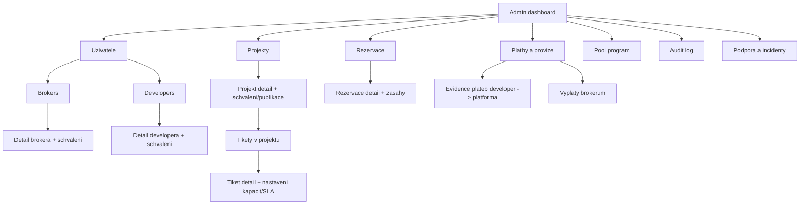

# Tipconnecta — Sitemapy: Admin
**Verze:** v1.3.0  
**Datum:** 2026-01-25  

**IA pravidlo:** Sladěno s kanonickou UX Spec v2.8.1 (CLEAN).

**Scope:** IA + sitemap + URL patterns (dev handoff) pro roli **Admin (Platforma)**.  
**IA pravidlo:** Labely v Mermaid jsou **ASCII-only** kvuli bezproblemovemu renderu v GitHub Preview.

---

## 1) Mini IA legenda
- **LIST** = seznam entit (tabulka / karty)  
- **DETAIL** = detail entity + stav + akce  
- **FORM** = vytvoreni/editace entity  
- **STEPPER** = vicekrokovy proces (wizard)  
- **TAB/SECTION** = vnitrni prepinani kontextu (napr. `?tab=`)

---

## 2) URL konvence
- App je za loginem: `/app/...`
- RBAC prefix role:
  - Admin: `/app/admin/...`

**ID placeholdery:** `:userId`, `:projectId`, `:ticketId`, `:reservationId`, `:paymentId`, `:payoutId`

---

# 3) Sitemap — Admin

## 3.1 Diagram (Mermaid / GitHub)

---

## 3.2 URL patterns (Admin)

### Dashboard
- `/app/admin/dashboard`

### Uzivatele
- **Brokers LIST:** `/app/admin/users/brokers`
- **Broker DETAIL:** `/app/admin/users/brokers/:userId`
- **Developers LIST:** `/app/admin/users/developers`
- **Developer DETAIL:** `/app/admin/users/developers/:userId`

### Projekty a tikety
- **Projekty LIST:** `/app/admin/projects`
- **Projekt DETAIL:** `/app/admin/projects/:projectId`
- **Tikety LIST:** `/app/admin/tickets`
- **Tiket DETAIL:** `/app/admin/tickets/:ticketId`

### Rezervace
- **LIST:** `/app/admin/reservations`
- **DETAIL:** `/app/admin/reservations/:reservationId`

### Platby a provize
- **Prijate platby (developer -> platforma):** `/app/admin/payments`
- **Vyplaty brokerum:** `/app/admin/payouts`
- **Detail platby/vyplaty:** `/app/admin/payments/:paymentId` a `/app/admin/payouts/:payoutId`

### Pool
- `/app/admin/pool`

### Audit
- `/app/admin/audit`

### Podpora/incidenty
- `/app/admin/support`

---

**Changelog v1.1:** bez strukturálních změn (sjednocení verzí se sitemapami + rezervace řeší Broker modal).