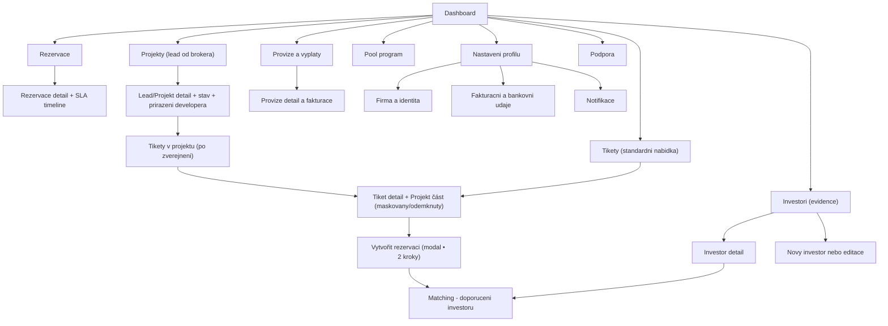

# Tipconnecta — Sitemapy: Broker (Obchodnik)
**Verze:** v1.3.1  
**Datum:** 2026-01-26  

**IA pravidlo:** V UI se sekce jmenuje **Tikety**. Interně jde o „Marketplace“ (standardní nabídka tiketů).

**Scope:** IA + sitemap + URL patterns (dev handoff) pro roli **Broker / Obchodnik**.  
**IA pravidlo:** Labely v Mermaid jsou **ASCII-only** kvuli bezproblemovemu renderu v GitHub Preview.

---

## 0) Kde je „detail projektu“ (pro brokera)?
- **Projekt je samostatna entita** (data model), tiket je na projekt navazany.
- V broker UX je **Projekt detail soucasti obrazovky Tiket detail** (jako karta/sekce/tab), aby uzivatel neskakal na „jinou stranku“.
- Projekt ma 2 rezimy zobrazeni:
  - **Maskovany (teaser)**: pred aktivaci rezervace / pred splnenim gatingu.
  - **Odemknuty (full)**: po splneni pravidel (podpisy + auditni stopa).

> Prakticky: `Tiket detail` = rozhodovaci obrazovka + v ni „Projekt část“ (maskovany/odemknuty).

---

## 1) Mini IA legenda
Pouzivame konzistentni typy stranek (pro rychlou orientaci UX/UI + dev handoff).

- **LIST** = seznam entit (tabulka / karty)  
- **DETAIL** = detail entity + stav + akce  
- **FORM** = vytvoreni/editace entity  
- **STEPPER** = vicekrokovy proces (wizard) se striktnimi pravidly  
- **MODAL** = overlay (akce bez opuštění kontextu)  
- **TAB/SECTION** = vnitrni prepinani kontextu bez opusteni detailu (napr. `?tab=`)

---

## 2) URL konvence
- Aplikace je za loginem: `/app/...`
- Doporucony RBAC prefix role:
  - Broker: `/app/broker/...`

**ID placeholdery:** `:ticketId`, `:projectId`, `:reservationId`, `:investorId`, `:leadId`, `:commissionId`

---

# 3) Sitemap — Broker (Obchodnik)

## 3.1 Co broker vidi „standardne v nabidce“ vs „co prinesl sam“
- **Standardni nabidka** = navigace **Tikety** (broker vybira tiket k rezervaci).
- **Brokerem prinesene projekty** = navigace **Projekty (lead od brokera)** (broker vidi stav, prirazeni developera a po zverejneni i tikety v projektu).

---

## 3.2 Diagram (Mermaid / GitHub)

---

## 3.3 URL patterns (Broker)

### Dashboard
- `/app/broker/dashboard`

### Tikety (standardní nabídka / Marketplace)
- **LIST:** `/app/broker/tickets`
- **DETAIL:** `/app/broker/tickets/:ticketId`
  - **Projekt část (tab/section):** `/app/broker/tickets/:ticketId?tab=project` (nebo `#project`)
  - **Galerie (inline):** bez modalu; cover obrázek + pás miniatur (klik mění hlavní obrázek)
- **MODAL • 2 kroky (rezervace):** `/app/broker/tickets/:ticketId/reservations/new` *(otevírá modal)*

### Rezervace
- **LIST:** `/app/broker/reservations`
- **DETAIL:** `/app/broker/reservations/:reservationId`

### Investori (evidence)
- **LIST:** `/app/broker/investors`
- **FORM new:** `/app/broker/investors/new`
- **DETAIL:** `/app/broker/investors/:investorId`
- **FORM edit:** `/app/broker/investors/:investorId/edit`
- **Matching:** `/app/broker/investors/:investorId/matching`

### Projekty (lead od brokera)
- **LIST:** `/app/broker/leads`
- **DETAIL (Lead/Projekt):** `/app/broker/leads/:leadId`
- **Tikety v projektu (po zverejneni):** `/app/broker/leads/:leadId/tickets`
  - deep-link na tiket: `/app/broker/tickets/:ticketId`

### Provize a vyplaty
- **LIST:** `/app/broker/commissions`
- **DETAIL:** `/app/broker/commissions/:commissionId`

### Pool
- `/app/broker/pool`

### Nastaveni
- `/app/broker/settings/profile`
- `/app/broker/settings/billing`
- `/app/broker/settings/notifications`

### Podpora
- `/app/broker/support`

---

## 4) Poznamky (pro IA konzistenci)
- Rezervace se zakládá v **2‑krokovém modalu** (investown pattern). Route `/reservations/new` může být implementovaná jako „modal route“ kvůli deeplinku.
- „Projekt detail“ je UXove **sekce uvnitr Tiket detailu**; nedelat samostatnou polozku v hlavni navigaci brokera.
- „Projekty (lead od brokera)“ = **jen projekty prinesene brokerem** (lead pred zasmluvnenim developera) + jejich zivotni cyklus, prirazeni developera a po zverejneni i tikety.