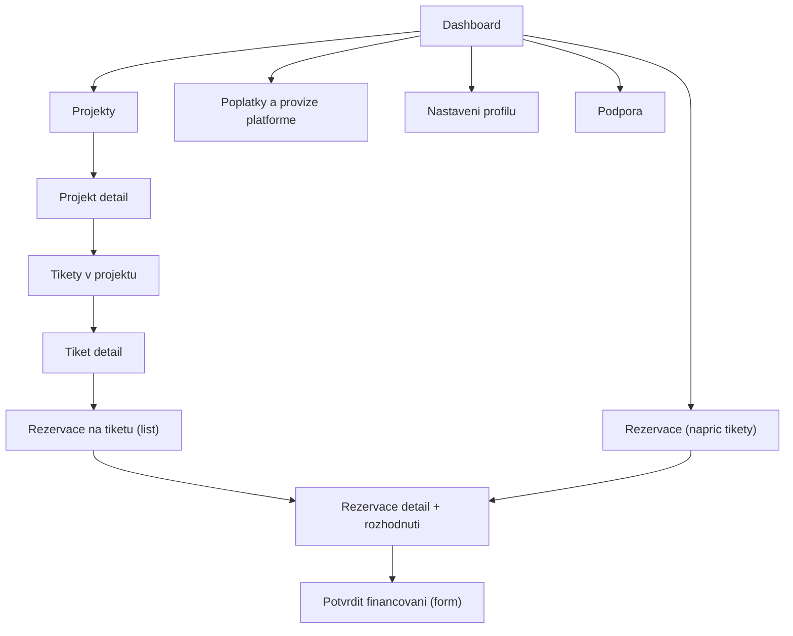

# Tipconnecta — Sitemapy: Developer
**Verze:** v1.3.0  
**Datum:** 2026-01-25  

**IA pravidlo:** Sladěno s kanonickou UX Spec v2.8.1 (CLEAN).

**Scope:** IA + sitemap + URL patterns (dev handoff) pro roli **Developer**.  
**IA pravidlo:** Labely v Mermaid jsou **ASCII-only** kvuli bezproblemovemu renderu v GitHub Preview.

---

## 1) Mini IA legenda
- **LIST** = seznam entit (tabulka / karty)  
- **DETAIL** = detail entity + stav + akce  
- **FORM** = vytvoreni/editace entity  
- **STEPPER** = vicekrokovy proces (wizard)  
- **TAB/SECTION** = vnitrni prepinani kontextu (napr. `?tab=`)

---

## 2) URL konvence
- App je za loginem: `/app/...`
- RBAC prefix role:
  - Developer: `/app/developer/...`

**ID placeholdery:** `:projectId`, `:ticketId`, `:reservationId`

---

# 3) Sitemap — Developer

## 3.1 Diagram (Mermaid / GitHub)

---

## 3.2 URL patterns (Developer)

### Dashboard
- `/app/developer/dashboard`

### Projekty
- **LIST:** `/app/developer/projects`
- **DETAIL:** `/app/developer/projects/:projectId`
- **Tikety v projektu:** `/app/developer/projects/:projectId/tickets`
- **Novy tiket v projektu:** `/app/developer/projects/:projectId/tickets/new`

### Tikety
- **LIST (vsechny):** `/app/developer/tickets`
- **DETAIL:** `/app/developer/tickets/:ticketId`
- **Rezervace na tiketu:** `/app/developer/tickets/:ticketId/reservations`

### Rezervace
- **LIST:** `/app/developer/reservations`
- **DETAIL:** `/app/developer/reservations/:reservationId`
- **Potvrzeni financovani (FORM):** `/app/developer/reservations/:reservationId/financing`

### Poplatky / provize
- `/app/developer/fees` (v MVP muze byt read-only)

### Nastaveni
- `/app/developer/settings/profile`
- `/app/developer/settings/billing`
- `/app/developer/settings/notifications`

### Podpora
- `/app/developer/support`

---

**Changelog v1.1:** bez strukturálních změn (sjednocení verzí; rezervační proces je u Broker role).