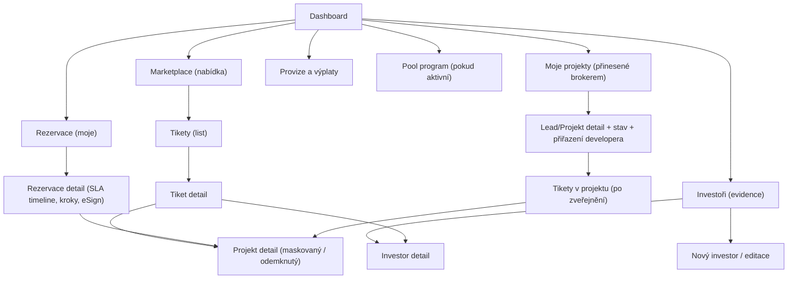

# Tipconnecta — Sitemap & Page Templates (GitHub friendly) — v4
> Poznámka: Tento soubor je psaný tak, aby se bezchybně renderoval v GitHub **Preview** (včetně Mermaid diagramů).

---

## 0) Jak psát Mermaid diagramy, aby fungovaly na GitHubu

**Doporučení (praktická):**
- používej ` ```mermaid ` fenced code blok
- pro text v uzlech používej uvozovky: `A["Text s diakritikou / : & ()"]`
- vyhýbej se znakům `&` v labelech (nahraď „a“), pokud to dělá problémy
- každé propojení piš na vlastní řádek
- ID uzlů drž v ASCII bez diakritiky (A, B1, C2…)

---

## 1) Sitemap — Broker (Obchodník)

### 1.1 Mermaid (diagram do GitHub Preview)



### 1.2 Textová verze (fallback bez Mermaid)

- **Dashboard**
  - Marketplace (nabídka)
    - Tikety (list)
      - Tiket detail
        - Projekt detail (maskovaný / odemknutý)
  - Rezervace (moje)
    - Rezervace detail (SLA timeline, kroky, eSign)
      - Projekt detail (maskovaný / odemknutý)
  - Investoři (evidence)
    - Investor detail
    - Nový investor / editace
  - Moje projekty (přinesené brokerem)
    - Lead/Projekt detail + stav + přiřazení developera
    - Tikety v projektu (po zveřejnění)
      - Projekt detail
  - Provize a výplaty
  - Pool program (pokud aktivní)

---

## 2) Kde je „detail projektu“ vs. „detail tiketu“

- **Projekt detail** = stránka nad entitou **Projekt** (kontejner), která obsahuje popis projektu, dokumenty a seznam tiketů.
- **Tiket detail** = stránka nad entitou **Tiket** (konkrétní nabídka financování) a vždy odkazuje na rodičovský projekt.

---

## 3) Rozlišení: standardní nabídka vs. projekty přinesené brokerem

### 3.1 Standardní nabídka („Marketplace“)
- Zobrazuje **zveřejněné tikety** (a jejich projekty) napříč platformou.
- Broker zde vybírá tiket a vytváří rezervaci pro konkrétního investora.

### 3.2 Projekty přinesené brokerem („Moje projekty“)
- Zobrazuje projekty, které broker založil jako **lead** (před zasmluvněním developera) + jejich lifecycle.
- Jakmile je developer přiřazen a tikety jsou schválené/zveřejněné, projekt se začne objevovat i v Marketplace (přes své tikety),
  ale broker ho pořád vidí i v „Moje projekty“ kvůli přehledu a provizím.
