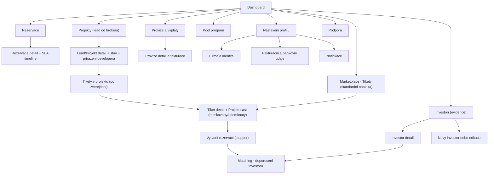
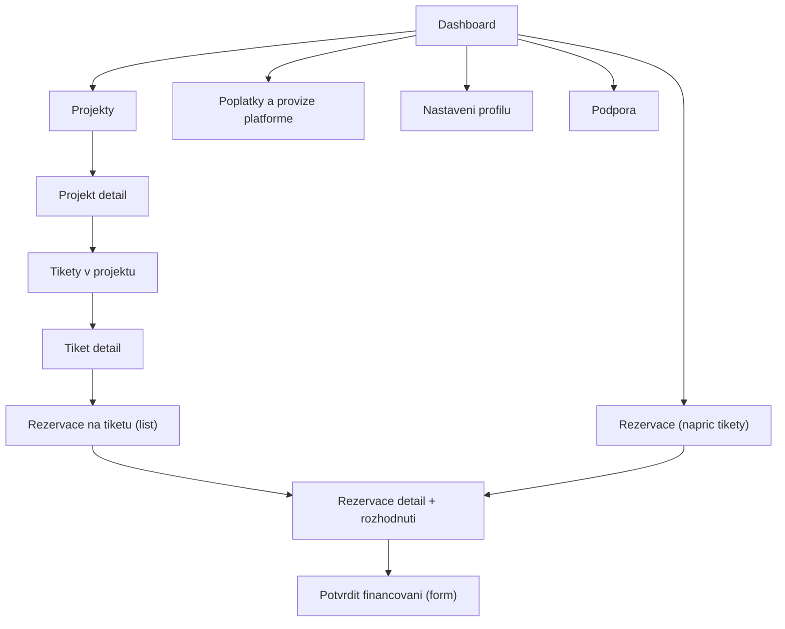
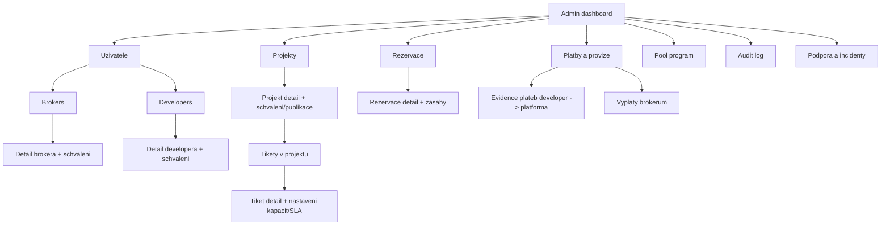

# Tipconnecta — Sitemap & Page Templates (GitHub-friendly)
**Verze:** v6  
**Datum:** 2026-01-23  
**Pozn.:** Tato verze zachovává sitemapu brokera (dle vašeho renderu) a doplňuje:  
- Projekt detail (maskovaný/odemknutý) jako součást **Tiket detail**  
- „Projekty (lead od brokera)“ se subkategoriemi: **Lead/Projekt detail + stav + přiřazení developera** a **Tikety v projektu (po zveřejnění)**  
- Mini IA legendu (list/detail/form/stepper)  
- Mapu URL patternů pro dev handoff pro všechny sitemapy  
- **Fix:** Mermaid diagramy používají ASCII-only labely pro bezproblémový render v GitHub Preview  

---

## 0) Rychlá odpověď: Kde je „detail projektu“?
- **Datově je Projekt samostatná entita** a tiket je vždy navázaný na projekt. Na frontu se má tiket zobrazovat **v kontextu projektu** (thumbnail + vazba na projekt).  
- **Detail projektu existuje ve 2 režimech:** maskovaný teaser a odemknutý detail.  
- V UX pro brokera je „Projekt detail“ **zabalený do obrazovky Tiket detail** (jako karta/sekce/tab), aby uživatel neměl pocit, že skáče na jinou stránku. Technicky lze stále držet samostatný view (tab / drawer / route), ale v sitemapě ho vedeme jako součást Tiket detail.

> Důležité: „Dokumenty k tiketu samostatně nevedeme (vše je navázáno na projekt)“ – dokumenty tedy řešíme jako sekci v Projekt části Tiket detailu.

---

## 1) Mini IA legenda (pro všechny role)
Používáme konzistentní typy stránek a komponent, aby byla IA čitelná i pro vývoj.

- **LIST** = seznam entit (tabulka / karty)  
  - příklad: „Marketplace – Tikety“, „Rezervace“, „Investoři“  
  - URL: typicky `/.../tickets` nebo `/.../reservations`

- **DETAIL** = detail jedné entity + její stav + akce  
  - příklad: „Tiket detail“, „Rezervace detail“, „Investor detail“, „Lead detail“  
  - URL: typicky `/.../:id`

- **FORM** = vytvoření / editace entity (single page)  
  - příklad: „Nový investor“, „Editace investora“, „Vytvořit lead“  
  - URL: `/.../new`, `/.../:id/edit`

- **STEPPER** = vícekrokový proces s přísnými pravidly (wizard)  
  - příklad: „Vytvořit rezervaci“ (výběr investora → potvrzení → odeslání eSign)  
  - URL: `/.../new` + interní kroky (query / step state)

- **TAB/SECTION** (uvnitř detailu) = přepínání kontextu bez opuštění detailu  
  - příklad: v Tiket detailu: „Parametry“, „Projekt“, „Dokumenty“, „Rezervace“, „Audit“  
  - URL: `/.../:id#project` nebo `/.../:id?tab=project`

---

## 2) URL konvence (globálně)
### 2.1 Base
- Aplikace je za loginem: `/app/...`  
- Pro snazší RBAC a dev routing doporučujeme prefix role:  
  - Broker: `/app/broker/...`  
  - Developer: `/app/developer/...`  
  - Admin: `/app/admin/...`

### 2.2 ID placeholder
- `:ticketId`, `:projectId`, `:reservationId`, `:investorId`, `:leadId`, `:userId`

---

# 3) Sitemapy

## 3.1 Sitemap — Broker (Obchodník)
### 3.1.1 Co broker vidí „standardně v nabídce“ vs „co přinesl sám“
- **Standardní nabídka** je v navigaci jako **Marketplace – Tikety** (broker vybírá tikety k rezervaci).  
- **Brokerem přinesené projekty** jsou v navigaci jako **Projekty (lead od brokera)** (broker vidí stav, přiřazení developera a po zveřejnění i tikety v projektu).

### 3.1.2 Diagram (Mermaid / GitHub)

### 3.1.3 URL patterns (Broker)
- **Dashboard:** `/app/broker/dashboard`

**Marketplace (standardní nabídka)**
- LIST: `/app/broker/tickets`
- DETAIL: `/app/broker/tickets/:ticketId`
  - tab/sekce Projekt: `/app/broker/tickets/:ticketId?tab=project` (nebo `#project`)
- STEPPER vytvořit rezervaci: `/app/broker/tickets/:ticketId/reservations/new`

**Rezervace**
- LIST: `/app/broker/reservations`
- DETAIL: `/app/broker/reservations/:reservationId`

**Investoři (evidence)**
- LIST: `/app/broker/investors`
- FORM new: `/app/broker/investors/new`
- DETAIL: `/app/broker/investors/:investorId`
- FORM edit: `/app/broker/investors/:investorId/edit`
- Matching pro investora: `/app/broker/investors/:investorId/matching`

**Projekty (lead od brokera)**
- LIST: `/app/broker/leads`
- DETAIL (Lead/Projekt): `/app/broker/leads/:leadId`
- Tikety v projektu (po zveřejnění): `/app/broker/leads/:leadId/tickets`
  - deep-link na konkrétní tiket: `/app/broker/tickets/:ticketId`

**Provize a výplaty**
- LIST: `/app/broker/commissions`
- DETAIL: `/app/broker/commissions/:commissionId`

**Pool**
- `/app/broker/pool`

**Nastavení**
- `/app/broker/settings/profile`
- `/app/broker/settings/billing`
- `/app/broker/settings/notifications`

**Podpora**
- `/app/broker/support`

---

## 3.2 Sitemap — Developer
> Developer pracuje primárně s: projekty → tikety → rezervace → potvrzení financování.

### 3.2.1 URL patterns (Developer)
- Dashboard: `/app/developer/dashboard`

**Projekty**
- LIST: `/app/developer/projects`
- DETAIL: `/app/developer/projects/:projectId`
- Tikety v projektu: `/app/developer/projects/:projectId/tickets`
- Nový tiket v projektu: `/app/developer/projects/:projectId/tickets/new`

**Tikety**
- LIST (all): `/app/developer/tickets`
- DETAIL: `/app/developer/tickets/:ticketId`
- Rezervace na tiketu: `/app/developer/tickets/:ticketId/reservations`

**Rezervace**
- LIST: `/app/developer/reservations`
- DETAIL: `/app/developer/reservations/:reservationId`
- Potvrzení financování (form): `/app/developer/reservations/:reservationId/financing`

**Poplatky / provize**
- `/app/developer/fees` (MVP může být read-only)

**Nastavení**
- `/app/developer/settings/profile`
- `/app/developer/settings/billing`
- `/app/developer/settings/notifications`

**Podpora**
- `/app/developer/support`

---

## 3.3 Sitemap — Admin
> Admin zajišťuje: schválení účtů, publikaci projektů/tiketů, nastavení SLA/kapacit, audit a ruční evidenci plateb.

### 3.3.1 URL patterns (Admin)
- Dashboard: `/app/admin/dashboard`

**Uživatelé**
- Brokeři LIST: `/app/admin/users/brokers`
- Broker DETAIL: `/app/admin/users/brokers/:userId`
- Developeri LIST: `/app/admin/users/developers`
- Developer DETAIL: `/app/admin/users/developers/:userId`

**Projekty & tikety**
- Projekty LIST: `/app/admin/projects`
- Projekt DETAIL: `/app/admin/projects/:projectId`
- Tikety LIST: `/app/admin/tickets`
- Tiket DETAIL: `/app/admin/tickets/:ticketId`

**Rezervace**
- LIST: `/app/admin/reservations`
- DETAIL: `/app/admin/reservations/:reservationId`

**Platby & provize**
- Přijaté platby (developer→platforma): `/app/admin/payments`
- Výplaty brokerům: `/app/admin/payouts`
- Detail platby/výplaty: `/app/admin/payments/:paymentId` / `/app/admin/payouts/:payoutId`

**Pool**
- `/app/admin/pool`

**Audit**
- `/app/admin/audit`

**Podpora/incidenty**
- `/app/admin/support`

---

# 4) Page templates (jen změny relevantní k vašemu požadavku)

## 4.1 Tiket detail (Broker) — obsahuje „Projekt část“ (maskovaný/odemknutý)
**Koncept:** Ticket detail je „one-stop“ rozhodovací obrazovka. Projekt detail je UXově vnímán jako sekce/tabs v rámci Ticket detailu.

- **Tab 1: Tiket (parametry)** — výnos, splatnost, částka, forma, LTV, zajištění, platnost tiketu (publikační okno), kapacita/queue.
- **Tab 2: Projekt (maskovaný/odemknutý)** — stejné bločky jako v definici projektu (teaser vs plný) vč. dokumentů a galerie.
- **Tab 3: Rezervace** — existující rezervace brokera na tento tiket + CTA „Vytvořit rezervaci“.
- **Tab 4: Audit** — klíčové časové značky (kdo co kdy viděl / podepsal), read-only.

> Pozn.: Projekt má jednotná pravidla maskování/odmaskování; nesmí vzniknout mix (např. odmaskovaný obrázek, ale maskovaný název).  

## 4.2 Lead/Projekt detail (Broker) — stav + přiřazení developera + tikety v projektu (po zveřejnění)
**Koncept:** Broker má vlastní sekci „Projekty (lead od brokera)“, kde:
- vidí stav leadu („čeká na zasmluvnění“, „přiřazen developer“, „v revizi“, „publikováno“…),
- vidí přiřazení developera (jakmile je hotovo),
- po zveřejnění vidí seznam tiketů projektu a může je používat stejně jako marketplace (deep-link).

---

## 5) Poznámky pro dev handoff (krátce)
- URL struktura výše je návrh pro stabilní routing a RBAC.
- Tab/section navigace je preferovaná pro „Projekt část“ v Ticket detailu (z hlediska UX) – technicky lze řešit query `?tab=` nebo hash anchor.
- Investor nemá účet v app; jeho cesta je mimo sitemap (eSign).

