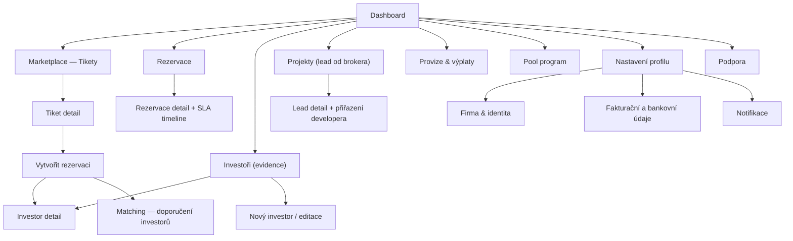
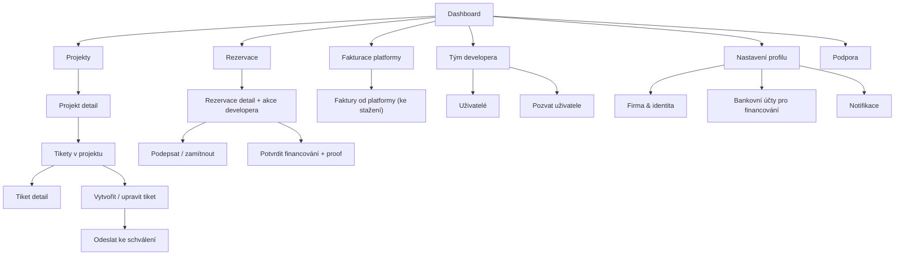
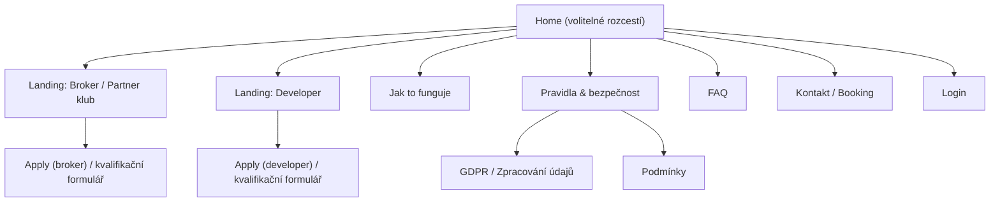

# Tipconnecta — Sitemap & Page Templates (v2)
> Formát optimalizovaný pro GitHub Preview (Markdown + Mermaid + ASCII wireframes)  
> Scope: **Aplikace za loginem** pro role **Broker / Developer / Admin** (Investor není uživatel platformy).

---

## 0) Kontext a klíčová pravidla (pro orientaci)

### 0.1 Role (kdo je uživatel aplikace)
- **Broker (obchodník / tipař)**: spravuje vlastní investory, vytváří rezervace na tiketech, sleduje SLA a průběh (včetně provizí).  
- **Developer**: zakládá projekty a tikety, podepisuje rezervační smlouvy, potvrzuje financování, hradí provizi platformě.  
- **Admin**: schvaluje uživatele a tikety, nastavuje kapacity a SLA, může dělat override, vede audit.

> Investor **není uživatel platformy** (nemá účet v aplikaci). Investor pouze podepisuje dokumenty přes eSign odkaz.  
> Zároveň po podpisu Souhlasu + NDA dochází k „odemknutí“ identit (auditní stopa introdukce).  
> Viz datový souhrn: role a maskování/odkrytí identit.

### 0.2 Entitní model (nejdůležitější objekty)
- **Projekt** (kontejner): vlastní developer; více tiketů na projekt.  
- **Tiket** (nabídka financování): má publikační okno; je v marketplace; má kapacitu rezervací.  
- **Rezervace**: propojuje broker ↔ investor (z evidence brokera) ↔ tiket; řídí podpisy, kapacitu, SLA a aktivaci.  
- **Investor-záznam**: interní záznam brokera (vidí jen broker + admin; ne ostatní).  
- **Provize / payout**: vzniká až po potvrzeném profinancování a po přijetí provize na účet platformy.  
- **Pool program**: (aktivní v MVP v UI) bonusový program navázaný na obrat/provize.

### 0.3 Klíčové UX principy vyplývající z dat
1) **Maskování → odmaskování musí být konzistentní**  
   Nesmí vzniknout stav, kdy je odmaskovaný obrázek, ale název projektu maskovaný (a naopak).

2) **Kapacita tiketu („Capacity_N“) se počítá až od podpisu rezervační smlouvy investorem**  
   Rezervace před podpisem rezervační smlouvy investorem kapacitu neblokují.

3) **SLA je primární „navigace“ uživatele**  
   Nejvyšší priorita UI/UX: co mám udělat dnes (deadline, čeká na podpis, čeká na potvrzení financování, čeká na nahrání faktury, apod.).

4) **Vše je auditované**  
   Změny SLA, override stavů, citlivé údaje → vždy důvod + auditní stopa.

---

## 1) Rozhodnutí (aktuální MVP režim)
> Tyto body vychází z posledních rozhodnutí v projektu (mimo datový souhrn).

- **Signup režim:** self-signup + následné schválení adminem (gating pilotu).  
- **Investor SLA:** sjednocené SLA **48h** na celý eSign balík (Souhlas + NDA + Rezervace).  
- **eSign balík:** posílat 3 dokumenty jako **1 envelope** (vnitřně může mít kroky, ale pro UX je to 1 „balík“).  
- **Pool program:** aktivní v MVP UI.  
- **Více uživatelů k jednomu developerovi:** must-have v MVP (Team management).  
- **Broker může přinést i projekt (hybrid):** vzniká jako lead obchodníka, později se přiřadí developerovi; broker potřebuje sledovat rezervace a realizaci tiketů kvůli provizi.

---

## 2) Sitemap (IA) — aplikace za loginem

### 2.1 Společné „shell“ stránky (všechny role)
- Login
- Zapomenuté heslo / reset
- Čeká na schválení účtu (pending approval)
- 404 / přístup odepřen

---

## 2.2 Sitemap — Broker (Obchodník)



**Poznámka k brokerům:**
- Evidence investorů je privátní (jen vlastník broker + admin).  
- Broker u tiketů pracuje s „teaser“ režimem až do právního odemknutí (Souhlas + NDA).

---

## 2.3 Sitemap — Developer



---

## 2.4 Sitemap — Admin

```mermaid
flowchart TD
  A["Admin dashboard"] --> B["Schvalování"]
  B --> B1["Uživatelé: pending / active"]
  B --> B2["Tikety: ke schválení"]
  B --> B3["Změny tiketu: žádosti developera"]
  A --> C["Tikety: správa marketplace"]
  C --> C1["Publikace / skrytí / expirace / reopen"]
  C --> C2["Nastavení kapacity + publikačního okna"]
  C --> C3["Override stavu (audit)"]
  A --> D["Rezervace: dohled"]
  D --> D1["SLA přehled + prodloužení"]
  D --> D2["Řešení incidentů / spory"]
  A --> E["Provize & payout"]
  E --> E1["Potvrzení přijetí provize (developer → platforma)"]
  E --> E2["Výplata brokerům + kontrola faktur"]
  A --> F["Pool program"]
  F --> F1["Uzávěrka období + vyhodnocení"]
  F --> F2["Potvrzení výplat"]
  A --> G["Audit log"]
  A --> H["Šablony: dokumenty a e-maily"]
  A --> I["Globální nastavení"]
  I --> I1["Default SLA"]
  I --> I2["Default kapacita"]
  I --> I3["DPH režimy / fakturace"]
```



---

## 3) Inventář hlavních typů stránek (Page Templates)
Níže jsou **univerzální šablony**, které pokryjí ~80–90 % UI.

### Template T1 — App Shell (Desktop responsive)
**Kde se používá:** všechny přihlášené stránky (kromě eSign).  
**Cíl UX:** rychlá orientace + okamžitý přístup k „taskům“ a notifikacím.

```text
┌───────────────────────────────────────────────────────────────────────────┐
│ Topbar: [Logo] [Global Search…]               [🔔 Notif] [User menu ▼]    │
├───────────────┬───────────────────────────────────────────────────────────┤
│ Sidebar       │ Page header: H1 + breadcrumb + (primary CTA)              │
│ - Dashboard   │ ────────────────────────────────────────────────────────  │
│ - Marketplace │ Content area (cards / table / tabs)                       │
│ - Rezervace   │                                                           │
│ - …           │                                                           │
└───────────────┴───────────────────────────────────────────────────────────┘
```

**Psychologie / důvěra:** v topbaru vždy dostupné „Audit & bezpečnost“ (tooltip u citlivých změn), a jasná role uživatele (Broker/Developer/Admin).

---

### Template T2 — Dashboard „Task-first“
**Kde se používá:** Dashboard Broker / Developer / Admin.  
**Cíl:** každý uživatel má „co dělat dnes“ (SLA, podpisy, potvrzení, faktury).

```text
[H1 Dashboard]                       [Period filter ▼]
-----------------------------------------------------------------
[ALERTS / TASKS (max 5)]
- ⚠️ Rezervace #123: 6h do deadlinu podpisu (Investor)  [Otevřít]
- ⏳ Tiket #88: čeká na schválení adminem               [Zobrazit]
- ✅ Financování potvrzeno: čeká na provizi            [Zobrazit]

[2-column]
[Left: Aktivní rezervace + timeline mini]   [Right: Nové tikety / feed]
-----------------------------------------------------------------
[Quick stats]
- Počet aktivních rezervací
- Profinancované tento měsíc
- (Broker) obrat do Poolu / kvalifikace
```

**Stavy:**  
- Empty state: „Zatím tu nic není – začněte v Marketplace.“  
- Error: „Data se nepodařilo načíst. Zkuste to znovu.“

---

### Template T3 — Marketplace list (Tikety) s rychlou due diligence
**Kde se používá:** BRK-200, ADM Marketplace control.  
**Cíl:** rychlé posouzení (částka, výnos, splatnost, zajištění, LTV/ratio, lokalita, čas do expirace).

```text
[H1 Marketplace — Tikety]  [Filter chips…] [Saved views]   [Search]
--------------------------------------------------------------------
[Table / cards view toggle]

[Ticket card/table row]
[Status chip] [Projekt teaser] [Developer teaser]
Částka: 25 000 000 Kč | Výnos: 12 % | Splatnost: 18 měs.
Zajištění: Zástava nem. (1.) | LTV: 65 % (pokud je)
Lokalita: Jihomoravský | Do konce zveřejnění: 14 dní
[CTA: Detail]  [Secondary: Doporučit investorům]
```

**Důležité:**  
- Pokud je tiket **Expirovaný/Skrytý** → nelze zakládat nové rezervace (CTA disabled).  
- „Do konce zveřejnění“ musí být viditelné (SLA do expirace tiketu).

---

### Template T4 — Detail tiketu (teaser vs unlocked)
**Kde se používá:** BRK-210, DEV-210, ADM-210.  
**Cíl:** mít na jednom místě parametry, dokumenty, a cestu k rezervaci.

```text
[H1 Tiket: Projekt #123 (teaser)]   [Status]   [Do konce zveřejnění: 14 dní]
---------------------------------------------------------------------------
[Summary strip]
Částka | Výnos | Splatnost | Forma financování | Lokalita | Zajištění | LTV

[Tabs]
1) Přehled (teaser/full)
2) Dokumenty (předrezervační / odemknuté)
3) Rezervace (list)
4) Audit (admin/limited)

[Right rail (sticky)]
[Primary CTA: Vytvořit rezervaci] (broker)
[Primary CTA: Upravit / požádat o změnu] (developer)
[Primary CTA: Publikovat / změnit kapacitu] (admin)
```

**Teaser režim (broker před odemknutím):**
- Název projektu a developer anonymizovaně („Projekt #123“, „Developer A“).  
- Obrázky jako placeholder.  
- Dokumenty: pouze „předrezervační“ (adminem povolené).

---

### Template T5 — Wizard: „Vytvořit rezervaci“ (broker)
**Kde se používá:** BRK-220.  
**Cíl:** minimalizovat chyby, rychle vybrat investora a odeslat eSign balík.

```text
[H1 Vytvořit rezervaci]     [Tiket summary (mini card)]
--------------------------------------------------------
[Step 1: Vybrat investora]
- Search / select investor z evidence
- nebo [Nový investor] (modal)

[Step 2: Kontaktní údaje pro eSign]
- E-mail investora
- Telefon (volitelně, pokud eSign podporuje)
- Jazyk: CZ

[Step 3: Rekapitulace + odeslání]
- Co investor podepisuje: Souhlas + NDA + Rezervační smlouva (1 balík)
- Deadline: 48h
[Primary CTA: Odeslat investorovi]
```

**UX guardrails:**  
- Pokud investor nemá e-mail → nelze odeslat.  
- Pokud tiket je expirovaný/skrytý/uzavřený → nelze založit rezervaci.

---

### Template T6 — Rezervace detail (SLA timeline + queue/capacity)
**Kde se používá:** BRK-310, DEV-310, ADM-310.  
**Cíl:** jedno místo pro stav, termíny, dokumenty, akce.

```text
[H1 Rezervace #R-000123]   [Status chip]  [Tiket link]  [Projekt link]
-----------------------------------------------------------------------
[Timeline / SLA]
(1) Odesláno investorovi  → deadline: 23.1. 14:30
(2) Podepsáno (Souhlas+NDA) → odemknutí identit (audit)
(3) Podepsáno (Rez. sml.) investor → pořadí ve frontě #2, v kapacitě: NE
(4) V kapacitě → čeká na akci developera (deadline 48h)
(5) Aktivní → jednání do 30 dní
(6) Financování potvrzeno → tiket uzavřen

[Main content]
- Strany: Broker, Investor, Developer (podle odmaskování)
- Dokumenty: (odkazy + status podpisu)
- Poznámky / komunikace (interní)
- Akce (role-based):
   (Broker) resend eSign, změnit kontakt, eskalovat adminovi
   (Developer) podepsat / zamítnout + důvod
   (Developer/Admin) potvrdit financování + proof
   (Admin) prodloužit SLA, override, audit poznámka
```

**Queue & kapacita:**
- Zobrazuje se „Pořadí ve frontě“ a „V kapacitě: ANO/NE“ po podpisu rezervační smlouvy investorem.
- Pokud mimo kapacitu → developer vidí rezervaci, ale dokument se mu odemkne až při vstupu do kapacity.

---

### Template T7 — Investor evidence (broker-only)
**Kde se používá:** BRK-400/410.  
**Cíl:** rychle vybrat investora + mít preference pro matching.

```text
[H1 Investoři]   [Search] [Filter: Aktivní/Neaktivní]  [CTA: Nový investor]
---------------------------------------------------------------------------
[Table]
Jméno/Firma | Stav | Min/Max investice | Min výnos | Max délka | Regiony | …
[Row actions: Detail | Upravit]
```

**Investor detail:**
- Preferované regiony, typy projektů, formy financování, požadavek na zajištění, max poměr investice k hodnotě zástavy (LTV/ratio).  
- Interní poznámka (NIKDY neukazovat developerovi).

---

### Template T8 — Matching view (broker)
**Kde se používá:** z tiketu / z vytvoření rezervace.  
**Cíl:** najít „nejpravděpodobnější“ investory + mít vysvětlení shody.

```text
[H1 Doporučení investorů pro Tiket #88]
----------------------------------------------------------------
[Filters]
- Zobrazit: Vysoká / Střední / Nízká / Mimo kritéria
- Min investice, region, zajištění, max LTV…

[List]
[Investor A]  Shoda: Vysoká
Důvody: částka v rozsahu • kraj odpovídá • výnos ≥ minimum • zajištění OK
[CTA: Vybrat investora]  [Secondary: Detail investora]
```

---

### Template T9 — Team management (developer)
**Kde se používá:** DEV-700.  
**Cíl:** více uživatelů na jeden developer účet (MVP must-have).

```text
[H1 Tým developera]
----------------------------------------------------------------
[Users table]
Jméno | E-mail | Role v týmu | Stav (pozván/aktivní) | Poslední aktivita | …
[CTA: Pozvat uživatele]

[Invite modal]
- E-mail
- Role (např. Admin týmu / Standard)
- Odeslat pozvánku
```

---

### Template T10 — Admin review (schvalování)
**Kde se používá:** ADM approvals.  
**Cíl:** rychle schválit/vrátit/zamítnout + auditní stopa.

```text
[H1 Ke schválení: Tiket #88]  [Status: Ke schválení]
----------------------------------------------------------------
[Left: Obsah tiketu (read-only)]
- povinná pole checklist
- dokumenty
- rizikové flagy

[Right: Decision panel]
[Approve] [Return for edits] [Reject]
- Povinný důvod (textarea)
- SLA/publikační okno (pokud approve)
```

---

## 4) „Screen ID“ doporučené číslování (pro rychlé mapování do Figmy)
> Nejde o finální design, ale o stabilní naming convention pro backlog.

### Broker (BRK)
- BRK-100 Dashboard
- BRK-200 Marketplace (Tikety)
- BRK-210 Tiket detail
- BRK-220 Vytvořit rezervaci (wizard)
- BRK-300 Rezervace (list)
- BRK-310 Rezervace detail (timeline)
- BRK-400 Investoři (list)
- BRK-410 Investor detail
- BRK-500 Projekty — lead od brokera
- BRK-600 Provize & výplaty
- BRK-700 Pool program
- BRK-800 Nastavení profilu
- BRK-900 Podpora

### Developer (DEV)
- DEV-100 Dashboard
- DEV-200 Projekty (list)
- DEV-210 Projekt detail
- DEV-220 Tiket create/edit
- DEV-230 Tiket detail
- DEV-300 Rezervace (list)
- DEV-310 Rezervace detail + akce
- DEV-400 Potvrdit financování
- DEV-600 Faktury od platformy
- DEV-700 Tým developera
- DEV-800 Nastavení profilu

### Admin (ADM)
- ADM-100 Admin dashboard
- ADM-200 Schvalování uživatelů
- ADM-210 Schvalování tiketů
- ADM-220 Žádosti o úpravu tiketu
- ADM-300 Tikety správa (publish/capacity/SLA)
- ADM-400 Rezervace dohled
- ADM-500 Provize & payout
- ADM-600 Pool správa
- ADM-700 Audit log
- ADM-800 Globální nastavení

---

## 5) Nejasnosti (otázky na vás)
- Zatím žádné blokující otázky pro sitemap a page templates.  
  Pokud chcete, doplníme: **jaké typy rolí v rámci „Team developera“** (jen 2 role vs. granularita práv).

---

## 6) Předpoklady (co jsme doplnili sami)
- Dashboard je postaven „task-first“ (SLA a akce nahoře), protože SLA dominuje procesu.
- U Team managementu počítáme s jednoduchými rolemi „Admin týmu / Standard“, aby MVP bylo rychlé.
- Marketplace preferuje table view (desktop-first, B2B) + volitelně card view.

---

## 7) Appendix: doporučené Mermaid diagramy (pro GitHub Preview)

### 7.1 Koncepční proces „Timeline & jistota“

```mermaid
flowchart LR
  A["Rezervace vytvořena"] --> B["eSign balík odeslán"]
  B --> C["Investor podepíše"]
  C --> D["Odemknutí identit + audit"]
  D --> E["Fronta / kapacita"]
  E --> F["Developer podepíše"]
  F --> G["Aktivní rezervace"]
  G --> H["Jednání / financování"]
  H --> I["Financování potvrzeno"]
  I --> J["Provize & payout"]
```



---

## 8) (Doporučeno) Sitemap & page templates pro web (akvizice) — MVP komunikace
> I když je samotná aplikace „za loginem“, marketingové podklady počítají s minimem webu
> (2 landingy + Jak to funguje + Pravidla & bezpečnost + Kontakt/booking).

### 8.1 Sitemap — Web (public)


### 8.2 Template W1 — Landing (Broker)
**Primární cíl:** „Chci do Partner klubu“ (apply) / „Domluvit 15min call“.  
**Obsahové bloky (recommended):** hero + pro koho + jak to funguje + co najdeš v nabídce + proč to funguje + benefity + FAQ + form.

```text
[Top nav: Logo | Jak to funguje | Pravidla | FAQ | Kontakt | Login]
--------------------------------------------------------------------
[Hero]
H1: Zajištěné zápůjčky 20M+ pro brokery.
Bullets: Přehledný proces podpisů • Ochrana introdukce • Provize jen po financování
[CTA primary: Chci do Partner klubu]  [CTA secondary: Domluvit 15min call]

[Section: Pro koho (checklist)]
- Broker 20M+ / hybrid / Praha-Brno…
- Co typicky řešíš…

[Section: Jak to funguje (5 kroků)]
Filtry → Rezervace → Souhlas+NDA → Odemknutí → Financování → Provize

[Section: Důkazy / bezpečnost]
- Auditní stopa introdukce
- Maskování → sdílíme jen ve správný čas
- SLA pro každý krok

[FAQ]
- Kdy se odemknou detaily?
- Jak rychlé jsou podpisy?
- Kdy vzniká nárok na provizi?

[Form: kvalifikace]
- Jméno, e-mail, telefon
- Regiony
- Typický ticket size
- # investorů
[CTA: Odeslat žádost]
```

### 8.3 Template W2 — Landing (Developer)
**Primární cíl:** „Domluvit call“ / „Začít pilot“.  
**Důraz:** distribuce brokerů + kontrola úniku info + kapacity + auditní stopa.

```text
[Hero]
H1: Otevřete si distribuční síť brokerů — bez vyzobávání mimo platformu.
Bullets: Teaser režim • Kapacita a férová fronta • Auditní stopa introdukce
[CTA: Domluvit call]

[Section: Jak publikace funguje]
Projekt → Tiket → Publikace → Rezervace → Podpisy → Aktivace → Financování → Provize

[Section: Ticket readiness (checklist)]
- Parametry (částka, výnos, splatnost, zajištění, LTV…)
- Dokumenty (předrezervační vs po aktivaci)
- Kontaktní osoba

[FAQ]
- Kdo platí provizi?
- Jak se řídí kapacita?
- Jak se řeší změny tiketu po publikaci?
```

---

## 9) Další doporučený krok (pokud chceš pokračovat)
1) Vygeneruju **jednotný seznam screenů** (per role) a pro každý screen přiřadím:
   - použitou šablonu (T1–T10),
   - must-have datové bloky,
   - edge cases,
   - základní copy (1:1).
2) Pak přejdeme na **UI design system** (komponenty + stavy) a konkrétní UI layouty.

