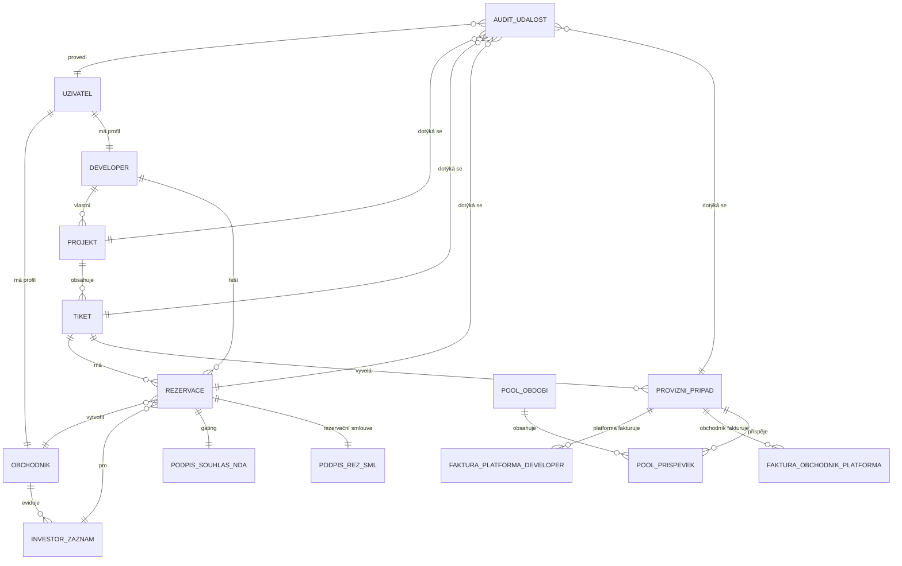
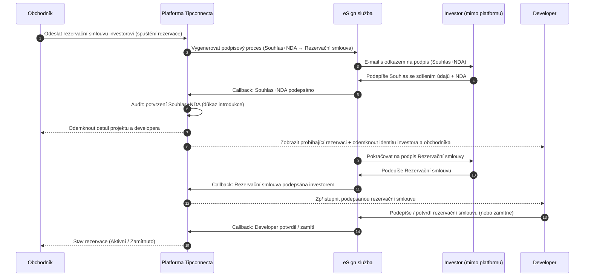
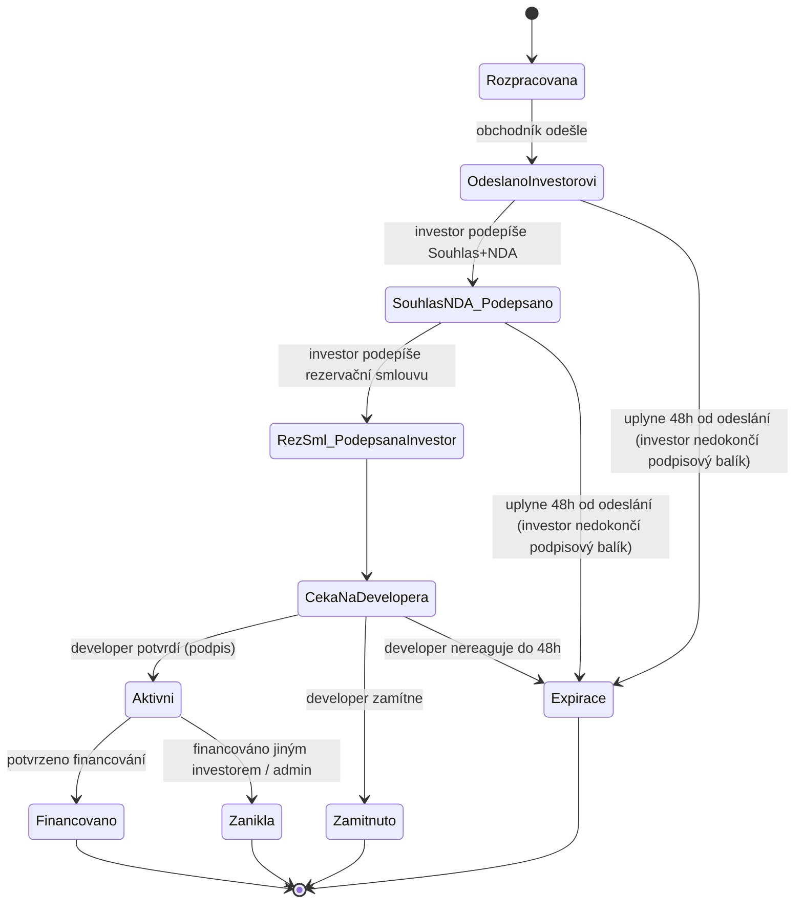

# Tipconnecta – Souhrn dat a pravidel (KANONICKÁ VERZE – čistá)

**Status:** kanonická verze (verzovaná)  
**Doc ID:** TIPCONNECTA-DATA-CLEAN-1.4.1
**Verze:** DATA-CLEAN-1.4.1
**Datum aktualizace:** 26. 1. 2026

> Pozn.: Tipconnecta je rebranding původního projektu Tipari.cz. V této kanonické verzi používáme jednotně název **Tipconnecta**.

**Změny v této verzi (DATA-CLEAN-1.4.1):**
- **Přidán „Hlídací pes“ (watchlist):** datový model pro sledování projektů/tiketů + periodické e‑maily/digest s novými projekty a změnami v matchingu.
- Jednotné SLA investora: **48 hodin** na dokončení podpisového balíku (Souhlas + NDA + Rezervační smlouva) od okamžiku odeslání procesu obchodníkem (eSign ve 2 krocích v jednom okně; časový limit se neresetuje).
- Maskování: obrázky projektu (cover + galerie) se v teaseru zobrazují jako **rozmazané náhledy** (ne skryté), aby UI působilo kvalitně a zároveň neodhalilo detaily.
- Rezervace: obchodník může v rezervačním procesu **založit nového investora inline** a přidat ho do své databáze bez opuštění flow.
- Kanonické seznamy: doplněny položky **Ostatní** s krátkým vlastním názvem (max 2 slova) u typu projektu a využití prostředků; tagy umožňují **přidat vlastní tag**.
- Pravidlo: expirace tiketu (konec publikačního okna) **neukončuje aktivní rezervace**.
- Projekt: doplněn **detailní popis projektu (longform)** + derived „Celkový součet provizí všech tiketů projektu“ (pro Project Detail).
- Matching: upřesněno zobrazení matchingu u tiketu (podpora desítek investorů; tabulka/seznam + filtry).
- Úklid: odstraněny interní komentáře/poznámky, sjednocena terminologie a notifikační katalog.

## Osnova

### Souhrn dat
- 0. Jak s dokumentem pracovat
- 1. Shrnutí pro vedení
- 2. Projektový rozsah
- 3. Role a zainteresované strany
- 4. Klíčové toky
- 5. Externí závislosti
- 6. Omezení a předpoklady
- 7. Datové entity
- 8. Kanonické seznamy povolených hodnot
- 10. Business logika
- 12. Datový slovník (MVP, bez technických kódů)
- 15. Pravidla publikace a blokátory dat
- 16. Audit a incident management
- 17. Administrace a nastavení
- 18. Matching investorů
- 19. Dokumenty, smlouvy a podpisy
- 20. Potvrzená rozhodnutí a parametry
- 21. Stavové automaty a automatizace
- 21.5 Notifikační události a šablony (katalog)
- 22. Exporty dat
- 23. Profil uživatele a nastavení účtu
- Příloha D: Právní rámec a minimalizace rizik

## Souhrn dat

### 0. Jak s dokumentem pracovat

Tento soubor je **jediný kanonický „souhrn dat“** (source of truth) pro:
- **programátora** (co má vzniknout v systému: data, vazby, stavy, pravidla, audit, integrační body)
- **UX designéra** (uživatelské toky, rozhodovací body, chybové stavy, maskování a odmaskování informací)
- **UI designéra** (informační architektura, datové bloky na obrazovkách, viditelnost a oprávnění)

Cíl:
- odstranit duplicity a rozpory mezi podklady
- převést „chaotické“ výčty do jedné logické struktury
- připravit přehledné seznamy povolených hodnot (seznamy povolených hodnot)
- popsat business logiku tak, aby byla proveditelná v systému

#### 0.1 Co v dokumentu záměrně zatím není
- technické názvy polí a strojové klíče
- návrh databázového schématu
- návrh konkrétních koncových bodů aplikačního programového rozhraní

Tyto části jsou mimo rozsah tohoto dokumentu (řešeno v technické/implementační dokumentaci).

#### 0.2 Kontext: rebranding a vizuální styl

- Platforma se jmenuje **Tipconnecta** (dříve **Tipari.cz**). V této dokumentaci používáme jednotně název Tipconnecta.
- Cílový vizuální a interakční styl platformy chceme **kompletně kopírovat podle Investown** (UI styl a principy rozhraní).
  - Tento dokument řeší primárně data, pravidla a logiku. Vizuální specifikace řeší samostatně **Design System** a Figma.

#### 0.3 Terminologie a zkratky

V dokumentu se vyskytují některé zkratky – aby nevznikaly nejasnosti, používáme je takto:

- **Uživatelské rozhraní (UI)**: obrazovky a ovládací prvky, které uživatelé vidí a používají.
- **Uživatelský zážitek (UX)**: jak snadno a pochopitelně uživatelé systémem projdou (toky, přehlednost, chybové stavy).
- **Časové lhůty (SLA)**: doby, do kdy se musí stát určitý krok (např. podpis smlouvy). Vždy nastavitelné administrátorem.
- **Ochrana osobních údajů (GDPR)**: povinnosti a souhlasy se zpracováním osobních údajů.
- **Mezinárodní číslo účtu (IBAN)**: formát pro bankovní účet (použijeme, pokud bude výplata probíhat převodem).
- **Poměr dluhu k hodnotě zajištění (LTV)**: ukazatel rizika u zajištěného financování.
- **Minimální první verze (MVP)**: funkční základ, který umožní provoz (zbytek rozšiřujeme postupně).
- **AML/KYC**: procesy proti praní špinavých peněz a ověření klienta. V této verzi platformy se **neimplementuje zákonný proces AML/KYC vůči investorům** (investor je mimo platformu). U obchodníků a developerů probíhá **interní administrativní schválení účtu** (kontrola údajů / smluvní dokumentace), nikoliv plnohodnotné AML/KYC.

---

### 1. Shrnutí pro vedení

#### 1.1 Účel a mise
Tipconnecta je platforma pro **zprostředkování investičních příležitostí mezi firmami** (obchodníci přivádějí investory, developeři přidávají projekty). Klíčovým prvkem je řízený tok rezervace a následného jednání – tak, aby:
- obchodník věděl, co má dělat a kdy
- developer viděl jen relevantní informace ve správný čas
- platforma měla kontrolu nad pravidly, časovými limity a provizemi

#### 1.2 Hodnota pro uživatele (hlavní přínosy)

- **Obchodník (tipař/broker):** pracuje s nabídkou tiketů v režimu **maskovaných detailů** (např. název projektu, název developera; **obrázky projektu (hlavní i galerie) se zobrazují jako rozmazané náhledy**; většina dokumentů je skrytá nebo dostupná jen jako placeholder bez obsahu). Plné detaily se mu odemknou až ve chvíli, kdy jeho investor **dokončí podpis Souhlasu se sdílením údajů + NDA (pro platformu)**. Tím vzniká právní a auditní stopa introdukce a zároveň se udržuje férová konkurence na tiketech.
- **Developer:** získá přístup k distribuční síti obchodníků. Identita investora a obchodníka se mu zpřístupní **po potvrzení Souhlasu se sdílením údajů + NDA investorem** (tedy ještě před podpisem rezervační smlouvy developerem). Plně podepsanou rezervační smlouvu obdrží až po podpisu investora a následném potvrzení/podpisu developera.
- **Platforma (administrátor):** správa pravidel a parametrů (časové limity, kapacity rezervací, splatnosti), finanční vypořádání (provize, faktury), audit a řešení sporů. Platforma **neověřuje investory** ani **neschvaluje jednotlivé rezervace** – nastavuje rámec, eviduje průběh a může kdykoliv zasáhnout (override) s auditní stopou.

#### 1.3 Přehled platformy

Základní tok je:
1) developer (nebo obchodník jako „lead“) zadá projekt a tiket k publikaci
2) administrátor projekt/tiket schválí a zveřejní (včetně nastavení kapacit, časů a publikačního okna)
3) obchodník vybere investora ze své evidence a připraví rezervaci na tiket (v UI stále vidí maskované detaily projektu a developera + dokumenty vybrané administrátorem)
4) obchodník odešle investorovi odkaz na elektronický podpis (eSign). Od tohoto okamžiku běží jednotné SLA investora **48 hodin** na dokončení podpisového balíku (Souhlas se sdílením údajů + NDA + Rezervační smlouva); SLA je nastavitelné administrátorem na úrovni tiketu (časový limit se neresetuje mezi kroky v eSign).
5) investor v podpisovém okně nejprve podepíše:
   - **Souhlas se sdílením údajů** (investor ↔ platforma; se sdílením údajů developerovi)
   - **NDA** (pouze investor ↔ platforma)
   Po potvrzení Souhlasu + NDA:
   - obchodníkovi se **odtajní** název projektu, název developera, obrázky a plná sada dokumentů,
   - developerovi se poprvé zobrazí probíhající rezervace (včetně jména investora a obchodníka),
   - platforma má auditní stopu, že investor byl **představen developerovi prostřednictvím platformy** (i kdyby investor následně nedokončil podpis rezervační smlouvy).
6) investor následně podepíše **rezervační smlouvu**. Systém uloží čas podpisu investora a použije ho pro pořadí ve frontě/kapacitě rezervací.
7) pokud je rezervace v rámci kapacity tiketu, systém zpřístupní developerovi rezervační smlouvu podepsanou investorem a spustí SLA pro developera (**výchozí 48 hodin**, nastavitelné administrátorem na úrovni tiketu). Developer rezervaci:
   - **potvrdí** (podepíše rezervační smlouvu elektronicky (eSign)), nebo
   - **zamítne** s odůvodněním.
8) po podpisu obou stran se rezervace **aktivuje**. Od aktivace běží jednání a lhůta na profinancování (výchozí 30 dní; vše upravitelné/prodlužitelné administrátorem).
9) po reálném profinancování na účet developera vzniká platformě nárok na provizi; po úhradě provize platformě vzniká nárok obchodníků vyfakturovat svůj podíl (platforma vyplácí dle SLA)

---

### 2. Projektový rozsah

#### 2.1 Co je v rozsahu

- Registrace a ověřování obchodníků a developerů (KYC/administrativní schválení účtu).
- Evidence investorů obchodníkem (interní databáze kontaktů). Platforma investory **neschvaluje** ani **neověřuje**.
- Zadání projektu a tiketů developerem.
- Zadání projektu obchodníkem jako „lead“ (návrh projektu do systému), včetně interního stavu „čeká na zasmluvnění developera“.
- Schválení a zveřejnění projektu/tiketů administrátorem (publikační pravidla, kapacity rezervací, časové limity).
- Vyhledávání a párování investorů (matching) na základě preferencí.
- Rezervace tiketu obchodníkem pro konkrétního investora.
- Rezervační smlouvy: elektronický podpis (výchozí)
- Aktivace rezervace až po podpisu **rezervační smlouvy** investorem i developerem.
  - **Odkrytí identit a detailů projektu** probíhá už po podpisu **Souhlasu se sdílením údajů + NDA** investorem (auditní důkaz introdukce):
    - obchodníkovi se odtajní projekt a developer,
    - developerovi se odtajní investor a obchodník.
- Jednání po aktivaci rezervace (výchozí 30 dní; vše upravitelné/prodlužitelné administrátorem).
- Financování a platby **bez bankovní integrace**:
  - financování potvrzuje **developer** ručním zadáním (datum přijetí na účet),
  - úhradu provize (developer → platforma) a výplaty (platforma → obchodník) eviduje **administrátor** ručně (s auditní stopou a případně přílohami).
- Provizní logika a vypořádání:
  - nárok platformy na provizi vzniká až po reálném profinancování,
  - nárok obchodníka na výplatu vzniká až po úhradě provize platformě,
  - obchodník vystavuje fakturu platformě na základě dat poskytnutých platformou.
- Auditní záznamy, spory/incident management, exporty.
- Bonusový program „Pool“ (pokud aktivní): tvorba poolu z podílu platformy, vyhodnocení za období a výplata.
- Doba zveřejnění projektu/tiketů: po zveřejnění běží publikační okno; po expiraci se tiket skryje a nové rezervace nejsou možné (aktivní rezervace doběhnou).

#### 2.2 Co je mimo rozsah
- investor jako aktivní uživatel platformy (investor nemá přístup do uživatelského rozhraní)
- hypotéky a retailové financování pro fyzické osoby
- přímé půjčky mezi investorem a developerem jako „produkt platformy“

---

### 3. Role a zainteresované strany

#### 3.1 Role uživatelů

- **Administrátor platformy** (interní role): má právo změnit cokoli v systému (globální nastavení, tiket, rezervace, provize, doklady). Provádí manuální kroky (například potvrzení financování a úhrad), řeší spory/incidenty. Každý zásah musí mít důvod a auditní stopu.
- **Obchodník (tipař/broker):** spravuje vlastní profil, eviduje své investory, vytváří rezervace a sleduje jejich průběh. Vystavuje faktury platformě na svůj podíl provize. Může také zadat projekt do systému ke schválení jako „lead“ (pokud developer ještě není zasmluvněn na platformě).
- **Developer:** spravuje vlastní profil, zakládá projekty a tikety, doplňuje data a dokumenty projektu, podepisuje rezervační smlouvy, komunikuje financování a hradí provizi platformě dle smlouvy.

#### 3.2 Investor

Investor:
- není uživatelský účet,
- nemá přístup do platformy a nevidí „co se na platformě děje“,
- je evidován obchodníkem jako kontakt (osoba / firma) primárně kvůli komunikaci a podpisu rezervační smlouvy.

GDPR a právní minimum (požadavek na data a proces):
- investor musí obdržet informace dle GDPR (informační povinnost) a musí existovat dohledatelný záznam, že je potvrdil,
- odemknutí citlivých údajů směrem k developerovi je vázáno na podpis **Souhlasu se sdílením údajů** (investor → platforma (se souhlasem předání údajů developerovi)),
- před zobrazením plných detailů projektu je součástí podpisového procesu také **NDA (investor ↔ platforma)**,
- platforma uchovává auditní stopu doručení a podpisu (elektronicky).

Pravidlo:
- datum narození investora se nesbírá (MVP).

### 4. Klíčové toky

#### 4.1 Registrace a schválení uživatelů

1) Obchodník a developer vyplní registrační formulář.
2) Administrátor provede ověření (administrativní, KYC dle interních pravidel).
3) Po schválení má uživatel přístup do platformy.

Pravidlo:
- Ověřování se týká **uživatelů platformy** (obchodník, developer), nikoli investorů evidovaných obchodníkem.

#### 4.2 Evidence investorů obchodníkem (interní databáze)

1) Obchodník vytvoří investora ve své databázi.
2) Vyplní údaje a investiční profil (preferované parametry, velikosti, zajištění, regiony atd.).
3) Platforma investora **neověřuje** a **neschvaluje** – investor je okamžitě použitelný pro rezervace. Administrátor může záznam kdykoliv zablokovat (např. zneužití, GDPR incident) a zablokování má auditní stopu.

#### 4.3 Projekt a tikety (nabídky)

Kanonické pravidlo: projekt (a následně tikety) může do systému vložit **developer** i **obchodník**.

A) Developer zadává projekt a tikety
1) Developer založí projekt, doplní data, dokumenty a založí jeden nebo více tiketů.
2) Odešle projekt/tikety ke schválení.
3) Administrátor schválí a zveřejní (nastaví publikační okno, kapacity rezervací, časové limity, provize).

B) Obchodník zadává projekt jako „lead“
1) Obchodník zadá návrh projektu do systému (základní informace + kontakty na developera).
2) Projekt je ve stavu „čeká na zasmluvnění developera“.
3) Administrátor řeší zasmluvnění mimo platformu. Po zasmluvnění:
   - developer je vyzván k registraci, nebo
   - administrátor projekt přiřadí existujícímu developer účtu.
4) Poté pokračuje standardní schvalovací/publikační tok.

Požadavek na viditelnost:
- obchodník vidí stav svého leadu a průběh schvalování, ale nikdy neuvidí investory jiných obchodníků.

#### 4.4 Investor matching

- Obchodník nastaví investiční profil investora.
- Platforma (matching modul) navrhne vhodné tikety.
- Obchodník rozhodne, zda investora na tiket rezervuje.

#### 4.5 Rezervace a smlouvy

Rezervace je klíčový proces, který propojuje **obchodníka**, jeho **investora** (bez přístupu do platformy) a konkrétní **tiket**.

Kanonický cíl procesu:
- chránit citlivé informace (projekt/developer) až do okamžiku, kdy investor potvrdí právní dokumenty,
- vytvořit **auditní stopu „introdukce investora“** (pro právní ochranu platformy),
- řídit férové pořadí rezervací na tiketu podle času podpisu investora,
- umožnit developerovi rezervaci potvrdit nebo zamítnout s odůvodněním.

Proces (kanonická flow):

1) **Obchodník** na detailu tiketu vytvoří rezervaci pro vybraného investora (z interní evidence obchodníka) **NEBO** ho založí **inline během rezervace** („+ Nový investor“) bez opuštění rezervačního procesu.

2) **Před odesláním** rezervace obchodník vidí pouze **anonymizovaný/částečně zamaskovaný** obsah:
   - zamaskovaný název projektu a developer,
   - obrázky k projektu (v „maskované“ podobě; titulní obrázek i galerie se zobrazují jako **rozmazané náhledy**),
   - dokumenty, které administrátor výslovně označí jako bezpečné pro zobrazení před odemknutím (výběr adminem).

3) Obchodník rezervaci **potvrdí a odešle investorovi**.
   - Systém spustí eSign proces a investorovi odejde e-mail s odkazem na podpis.
   - Od tohoto okamžiku běží jednotné SLA investora na dokončení podpisového balíku (výchozí **48 hodin**, nastavitelné; administrátor může prodloužit).

4) Investor podepisuje v eSign (mimo platformu) **vždy ve dvou krocích**:
   - **Krok 1:** Souhlas se sdílením osobních/firmních údajů (investor ↔ platforma; se sdílením údajů developerovi) **+** NDA (investor ↔ platforma).
   - **Krok 2:** Rezervační smlouva (až po kroku 1).

5) Jakmile investor podepíše **Souhlas + NDA**:
   - platforma uloží auditní záznam, že investor potvrdil Souhlas + NDA (právní stopa introdukce),
   - **obchodníkovi se odmaskují plné informace** o projektu a developerovi,
   - **developerovi se zobrazí probíhající rezervace** na dashboardu a **odkryje se mu jméno investora i obchodníka**.
   - Časový limit 48h se **neresetuje**; po podpisu Souhlasu + NDA investor v eSign pokračuje k podpisu Rezervační smlouvy v rámci stejného časového okna.

6) Jakmile investor podepíše **rezervační smlouvu**:
   - vzniká datum/čas podpisu investora (z eSign) a tím se určí **pořadí ve frontě**,
   - rezervace se může dostat „do kapacity“ tiketu (top N dle kapacity).

7) Pokud je rezervace **v kapacitě**:
   - developerovi se zpřístupní rezervační smlouva **podepsaná investorem** a systém vyžádá akci developera,
   - běží SLA developera na podpis/rozhodnutí (výchozí **48 hodin**, nastavitelné; prodlužuje administrátor).
   - developer má dvě možnosti:
     - **potvrdit** (elektronicky podepsat rezervační smlouvu v eSign), nebo
     - **zamítnout** (povinné odůvodnění).

8) Po podpisu rezervační smlouvy developerem:
   - rezervace se stává **aktivní**,
   - systém od tohoto okamžiku spustí obchodní lhůty (jednání/financování – default 30 dní, administrátor může prodlužovat).

9) Pokud developer zamítne rezervaci, nebo rezervace spadne na SLA (Souhlas+NDA / rezervační smlouva / podpis developera):
   - rezervace se ukončí s důvodem,
   - systém automaticky přepočítá pořadí a **posune další rezervaci do kapacity**, pokud existuje.

10) Ve chvíli, kdy dojde k financování tiketu jedním investorem:
- tiket se uzavře jako profinancovaný a ostatní rezervace na daném tiketu automaticky zanikají (viz kapitola o stavech a pravidlech tiketu/rezervace).

#### 4.6 Financování a provize

1) Dojde k reálnému financování (převod prostředků na účet developera). **Částečné financování nepřipouštíme**, ale může dojít k dohodě na jiné (finální) částce než byla původně uvedená na tiketu.
2) Financování do systému potvrzuje **developer** (ruční zadání v jeho účtu), včetně:
   - **data přijetí** prostředků na bankovní účet developera (od tohoto data běží navazující lhůty),
   - **profinancované částky** (skutečně přijaté částky; může se lišit od cílové),
   - volitelných podkladů (např. potvrzení / výpis).
   Administrátor může záznam upravit (override) s auditní stopou.
3) V okamžiku financování vzniká platformě nárok na provizi.
4) Současně platí: **po potvrzení financování jedné rezervace zanikají všechny ostatní rezervace na stejném tiketu** (včetně těch, kde investor už podepsal).
5) Developer uhradí provizi platformě do **14 dnů** (výchozí; administrátor může měnit).
6) Po přijetí platby platformou se provize na tiketu stává „způsobilá k vyfakturování“ pro obchodníky.
7) Obchodník vystaví fakturu platformě na svůj podíl (primárně v Kč; sekundárně se může zobrazit procento).
8) Platforma uhradí fakturu obchodníka do **3 dnů** (výchozí; administrátor může měnit).

### 5. Externí závislosti

- Poskytovatel elektronického podpisu (eSign) pro **rezervační smlouvy**, **Souhlas se sdílením údajů** a **NDA (investor ↔ platforma)**.
- E-mail/SMS doručování výzev k podpisu a notifikací.
- Úložiště dokumentů (podepsané dokumenty, podklady projektu).
- Bankovní převody probíhají mimo platformu; platforma **není napojená na banku**:
  - **financování potvrzuje developer** ručním zadáním (datum přijetí na účet),
  - **úhrady** (provize developer → platforma, výplaty platforma → obchodníci) **eviduje administrátor** ručně (s auditní stopou).

### 6. Omezení a předpoklady

- Platforma je B2B (investor nemá přístup do aplikace).
- Platforma v MVP není napojená na banky; **financování potvrzuje developer ručně** a **úhrady (provize, výplaty) eviduje administrátor ručně**.
- Časy (podpisy, jednání, splatnosti) musí být nastavitelné administrátorem globálně i pro každý tiket/rezervaci zvlášť.
- Platforma neověřuje investory evidované obchodníkem a neschvaluje jednotlivé rezervace.
- Maskování identity projektu/developera a investora je klíčový právně-obchodní mechanismus; **odemknutí identit po podpisu Souhlasu se sdílením údajů + NDA investorem** slouží jako důkaz introdukce (platforma → developer). Aktivace rezervace (podpis rezervační smlouvy oběma stranami) spouští obchodní lhůty.

### 7. Datové entity

Toto je kanonický seznam hlavních entit. Vztahy jsou uvedeny logicky, detailní DB návrh není součástí tohoto dokumentu.

#### 7.1 Uživatelský účet
- role: administrátor / obchodník / developer

#### 7.2 Profil obchodníka
- navázán na uživatelský účet obchodníka
- obsahuje obchodní úroveň (Partner/Premium/Elite), počet slotů, fakturační údaje

#### 7.3 Profil developera
- navázán na uživatelský účet developera
- obsahuje firemní údaje, bankovní účet pro financování, kontakty

#### 7.4 Investor (záznam obchodníka)
- patří obchodníkovi (není globální)
- obsahuje identifikační a kontaktní údaje + investiční profil

#### 7.5 Projekt
- standardně je vlastníkem developer
- může vzniknout i jako „lead“ vytvořený obchodníkem (před zasmluvněním developera) a po zasmluvnění se přiřadí developerovi

#### 7.6 Tiket (nabídka)
- patří projektu
- obsahuje investiční parametry, kapacity rezervací, časové limity, publikační okno a provizní nastavení

#### 7.7 Rezervace
- patří tiketu a investorovi (záznam obchodníka)
- vzniká vytvořením rezervace obchodníkem
- po **odeslání** investorovi běží jednotné SLA investora (výchozí 48h) na dokončení podpisového balíku (Souhlas + NDA + Rezervační smlouva); eSign probíhá ve 2 krocích v jednom okně a časový limit se neresetuje
- po podpisu **Souhlasu + NDA** investorem:
  - obchodníkovi se odmaskují detaily projektu/developera
  - developerovi se odkryje identita investora a obchodníka (auditní důkaz introdukce)
- aktivuje se až po podpisu rezervační smlouvy oběma stranami (od aktivace běží jednání/profinancování)
- obsahuje termíny, podepsané dokumenty (z eSign), auditní stopu a vazbu na provizi

#### 7.8 Provize
- provize platformy vůči developerovi (vzniká až po profinancování)
- rozdělení provize mezi platformu a obchodníky (role 1 / role 2)

#### 7.9 Platby / úhrady
- evidence financování (převod na účet developera) – ruční zadání developerem (administrátor může override)
- evidence úhrady provize developer → platforma – ruční zadání
- evidence výplaty obchodníkům platforma → obchodník – ruční zadání

#### 7.10 Auditní záznam
- loguje klíčové události (stavové změny, podpisy, prodloužení termínů, ruční zásahy, exporty)

#### 7.11 Pool bonus program (volitelné – pokud aktivní)
- akumulace části podílu platformy do poolu (výchozí 10 %)
- periodické vyhodnocení (půlrok) a výplata brokerům dle pravidel
- evidence příspěvků a výplat (audit, reporty)


#### 7.12 Hlídací pes (watchlist / uložené sledování)

**Účel:** obchodník si může „hlídat“ projekty / tikety nebo uložené filtry a dostávat **opakované e‑maily** (digest) s novinkami: nové vhodné projekty, změny u sledovaných tiketů a aktualizace matchingu.

**Datový objekt: `WatchSubscription`**
- `id`
- `broker_id`
- `scope` = `ticket` | `project` | `saved_filter`
- `target_id` (ticket_id / project_id) nebo `filter_payload` (JSON uloženého filtru)
- `frequency` = `daily` | `weekly` | `custom`
- `custom_days_interval` (int; jen při `custom`)
- `send_time_local` (např. `08:30`)
- `channels` = `email` (+ volitelně `in_app`)
- `active` (bool)
- `last_sent_at`, `next_send_at`
- `created_at`, `updated_at`

**Pravidla**
- Digest se posílá **opakovaně** dle nastavené frekvence (dokud je `active=true`).
- U `saved_filter` digest obsahuje nové položky od posledního odeslání + stručné shrnutí (počty).
- U `ticket/project` digest obsahuje změny (stav, rezervace, dokumenty, matching, expirace).
- **Maskování (teaser):** pokud obchodník nemá odemčeno, v e‑mailu se používají *maskované názvy* a **rozmazané náhledy** místo skrytých obrázků.


### 8. Kanonické seznamy povolených hodnot

#### 8.0 Zásady správy číselníků a stavů

Aby byla data dlouhodobě **auditovatelná**, srovnatelná v čase a bezpečně exportovatelná (reporting, účetnictví, právní audit), platí pro všechny číselníky (včetně stavů) tato pravidla:

1) **Význam položky je neměnný.** Jakmile je položka jednou použita v datech, její význam se už nesmí „přepsat“.
2) **Přidávání je povoleno, mazání ne.** Když vznikne potřeba nové hodnoty, přidá se nová položka. Historické položky se nesmí mazat.
3) **Zneaktivnění místo odstranění.** Pokud se položka přestane používat, pouze se označí jako „neaktivní“ (nejde vybrat pro nová data), ale zůstává dohledatelná v historii.
4) **Změna názvu je pouze změna popisku.** Pokud se upraví text pro uživatelské rozhraní, nesmí se tím změnit význam. Pro audit/reporting se pracuje s neměnným interním identifikátorem položky.
5) **Nahrazení hodnoty se řeší novou položkou.** Pokud se hodnota ukáže jako nevhodná, vytvoří se nová a stará se zneaktivní; v datech se nic hromadně nepřepisuje zpětně.
6) **Každá ruční změna stavů musí mít důvod.** Důvody jsou číselník (viz 8.14) a jsou povinné pro administrátorské zásahy.

Pravidlo:
- Tyto zásady platí i pro číselníky jako „Typ projektu“, „Forma financování“, „Typ zajištění“ apod.

#### 8.1 Úrovně obchodníka a sloty
Úrovně jsou brandově ukotvené: **Partner, Premium, Elite**.

**Výchozí nastavení (pro obchodní provoz):**
- **Partner:** 10 aktivních rezervací (slotů)
- **Premium:** 25 aktivních rezervací (slotů)
- **Elite:** 50 aktivních rezervací (slotů)

Poznámky:
- slot = kapacita na **současně otevřené (běžící)** rezervace (tj. rezervace v procesu včetně čekání na podpis i aktivních; ne historické)
- počty slotů musí být upravitelné administrátorem
- úrovně nejsou „provizní pool“; jsou to úrovně přístupu a kapacity

#### 8.2 Typy projektů (kanonický seznam)

**Kanonický (business) seznam pro Tipconnecta (B2B)** – používá se ve formulářích, filtrech a statistikách:
- Rezidenční
- Logistika
- Komerční
- Smíšený
- Retail
- Ubytovací zařízení
- Pozemky
- Energetika
- Ostatní
- Pokud je zvolen typ **Ostatní**, zobrazí se povinné pole **„Vlastní typ projektu“** (max. 2 slova; doporučeno max. 24 znaků).

Pravidla:
- **Typ projektu** je hlavní businessová kategorie pro filtrování, reporting a porovnání projektů.
- Detailnější členění (např. účelové členění jako „nákup / výstavba / rekonstrukce“ apod.) řešíme jako **tagy** (volitelné) a/nebo přes pole **Využití prostředků** (viz kapitola 8.6).
- Pokud někdy vznikne potřeba interního mapování na detailnější taxonomii, lze jej doplnit bez změny tohoto primárního číselníku.

#### 8.3 Doplňková kategorizace projektu (tagy)

Toto je **volitelné tagování** (není to primární typ projektu). Používá se pro filtrování, vysvětlení účelu financování a pro lepší matching.

**Doporučený kanonický seznam tagů (sjednoceno napříč podklady):**
- Nákup nemovitosti (buy & hold)
- Výstavba
- Rekonstrukce
- Refinancování
- Překlenovací financování (bridge)
- Land development (příprava pozemků)
- Brownfield redevelopment
- Projektové financování (SPV)
- Provozní financování
- Prodej projektu (transakce, ne financování) – volitelné

Pravidla:
- Tagy nesmí rozbíjet typ projektu. Jsou doplňkové.
- Tagy mohou být vícenásobné, ale doporučuje se max. 3 na jeden projekt/tiket.
- Při zadávání/úpravě projektu lze přidat i **vlastní tag** mimo kanonický seznam. V UI: „Přidat nový tag“ + text (max. 2 slova). Nový tag se uloží do číselníku; admin ho může později spravovat (přejmenovat / sloučit).
- „Prodej projektu“ je **transakční typ** – pokud ho nechceme v první verzi, vypnout (nezobrazovat v UI).

#### 8.4 Forma financování (kanonické pole na tiketu)

V podkladech se míchají pojmy „forma financování“ a „forma investice“ (instrument). Pro Tipconnecta (MVP) používáme **jedno pole**: **Forma financování**.

- Toto pole se zadává u tiketu.
- Toto pole se zobrazuje **i na kartě tiketu** (v seznamu tiketů) a v detailu tiketu.

**Kanonický seznam (finální):**
- Zápůjčka / úvěr
- Mezaninové financování
- Kapitálový vstup
- Joint Venture (společný podnik)
- Konvertibilní zápůjčka
- Zpětný leasing (sale & leaseback)
- Nabídka projektu (prodej projektu) – volitelné

Poznámky:
- Termín „přímá půjčka“ se v uživatelském rozhraní nepoužívá (brand). Pro běžné dealy používáme „Zápůjčka / úvěr“.
- Rozšíření (mimo tuto verzi): detailní rozlišení instrumentu (seniorita, konverze, kapitálový vstup…) lze řešit samostatným polem nebo v právních dokumentech/podmínkách tiketu.

#### 8.5 Ručení a zajištění (sjednocený katalog pro tiket)

Abychom nemíchali pojmy, rozlišujeme:
- **Ručení** = osobní/korporátní závazek třetí osoby (zvyšuje vymahatelnost).
- **Zajištění** = majetkové krytí závazku (zástava, účty, práva).
- **Procesní posílení** = notářská vykonatelnost, escrow apod.

##### 8.5.1 Kanonické typy zajištění (pro výběr v tiketu)
**Majetkové zajištění:**
- Zástavní právo k nemovitosti (1. pořadí) – primární
- Zástavní právo k nemovitosti (2. pořadí)
- Zástava rozestavěné stavby (nemovitost ve výstavbě)
- Křížová zástava více nemovitostí
- Zástava podílu (SPV / obchodní podíl)
- Zástava movitých věcí (stroje, zařízení, vybavení)
- Postoupení pohledávek
- Escrow / vázaný účet (kontrola cash-flow)
- Hotovostní kolaterál
- Pojištění (doplňkové)
- Jiné zajištění (volný popis)

**Ručení (garance):**
- Bankovní záruka
- Ručení mateřské společnosti (korporátní ručení)
- Osobní ručení

**Procesní posílení vymahatelnosti:**
- Notářský zápis (ideálně s přímou vykonatelností – pokud to právně chceme rozlišovat)
- Subordinace (dohoda o podřízenosti pohledávky / podřízený dluh)

**Doplňkové zajištění (časté v praxi):**
- Směnka / blankosměnka (doporučeno jako doplněk, ne jako jediné zajištění)

##### 8.5.2 Pravidla zadání a kombinací
- Pokud je vybrána „Zástavní právo k nemovitosti“, musí být vždy uvedeno **pořadí** (1./2./jiné).
- „Bez zajištění“ (pokud se vůbec povolí) se **nesmí kombinovat** s jinými typy.
- U zástav se doporučuje uvádět LTV (volitelně/později povinně podle pravidel publikace).

> Právní doplnění k právní jistotě: položka „Směnka“ je zde vedena jako volitelná forma zajištění, ale finální právní posouzení a případné úpravy textů/dokumentů proběhnou mimo tento souhrn dat (právní architektura).

#### 8.6 Využití prostředků – kanonický procentuální rozpad

Použijeme **procentuální rozpad (součet = 100 %)**. Kategorie (sjednoceno napříč podklady):
- Nákup nemovitosti
- Výstavba
- Rekonstrukce
- Refinancování závazků
- Překlenovací financování
- Projektová rezerva (CAPEX)
- Provozní náklady projektu
- Technická příprava projektu (projekce, studie, povolení)
- Marketing a prodej
- Daňové a transakční náklady
- Splacení společníka / investora
- Kombinované využití
- Ostatní (vlastní název max. 2 slova)

Pravidla:
- Součet musí být 100 % (validace ve formuláři).
- Pokud je použitá položka **Ostatní**, je povinné doplnit krátký název využití (max. 2 slova).
- „Kombinované využití“ je povoleno, ale i tak musí být rozpad vysvětlen (alespoň v textu).
- Doporučení: v UI zobrazovat tabulku nebo jednoduchý graf (pro rychlé pochopení).

Povinná právní formulace (copy-ready):
> „Uvedené využití prostředků je plánované a může se v průběhu realizace projektu měnit v závislosti na vývoji projektu.“

#### 8.6.1 Znalecký posudek, ocenění a poměr financování k hodnotě zástavy

- Znalecký posudek / odhad hodnoty zástavy je **volitelný** podklad (příloha u projektu).
- V první verzi systém **neblokuje** zveřejnění tiketu jen proto, že posudek chybí.
- Pokud je u tiketu vybráno zajištění typu „Zástavní právo k nemovitosti“, je doporučeno (ne povinné) evidovat:
  - hodnotu zástavy (dle posudku/odhadu),
  - poměr financování k hodnotě zástavy (informativně pro obchodníka a interně pro matching).

Pravidlo:
- Platforma podklady **neověřuje**; slouží jako evidence pro audit a komunikaci.

#### 8.7 Měna
- Koruna česká (CZK) – **jediná podporovaná měna** v první verzi platformy.
- Jiné měny nejsou v rozsahu (včetně přepočtů).

#### 8.7.1 Lokalita – kraje (kanonický seznam pro filtry)

- Hlavní město Praha
- Středočeský
- Jihočeský
- Plzeňský
- Karlovarský
- Ústecký
- Liberecký
- Královéhradecký
- Pardubický
- Vysočina
- Jihomoravský
- Olomoucký
- Zlínský
- Moravskoslezský

Doplnění:
- Kromě kraje evidujeme u projektu také **obec / město** (minimálně jako textové pole nebo číselník pro výběr), aby šlo lépe filtrovat a orientovat se.

#### 8.8 Stav účtu
- Čeká na ověření
- Aktivní (ověřen)
- Pozastaven
- Zamítnut
- Zablokován

#### 8.9 Stav investora v evidenci obchodníka
- Nový
- Aktivní
- Neaktivní
- Zablokovaný

#### 8.10 Stav projektu

Kanonický číselník stavu projektu (významy a přechody viz kapitola **21.0**):

- Návrh obchodníka (čeká na zasmluvnění developera)
- Rozpracovaný
- Ke schválení
- Schválený
- Zveřejněný
- Skrytý
- Uzavřený
- Zamítnutý

#### 8.11 Stav tiketu

Kanonický číselník stavu tiketu (významy a přechody viz kapitola **21.1**):

- Rozpracovaný
- Ke schválení
- Schválený
- Zveřejněný
- Skrytý (ručně skryto administrátorem)
- Expirovaný (uplynulo publikační okno)
- Uzavřený (profinancovaný; referenční / read-only)
- Zamítnutý

#### 8.12 Stav rezervace

Kanonický číselník stavu rezervace (významy a přechody viz kapitola **21.2**):

- Rozpracovaná
- Odesláno investorovi (čeká na Souhlas + NDA)
- Souhlas + NDA potvrzeny (odmaskováno obchodníkovi; developer vidí rezervaci) – čeká na podpis rezervační smlouvy investorem
- Podepsáno investorem – ve frontě (mimo kapacitu)
- Podepsáno investorem – v kapacitě (čeká na podpis / rozhodnutí developera)
- Aktivní (podepsáno oběma stranami)
- Financování potvrzeno (developer potvrdil přijetí na účet; tiket uzavřen)
- Ukončeno neúspěšně
- Spor

Pravidlo:
- „Jednání“ je fáze v rámci stavu **Aktivní** (řídí se daty a lhůtami, ne dalším stavem).
- „Financování potvrzeno“ je jediné úspěšné ukončení rezervace; ostatní končí jako **Ukončeno neúspěšně** s důvodem (8.14).

#### 8.13 Stav provize a vypořádání (sledování a platby)

Kanonický číselník, který sjednocuje: vznik nároku platformy, fakturaci developerovi, úhradu platformě a následné vyfakturování a výplatu obchodníků.

Zásadní pravidlo proti „falešné jistotě“:
- nárok obchodníka nikdy nevzniká v okamžiku **aktivní rezervace**, ale až po **reálném profinancování** a následně po **úhradě provize platformě**.

Kanonické stavy (významy a přechody viz kapitola **21.3**):

- Připraveno (čeká na financování)
- Nárok platformy vznikl (financováno)
- Fakturováno developerovi
- Čeká na úhradu developerem platformě
- Po splatnosti (developer → platforma)
- Uhrazena platformě
- Podklady pro fakturaci obchodníků poskytnuty
- Čeká na faktury obchodníků
- Faktury obchodníků přijaty / schváleny
- Čeká na výplatu obchodníkům
- Po splatnosti (platforma → obchodníci)
- Vyplaceno obchodníkům
- Spor / reklamace

Pravidlo:
- Primární prezentace v uživatelském rozhraní je vždy v Kč; procento je pouze doplňkový kontrolní údaj.

#### 8.14 Číselník důvodů (pro audit a ruční zásahy)

Tyto důvody slouží k:
- jednotnému označování ručních zásahů administrátora,
- vysvětlení ukončení rezervace/tiketu,
- exportům a interním statistikám.

**A) Rezervace – důvod ukončení**
- Profinancováno jiným investorem (automaticky)
- Investor odmítl pokračovat / odmítl podpis / odstoupil
- Developer odmítl rezervaci (nepotvrdil / odmítl podepsat rezervační smlouvu)
- Vypršela lhůta pro **dokončení podpisového balíku investorem** (48h od odeslání procesu) – investor nedokončil Souhlas + NDA + Rezervační smlouvu
- Vypršela lhůta pro podpis developera (48h od podpisu investora) – developer nedokončil podpis rezervační smlouvy
- Vypršela lhůta jednání (rezervace bez financování)
- Rezervace zrušena administrátorem
- Jiné (povinná poznámka)


Pravidlo: **Expirace tiketu (konec publikačního okna) neukončuje aktivní rezervace** – pouze zabrání zakládání nových rezervací na daný tiket.

**B) Tiket – důvod skrytí / znovuotevření / uzavření**
- Uzavřeno: financování potvrzeno (automaticky)
- Skryto: žádost developera
- Skryto: právní/compliance důvod
- Skryto: chyba v datech (oprava)
- Skryto: strategické pozastavení
- Znovuotevřeno: chybné uzavření (oprava)
- Znovuotevřeno: nová tranše / nové kolo (správa mimo platformu, jen evidenčně)
- Jiné (povinná poznámka)

**C) Finance – důvod ruční korekce (administrátor)**
- Oprava překlepu / chyby zadání
- Změna finální částky dle dohody investor–developer
- Pozdní potvrzení financování developerem (dopočtení)
- Účetní korekce (po dohodě s účetnictvím)
- Jiné (povinná poznámka)

**D) Výplata obchodníkům – důvod pozastavení**
- Čeká se na úhradu provize platformě
- Chybí faktura od obchodníka
- Nesoulad faktury s podklady (kontrola)
- Vyžádány doplňující údaje (plátce/neplátce daně z přidané hodnoty)
- Spor / reklamace
- Jiné (povinná poznámka)

---

### 10. Business logika (kanonická)

#### 10.1 Sloty obchodníka, kapacita tiketu a pravidla konkurence

##### Sloty obchodníka (limit obchodníka)

- Sloty definují, kolik **současně rozpracovaných / běžících rezervací** může mít obchodník (napříč všemi tikety).
- Levely obchodníka (dle brandu):
  - **Partner** – 10 slotů
  - **Premium** – 25 slotů (default)
  - **Elite** – 50 slotů (default)

Doplnění: default je 10/25/50 (Partner/Premium/Elite). Administrátor může hodnoty upravovat (globálně i per obchodník).

##### Kapacita tiketu (limit tiketu)

- Kapacita tiketu říká, kolik rezervací může být současně „v kapacitě“.
- **Do kapacity se započítávají rezervace až od podpisu rezervační smlouvy investorem** (až do jejich ukončení), typicky:
  - „podepsáno investorem – v kapacitě (čeká na podpis developera)“,
  - „rezervace aktivní“,
  - „jednání probíhá“.
- Rezervace před podpisem investora kapacitu tiketu neblokují.

##### Pravidla konkurence (fronta podle podpisu investora)

- Tiket se **nezamyká** pro jednoho obchodníka. O stejný tiket se mohou ucházet různí obchodníci současně.
- O pořadí rozhoduje **čas podpisu investora**.
- Systém udržuje pořadí všech investorem podepsaných rezervací a do kapacity pustí vždy **prvních N** (N = kapacita tiketu).
- Pokud některá rezervace v kapacitě odpadne (např. developer odmítne podpis, vyprší lhůty, rezervace je zrušena), systém automaticky posune další rezervaci z pořadí do kapacity.
- **Jakmile dojde k financování jedné rezervace, ostatní rezervace na tiketu automaticky zanikají** (včetně těch ve frontě).

#### 10.2 Maskování, odkrytí identit a důkazní stopa

Tento mechanismus je klíčový pro:
- ochranu nabídky (projekty/tikety) před předčasným „vyzobáváním“ mimo platformu,
- férovou konkurenci obchodníků na jednom tiketu (sloty/kapacita),
- právní a auditní důkaz, že k představení investora developerovi došlo prostřednictvím platformy.

Rozlišujeme **tři úrovně viditelnosti**:

**A) Teaser režim (před odesláním rezervace investorovi)**
- Obchodník vidí u projektu/tiketu pouze **maskované** informace: název projektu, název developera, obrázky projektu (hlavní náhled i galerie – **rozmazané náhledy**) a většinu dokumentů.
- Obchodník může vidět základní parametry tiketu potřebné k rozhodnutí (částka, lokalita, typ projektu, forma financování, publikační okno) a dokumenty, které administrátor označí jako „předrezervační“.
- Developer o takové „rozpracované“ rezervaci **neví** (není mu zobrazena v dashboardu).

**B) Právní odemknutí (po podpisu Souhlasu se sdílením údajů + NDA investorem)**
Jakmile investor podepíše:
- **Souhlas se sdílením údajů** (investor ↔ platforma; se sdílením údajů developerovi) a
- **NDA** (investor ↔ platforma),
platforma automaticky provede:
- **Odtajnění projektu a developera** obchodníkovi (název, obrázky, plné dokumenty dle viditelnosti).
- **Zobrazení probíhající rezervace developerovi** včetně **jména investora a obchodníka**.
- Zápis auditní stopy: „Investor a obchodník byli developerovi představení platformou“ (datum/čas + identifikátory dokumentů).

Poznámky:
- V této fázi ještě nemusí být podepsaná rezervační smlouva investorem a rezervace nemusí být „aktivní“.
- Pokud investor podepíše Souhlas + NDA, ale **nepodepíše rezervační smlouvu**, rezervace po vypršení SLA zanikne, ale auditní záznam o podpisu Souhlasu + NDA zůstává zachován.

**C) Aktivní rezervace (po podpisu rezervační smlouvy oběma stranami)**
- Aktivace rezervace nastává až po podpisu rezervační smlouvy investorem i developerem.
- Od aktivace běží jednací okno a lhůta na profinancování (default 30 dní, měnitelné/prodloužitelné adminem).
- Aktivace už nezpůsobuje „první“ odkrytí identit (to proběhlo v bodě B) – pouze potvrzuje závaznost rezervace.

Konzistenční pravidla:
- Obchodník nikdy nevidí identitu investorů jiných obchodníků.
- Developer vidí identitu investora a obchodníka pouze u rezervací, u kterých investor podepsal Souhlas + NDA.
- Admin může pravidla výjimečně přepsat (override) – vždy s auditní stopou.

#### 10.3 Časové limity a SLA (globálně + per tiket/rezervaci)

Výchozí hodnoty:
- Podpis investora: 48 hodin
- Podpis developera: 48 hodin
- Jednání po aktivaci: 30 dní
- Splatnost provize developer → platforma: 14 dnů
- Výplata obchodníkovi po úhradě platformě: 3 dny

Pravidlo:
- Administrátor může všechny časy měnit a prodlužovat, a to **globálně** i **pro konkrétní tiket/rezervaci**.

#### 10.4 Kdy vzniká nárok na provizi

- Obchodníkovi **nevzniká** nárok na provizi v okamžiku aktivní rezervace.
- Nárok platformy na provizi vzniká až po **reálném profinancování** (převod prostředků na účet developera).
- Nárok obchodníka na výplatu vzniká až po **úhradě provize platformě**.

#### 10.5 Provize v Kč vs v %

Brandové pravidlo:
- Primární vyjádření provize je vždy **v Kč**.
- Pro interní výpočty a audit se může držet i **%**, ale v rozhraní je sekundární.

#### 10.6 Fakturace a výplaty

Kanonický princip:
- **Provize obchodníka** se vždy počítá z **reálně profinancované částky** (částka, která přišla na bankovní účet developera) – zdrojem pravdy je potvrzení developera.
- Provize obchodníka (odměna) je vždy počítaná jako podíl z profinancované částky, **bez ohledu na to, zda je obchodník plátcem daně z přidané hodnoty**.
- **Daň z přidané hodnoty** (pokud je obchodník plátcem) je položka navíc na faktuře obchodníka. Platforma tedy hradí fakturu **včetně daně**, ale „provize“ jako odměna se nemění.
- **Dobropisy a storna se v platformě nepředpokládají.** Pokud nastanou (například účetní oprava), řeší se mimo platformu a v systému se pouze eviduje finální výsledek (s auditní stopou).

Kanonický tok vypořádání:
1) Developer potvrdí profinancování:
   - zadá **datum přijetí** financí na účet developera (může potvrdit i zpětně, ale k reálnému datu přijetí),
   - systém uloží také **čas potvrzení** (audit),
   - zadá **finální profinancovanou částku** (může se lišit od původního plánu),
   - volitelně nahraje podklady (soubor) a/nebo uvede poznámku.
     - Pokud **nepřiloží podklady**, poznámka (důvod) je **povinná**.
   - administrátor může provést ruční opravu (částka/datum) – vždy s důvodem a auditní stopou.
2) Systém z profinancované částky spočítá:
   - částku provize platformy (dle smluvního procenta),
   - podíly pro obchodníka 1 a obchodníka 2 (dle aktuálního rozdělení),
   - splatnost provize developer → platforma (výchozí 14 dnů; upravitelné administrátorem).
     - **Splatnost se počítá od data přijetí financí na účet developera** (ne od data, kdy developer klikne na potvrzení).
2a) Platforma vystaví fakturu developerovi (mimo platformu v účetnictví; výchozí nástroj Pohoda) a do platformy uloží její kopii:
   - provize platformy **+ daň z přidané hodnoty** (pokud je na dané faktuře uplatněna),
   - PDF faktura je:
     - odeslána e-mailem developerovi,
     - zároveň dostupná developerovi v platformě ke stažení,
   - režim daně z přidané hodnoty musí být nastavitelný **pro každou transakci zvlášť** (administrátor),
   - po vystavení se faktura považuje za uzamčenou (nelze měnit hodnoty zpětně; případné opravy řeší účetnictví mimo platformu).
3) Po přijetí úhrady provize platformě (ručně potvrzeno administrátorem) systém:
   - založí záznam „úhrada provize platformě“ s datem a částkou,
   - zpřístupní obchodníkům podklady k fakturaci (základ v korunách českých, identifikace tiketu/projektu, reference platby),
   - aktivuje nárok obchodníků na výplatu a započítání obratu do bonusového programu „Pool“ (viz 10.7).
4) Obchodník vystaví fakturu platformě:
   - pokud je plátcem daně z přidané hodnoty, připočte ji podle legislativy (platforma obchodníkovi poskytne i vypočtený přehled daně),
   - pokud není plátcem, fakturuje pouze základ.
5) Platforma uhradí fakturu obchodníka (výchozí lhůta 3 dny po přijetí faktury; upravitelné administrátorem). Stav úhrady se do systému zadává ručně administrátorem.

Doplnění k DPH:
- Platforma obchodníkovi vždy předává **základ provize v korunách českých**.
- Pokud obchodník uvede, že je plátcem daně z přidané hodnoty, platforma k základu vypočítá a zobrazí také **daň** a **celkovou částku včetně daně** (podle nastavené sazby). Obchodník z těchto údajů vystaví fakturu platformě.
- Právní a daňová odpovědnost za správnost faktury je na straně vystavitele (obchodníka). Platforma pouze drží data a kontrolní součty pro párování plateb.

##### 10.6.2 Povinné údaje na faktuře a platební identifikátory (Česká republika)

**Zákonný kontext:** základní náležitosti daňového dokladu vychází z § 29 zákona č. 235/2004 Sb., o dani z přidané hodnoty. Obecné náležitosti účetního dokladu vychází z § 11 zákona č. 563/1991 Sb., o účetnictví.

Tato část je primárně pro **datový model** a pro to, aby výstupy platformy (podklady, faktury, exporty) měly konzistentní a obhajitelnou strukturu.

Klíčové pravidlo: platforma bude umět vystavit doklad **s daní z přidané hodnoty i bez daně** (nastavuje administrátor u každé transakce zvlášť). Zpětné změny nejsou povolené – opravy pouze novou auditovanou operací (viz kapitola 16).

---

###### A) Platforma → developer

Platforma vystavuje developerovi doklad za **provizi platformy** (provize vzniká až po reálném financování a potvrzení přijetí financí developerem).

**A.1 Pokud se uplatňuje daň z přidané hodnoty (daňový doklad)**

Minimální náležitosti daňového dokladu, které má platforma pro každou fakturu držet a umět exportovat (zejména dle § 29 zákona č. 235/2004 Sb., o dani z přidané hodnoty):
- Evidenční číslo daňového dokladu (číslo faktury).
- Identifikace osoby, která uskutečňuje plnění (platforma): obchodní firma / název, sídlo nebo místo podnikání.
- Daňové identifikační číslo (DIČ) platformy.
- Identifikace osoby, pro kterou se plnění uskutečňuje (developer): obchodní firma / název, sídlo nebo místo podnikání.
- Daňové identifikační číslo (DIČ) developera, je-li mu přiděleno.
- Rozsah a předmět plnění (popis služby).
- Datum vystavení dokladu.
- Datum uskutečnění plnění nebo datum přijetí úplaty (pokud předchází).
- Jednotková cena bez daně a případná sleva (pokud je relevantní).
- Základ daně.
- Sazba daně.
- Výše daně **v korunách českých** (zaokrouhlená na haléře dle pravidel v 10.6.3).
- Celková částka k úhradě (základ + daň) – doporučené (užitečné pro párování plateb a jednoznačné zobrazení celku).

Pokud se uplatňuje **režim, kdy daň přiznává a platí zákazník** (typicky přenesená daňová povinnost), musí být na dokladu uvedena informace, že daň odvede zákazník.

**A.2 Pokud se daň z přidané hodnoty neuplatňuje (doklad bez daně / obchodní listina)**

V situacích, kdy platforma nevystavuje daňový doklad (např. faktura bez daně z přidané hodnoty dle nastavení administrátora), je nutné stále splnit minimální identifikaci podnikatele na obchodních listinách:
- obchodní firma nebo název,
- sídlo,
- identifikační číslo,
- údaj o zápisu v obchodním rejstříku (pokud je podnikatel zapsán).

Doporučená (praktická) data pro účetnictví a párování plateb, i pokud nejsou vždy zákonně povinná:
- identifikace odběratele (developer) v obdobném rozsahu,
- datum vystavení,
- splatnost (datum),
- bankovní spojení pro úhradu,
- vazba na projekt a tiket (identifikátory + název projektu po odkrytí).

---

###### B) Obchodník → platforma

Obchodník fakturuje platformě **podíl z provize platformy**, a to až poté, co platforma obdrží provizi od developera.

Platforma musí pro fakturu obchodníka evidovat minimálně:
- identifikaci obchodníka (obchodní firma / název, sídlo, identifikační číslo, daňové identifikační číslo – pokud existuje),
- status „plátce / neplátce daně z přidané hodnoty“,
- evidenční číslo dokladu a datum vystavení,
- popis plnění a vazbu na tiket/projekt,
- základ v korunách českých,
- daň z přidané hodnoty (pokud je obchodník plátcem) a celkovou částku,
- splatnost (datum).

---

###### C) Platební identifikátory pro bankovní párování

Doplnění: české platební příkazy typicky umožňují uvádět „variabilní symbol“, „specifický symbol“ a „konstantní symbol“ jako **volitelné** údaje platby. Pro Tipconnecta je ale důležité mít konzistentní pravidla pro párování, protože bankovní propojení není automatizované.

**C.1 Doporučené identifikátory, které platforma vygeneruje a uvede na dokladu**
- **Číslo faktury** (unikátní evidenční číslo dokladu).
- **Variabilní symbol** (čistě číselný řetězec, maximálně 10 číslic) – doporučené použít jako hlavní bankovní identifikátor.
- **Zpráva pro příjemce** (text) – např. „Tipconnecta – provize – tiket …“.

**C.2 Volitelné doplňky (pokud je bude potřeba používat)**
- specifický symbol (čistě číselný),
- konstantní symbol (čistě číselný).

**C.3 Bankovní údaje**
- číslo bankovního účtu příjemce (platforma / obchodník),
- mezinárodní formát účtu (pokud relevantní),
- identifikace banky (pokud relevantní).

---

###### D) Dopady do datového modelu

Závěr pro návrh dat:
- Každá faktura musí mít jednoznačné evidenční číslo (a ideálně i oddělený variabilní symbol, pokud evidenční číslo obsahuje nečíselné znaky).
- U každé transakce se ukládá „daňový režim dokladu“ (s daní / bez daně / přenesená daňová povinnost / jiné) včetně důvodu.
- U dokladů se ukládá vazba na tiket, projekt a hlavní finanční milník („datum uskutečnění plnění“ nebo „datum přijetí úplaty“) – tak, aby bylo možné obhájit splatnosti a audit.

##### 10.6.3 Zaokrouhlování a kontrolní součty

Kanonické pravidlo:
- Všechny výpočty se vedou v korunách českých s přesností minimálně 4–6 desetinných míst interně.
- **Na výstupech** (fakturační podklady, zobrazení v platformě, exporty) se částky zobrazují **na 2 desetinná místa** (haléře).
- Zaokrouhlení je **vždy směrem nahoru** (ceiling) na 2 desetinná místa.

Aby se součty „nerozjely“:
- Nejprve se spočítá **základní provize platformy** (bez daně z přidané hodnoty).
- Poté se aplikuje rozdělení podílů mezi platformu a obchodníky.
- Částky obchodníků se zaokrouhlí dle pravidla výše.
- Případný rozdíl vzniklý zaokrouhlením se promítne do **zbytkové části platformy** (platforma si „krátí“ svůj podíl), aby platilo:
  - součet (obchodník 1 + obchodník 2 + zbytek platformy) = základní provize platformy.

Doplnění: u daně z přidané hodnoty se postupuje stejně – daň se počítá ze základu a zaokrouhluje se na 2 desetinná místa směrem nahoru.

#### 10.7 Bonusový program „Pool“

Pool je **volitelný bonusový program pro obchodníky**.

Zásada:
- Pool je financovaný z **podílu platformy na provizi** (platforma si krátí svůj podíl).
- Podíly obchodníků na provizi se Pool programem **nesnižují**.

---

##### 10.7.1 Období vyhodnocení a mety

**Období vyhodnocení (výchozí):**
- 1. leden – 30. červen
- 1. červenec – 31. prosinec

**Spuštění uprostřed pololetí (férovost):**
- Pokud platforma začne fungovat uprostřed pololetí, **první období** se počítá od data spuštění (datum „go‑live“) do konce pololetí.

**Přepočet met pro zkrácené první období:**
- Aby byl program férový i při zkráceném prvním období, **meta 1 i meta 2 se přepočítá poměrně** podle délky období v kalendářních dnech:
  - meta pro období = meta základ × (počet dnů období / počet dnů daného pololetí)
- Zaokrouhlení: na celé koruny české, **vždy nahoru**.

**Mety (výchozí hodnoty; nastavitelné administrátorem):**
- **Meta 1 (kvalifikace):** 100 000 000 Kč obratu v období.
- **Meta 2 (výhra celý Pool):** 200 000 000 Kč obratu v období.

---

##### 10.7.2 Obrat obchodníka pro Pool

**Definice obratu:**
- „Obrat“ = součet **reálně profinancovaných částek** tiketů v daném období.
- Počítá se **v korunách českých**.
- Používá se vždy **finální profinancovaná částka**, kterou developer potvrdí (může se lišit od původního cíle tiketu).

**Kdy se obrat započítá (cash‑basis pravidlo):**
- Obrat se do Poolu započítá až ve chvíli, kdy administrátor **ručně potvrdí**, že provize developer → platforma byla **uhrazena a připsána na účet platformy**.
- Důvod: Pool je bonusový program navázaný na skutečně přijaté peníze platformou.

**Datum obratu (zařazení do období):**
- Pro zařazení do období se používá **datum profinancování** = datum, které developer potvrdí jako datum přijetí financí od investora na svůj účet.
- Pokud je úhrada provize platformě potvrzena až po konci období, ale datum profinancování je uvnitř období, může se ještě započítat, pokud je to **před uzávěrkou období** (výchozí datum‑do + 14 dnů).

**Komu se obrat započítá:**
- Obrat se započítává obchodníkovi, pokud je u profinancovaného tiketu evidovaný jako:
  - **obchodník 1** (přivedl investora), a/nebo
  - **obchodník 2** (přivedl projekt), pokud obchodník 2 je skutečně obchodník (nikoliv developer).
- Pokud je broker stejná osoba v obou rolích, obrat se mu započítá **jen jednou**.

---

##### 10.7.3 Kvalifikace, pořadí a rozdělení Poolu

**Kvalifikovaní obchodníci (maximálně 3):**
- Kvalifikovaní jsou maximálně **3 obchodníci**, kteří jako první v období dosáhnou **mety 1**.
- Ostatní obchodníci, kteří metu 1 dosáhnou později než první tři, **nemají nárok** na podíl z Poolu.

**Tie‑break (pořadí):**
- Při shodě obratu rozhoduje dřívější čas dosažení dané mety.
- Čas dosažení mety je **čas, kdy systém zapíše obrat** do Pool statistiky (tj. po ručním potvrzení úhrady provize platformě), ve kterém se obchodník **poprvé dostane na hodnotu ≥ meta**.

**Varianta A – někdo dosáhne mety 2 (vítěz bere vše):**
- Pokud kdokoliv v období dosáhne **mety 2**, vítězem je obchodník, který ji dosáhl **jako první** (dle času dosažení mety 2).
- Vítěz získá **100 % zůstatku Poolu** za dané období.
- Ostatní obchodníci v daném období nedostanou nic.

**Varianta B – nikdo nedosáhne mety 2:**
- Pokud v období metu 2 nedosáhne nikdo:
  - když je kvalifikovaný **1 obchodník** (dosáhl mety 1), získá **100 % Poolu**;
  - když jsou kvalifikovaní **2–3 obchodníci**, Pool se rozdělí **poměrově podle jejich obratu** k poslednímu dni období:
    - podíl = obrat obchodníka / součet obratů kvalifikovaných
    - výplata = zůstatek Poolu × podíl

**Varianta C – nikdo nedosáhne mety 1 (rollover):**
- Pokud se v období nekvalifikuje nikdo (meta 1 nedosažena):
  - výchozí pravidlo (nastavitelné administrátorem): **50 % Poolu zůstává platformě** a **50 % se převádí** do dalšího období.

**Anonymita:**
- Při vyhlašování výsledků se obchodníci zobrazují **anonymně** (např. „Obchodník A / B / C“).
- Administrátor vidí reálné identity.

---

##### 10.7.4 Příspěvky do Poolu a výplata

**Příspěvek do Poolu (vznik):**
- Příspěvek do Poolu vzniká při ručním potvrzení úhrady provize platformě (developer → platforma).
- Výpočet:
  - příspěvek = (**podíl platformy na provizi bez daně z přidané hodnoty**) × (**procento do Poolu**)

**Výplata Poolu:**
- Výplata probíhá po uzávěrce období:
  - systém připraví výpočet a podklady,
  - administrátor ručně potvrdí výplatu (platforma nemá bankovní integraci).
- Každá výplata musí mít auditní stopu (komu, kolik, podle jakého pravidla, kdo potvrdil, kdy).

---

##### 10.7.5 Report a export pro administrátora

Administrátor musí mít pro každé období export do tabulky (Excel/CSV). Minimální pole exportu:
- období (datum od, datum do, uzávěrka),
- stav období (otevřené / uzavřené / vyplacené),
- meta 1 a meta 2 (základní i přepočtené pro období),
- procento do Poolu,
- počáteční zůstatek, příspěvky, převody, konečný zůstatek,
- seznam příspěvků do Poolu: datum přijetí provize platformou, tiket, projekt, profinancovaná částka, podíl platformy, příspěvek do Poolu,
- kvalifikovaní obchodníci (interně identita, externě anonymní označení), jejich obrat, čas dosažení mety 1, případně mety 2,
- výsledné rozdělení Poolu (podíl a částka) + datum výplaty.

#### 10.8 Doba zveřejnění projektu a tiketů

- Každý tiket má **publikační okno 90 dnů** (výchozí).
- Po uplynutí publikačního okna přejde tiket do stavu **Expirovaný**:
  - tiket se skryje z nabídky,
  - nelze zakládat nové rezervace,
  - existující běžící rezervace mohou doběhnout (pokud je administrátor ručně neukončí).
- Stav **Skrytý** nastavuje administrátor ručně (například dočasné stažení z nabídky):
  - tiket není viditelný v nabídce,
  - nelze zakládat nové rezervace,
  - existující rezervace mohou pokračovat (pokud administrátor nerozhodne jinak).
- Stav **Uzavřený (profinancovaný)** vzniká potvrzením financování developerem:
  - tiket zůstává viditelný jako reference,
  - tiket je **deaktivovaný pro další akce**,
  - všechny ostatní rezervace na tiketu zanikají.
- Administrátor může tiket znovu zveřejnit (re-open) ze stavu Skrytý nebo Expirovaný:
  - prodlouží / nastaví nové publikační okno,
  - systém odešle obchodníkům notifikaci, že se tiket znovu otevřel (pokud mají rozpracované rezervace, mohou je dokončit).

#### 10.9 Změny tiketu po zveřejnění (žádost developera)

- Developer nemůže „na přímo“ upravovat tiket, který je již zveřejněný.
- Developer může podat **žádost o úpravu tiketu** (popis změn), kterou posuzuje administrátor.
- Administrátor může:
  - změnu schválit,
  - změnu zamítnout,
  - změnu schválit s úpravou (admin upraví navržené hodnoty).
- Po schválení se změna promítne do tiketu a v uživatelském rozhraní se zobrazí informace, že tiket byl upraven (např. tag „upraveno“ + datum).
- Omezení pro developera: žádost o úpravu nelze podat (nebo nelze změnu aplikovat) v případě, že:
  - na tiketu existují **aktivní rezervace**, nebo
  - na tiketu existují **vygenerované žádosti k podpisu investora** (rezervace už byla odeslána investorovi k podpisu).
- Administrátor má právo na vše (může udělat výjimku), ale každá výjimka musí mít auditní stopu.

### 12. Datový slovník (MVP, bez technických kódů)

Tato kapitola převádí „formuláře“ a „entity“ do jednotného **datového slovníku**, aby:
- programátor přesně věděl, jaká data musí existovat a jak se validují,
- návrhář uživatelského rozhraní věděl, co je povinné, co je citlivé a kdo to vidí.

Poznámky:
- Používáme **lidské názvy polí** (bez strojových klíčů).
- „Kdo vidí“ je myšleno pro **uživatelské rozhraní platformy**; dokumenty pro podpis mohou obsahovat více údajů.

#### 12.0 Společné konvence napříč systémem

**Společná pole (doporučení pro všechny entity):**
- Interní identifikátor záznamu (unikátní, generuje systém).
- Datum a čas vytvoření.
- Datum a čas poslední změny.
- Kdo záznam vytvořil / změnil (uživatel nebo administrátor).
- Stav záznamu (pokud entita má stavový tok).
- Auditní stopa (záznam změn stavů, limitů a finančních údajů).

**Práce s částkami a procenty:**
- Částky ukládáme pouze v korunách českých s přesností na haléře.
- Procenta ukládáme v rozsahu 0–100; pokud jde o rozdělení, součet musí být 100.

**Maskování a odkrytí identity (rezervace):**
- Do chvíle, než obchodník rezervaci **odešle** investorovi, vidí u projektu/tiketu **maskované**: název projektu, název developera, obrázky projektu a většinu dokumentů (kromě administrátorem vybraných „předrezervačních“ dokumentů).
- Po podpisu **Souhlasu se sdílením údajů + NDA** investorem se:
  - obchodníkovi odmaskují detaily projektu a developera,
  - developerovi se zobrazí probíhající rezervace včetně jména investora a obchodníka (auditní důkaz introdukce).
- **Aktivní rezervace** vzniká až po podpisu rezervační smlouvy oběma stranami; od aktivace se spouští obchodní lhůty (jednání, financování atd.).
- Administrátor vidí vždy vše.

---

#### 12.1 Uživatelský účet

| Pole | Typ / formát | Povinnost | Vyplňuje | Kdo vidí | Validace / poznámka |
|---|---|---|---|---|---|
| Interní identifikátor účtu | text (unikátní identifikátor) | ano | systém | administrátor | nemění se |
| Role účtu | výběr: administrátor / obchodník / developer | ano | systém / administrátor | administrátor | zásadní pro oprávnění |
| Přihlašovací e-mail | e-mail | ano | uživatel | administrátor | musí být unikátní |
| Telefon | telefon | doporučeno | uživatel | administrátor | formát včetně předvolby |
| Stav účtu | výběr (viz kapitola 8.8) | ano | administrátor | administrátor | změna stavu = audit |
| Datum registrace | datum a čas | ano | systém | administrátor | |
| Ověřil administrátor | odkaz na administrátora | volitelné | administrátor | administrátor | vyplní se při ověření |
| Datum ověření | datum a čas | volitelné | administrátor | administrátor | |
| Poznámka k ověření | text | volitelné | administrátor | administrátor | interní |

---

#### 12.2 Profil obchodníka

| Pole | Typ / formát | Povinnost | Vyplňuje | Kdo vidí | Validace / poznámka |
|---|---|---|---|---|---|
| Typ subjektu | výběr: fyzická osoba / právnická osoba | ano | obchodník | administrátor, obchodník | určuje povinná pole |
| Jméno a příjmení | text | podmíněně | obchodník | administrátor, obchodník | povinné pro fyzickou osobu |
| Název společnosti | text | podmíněně | obchodník | administrátor, obchodník | povinné pro právnickou osobu |
| Identifikační číslo osoby | text | podmíněně | obchodník | administrátor, obchodník | povinné pro právnickou osobu |
| Adresa bydliště / sídla | text | ano | obchodník | administrátor, obchodník | |
| Kontaktní e-mail | e-mail | ano | obchodník | administrátor, obchodník | může být stejný jako přihlašovací |
| Kontaktní telefon | telefon | ano | obchodník | administrátor, obchodník | |
| Region působnosti | vícenásobný výběr (kraje) | ano | obchodník | administrátor, obchodník | používá se pro filtrování a onboarding |
| Specializace | vícenásobný výběr | volitelné | obchodník | administrátor, obchodník | doporučeno pro matching |
| Preferovaný způsob komunikace | výběr | volitelné | obchodník | administrátor, obchodník | |
| Úroveň obchodníka | výběr: Partner / Premium / Elite | ano | administrátor | administrátor, obchodník | navazuje na limit slotů |
| Limit aktivních rezervací (slotů) | číslo (celé) | ano | administrátor | administrátor, obchodník | výchozí dle úrovně |
| Rámcová smlouva s platformou | potvrzení + datum | ano | obchodník | administrátor | může být elektronický podpis |
| Dohoda o mlčenlivosti | potvrzení + datum | ano | obchodník | administrátor | |
| Provizní podmínky | potvrzení + datum | ano | obchodník | administrátor | |
| Etický kodex | potvrzení + datum | ano | obchodník | administrátor | |
| Souhlas se zpracováním osobních údajů | potvrzení + datum | ano | obchodník | administrátor | |

**Údaje pro fakturaci a výplaty (povinné nejpozději před první výplatou):**
- bankovní účet pro výplatu provizí obchodníkovi (číslo účtu nebo mezinárodní číslo účtu, měna)
- fakturační adresa (pokud se liší od adresy sídla/bydliště)
- daňové identifikační číslo (pokud existuje)
- status plátce daně z přidané hodnoty (ano/ne) – pro správné vystavení dokladu

---

#### 12.3 Profil developera

| Pole | Typ / formát | Povinnost | Vyplňuje | Kdo vidí | Validace / poznámka |
|---|---|---|---|---|---|
| Typ subjektu | výběr: právnická osoba / fyzická osoba podnikatel | ano | developer | administrátor, developer | |
| Název společnosti | text | ano | developer | administrátor, developer | |
| Identifikační číslo osoby | text | ano | developer | administrátor, developer | |
| Daňové identifikační číslo | text | volitelné | developer | administrátor, developer | |
| Sídlo společnosti | text | ano | developer | administrátor, developer | |
| Země registrace | text | ano | developer | administrátor, developer | |
| Kontaktní e-mail | e-mail | ano | developer | administrátor, developer | |
| Kontaktní telefon | telefon | ano | developer | administrátor, developer | |
| Oprávněná osoba – jméno | text | ano | developer | administrátor, developer | |
| Oprávněná osoba – funkce | text | ano | developer | administrátor, developer | |
| Oprávněná osoba – e-mail a telefon | e-mail + telefon | ano | developer | administrátor, developer | |
| Zaměření | vícenásobný výběr (typy projektů) | volitelné | developer | administrátor, developer | podporuje párování |
| Regiony působnosti | vícenásobný výběr (kraje) | volitelné | developer | administrátor, developer | |
| Typické financování | výběr | volitelné | developer | administrátor, developer | informativní |
| Stav účtu | výběr (viz kapitola 8.8) | ano | administrátor | administrátor | |
| Rámcová smlouva s platformou | potvrzení + datum | doporučeno | administrátor | administrátor | spravuje administrátor |
| Anti-obcházející ujednání | potvrzení + datum | doporučeno | administrátor | administrátor | spravuje administrátor |

**Údaje pro fakturaci a výplaty (povinné nejpozději před první výplatou):**
- výchozí bankovní účet developera pro financování (pokud se nemění tiket od tiketu)

---

#### 12.4 Investor (záznam v evidenci obchodníka)

| Pole | Typ / formát | Povinnost | Vyplňuje | Kdo vidí | Validace / poznámka |
|---|---|---|---|---|---|
| Interní identifikátor investora | text (unikátní identifikátor) | ano | systém | administrátor, obchodník | |
| Vlastník záznamu | odkaz na obchodníka | ano | systém | administrátor, obchodník | investor je vždy „pod obchodníkem“ |
| Typ investora | výběr: fyzická osoba / právnická osoba | ano | obchodník | administrátor, obchodník | |
| Jméno a příjmení / název firmy | text | ano | obchodník | administrátor, obchodník | |
| Identifikační číslo osoby | text | podmíněně | obchodník | administrátor, obchodník | pouze pro právnickou osobu |
| Daňová rezidence | text | ano | obchodník | administrátor, obchodník | |
| E-mail | e-mail | doporučeno | obchodník | administrátor, obchodník | pro podpisy a komunikaci |
| Telefon | telefon | doporučeno | obchodník | administrátor, obchodník | |
| Adresa | text | volitelné | obchodník | administrátor, obchodník | |
| Stav záznamu | výběr (viz kapitola 8.9) | ano | obchodník / administrátor | administrátor, obchodník | blokace = audit |
| Minimální investice | číslo | volitelné | obchodník | administrátor, obchodník | pokud je vyplněno, musí být ≤ maximum |
| Maximální investice | číslo | volitelné | obchodník | administrátor, obchodník | |
| Minimální očekávaný výnos ročně | číslo (v procentech) | volitelné | obchodník | administrátor, obchodník | pouze preference investora |
| Maximální délka investice | číslo + jednotka | volitelné | obchodník | administrátor, obchodník | |
| Preferovaný typ výnosu | výběr: fixní / variabilní / individuálně | volitelné | obchodník | administrátor, obchodník | preference investora |
| Preferovaná výplata výnosu | výběr: měsíčně / čtvrtletně / pololetně / ročně / na konci | volitelné | obchodník | administrátor, obchodník | preference investora |
| Preferované typy projektů | vícenásobný výběr (viz kapitola 8.2) | volitelné | obchodník | administrátor, obchodník | |
| Preferované regiony | vícenásobný výběr (kraje) | volitelné | obchodník | administrátor, obchodník | |
| Preferované formy financování | vícenásobný výběr (viz kapitola 8.4) | volitelné | obchodník | administrátor, obchodník | |
| Požadavek na zajištění | výběr: ano / ne / preferováno | volitelné | obchodník | administrátor, obchodník | |
| Preferované typy zajištění | vícenásobný výběr (viz kapitola 8.5.1) | volitelné | obchodník | administrátor, obchodník | |
| Maximální poměr financování k hodnotě zástavy | číslo (v procentech) | volitelné | obchodník | administrátor, obchodník | poměr investice k hodnotě zástavy |
| Interní poznámka obchodníka | text | volitelné | obchodník | pouze obchodník | nikdy nezobrazovat developerovi |

Kanonické rozhodnutí pro ochranu osobních údajů:
- Datum narození investora se v první verzi nesbírá.

---

#### 12.5 Projekt

Projekt je „kontejner“ pro strukturu a dokumentaci (více tiketů může patřit pod jeden projekt).

| Atribut | Typ | Povinné | Vlastník | Kdo vidí | Komentář |
|---|---|---|---|---|---|
| Název projektu | string | ano | developer | **Developer, admin. Obchodník: maskovaný do podpisu Souhlasu + NDA investorem**, poté plný název. | Před odmaskováním se zobrazuje anonymizovaná varianta (např. „Projekt #123“). |
| Název developera | string | ano | developer | **Developer, admin. Obchodník: maskovaný do podpisu Souhlasu + NDA investorem**, poté plný název. | V seznamu tiketů se zobrazuje anonymní label, dokud není podepsán Souhlas + NDA. |
| Typ projektu | enum | ano | developer | všichni | Hodnoty viz 8.2. Pokud je zvolen typ **Ostatní**, je povinné vyplnit pole „Vlastní typ projektu“ (max. 2 slova). |
| Vlastní typ projektu | string | podmíněně | developer | všichni | Vyplňuje se pouze pokud Typ projektu = Ostatní. Validace: max. 2 slova; doporučeno max. 24 znaků. |
| Tagy projektu | list(string) | volitelné | developer | všichni | Doporučený seznam viz 8.3; umožnit i vlastní tagy (max. 2 slova). |
| Stručný popis projektu | text | ano | developer | Developer, admin; obchodník vidí jen **teaser** (zkrácená/anonymizovaná verze) do podpisu Souhlasu + NDA investorem. | Teaser je určen k rozhodnutí, zda má obchodník smysl zahajovat rezervaci. |
| Detailní popis projektu | longtext / markdown | ano (při publikaci) | developer | developer, admin; obchodník až po podpisu Souhlasu + NDA investorem | Dlouhý popis projektu bez omezení na pár slov; může obsahovat strukturu (nadpisy, odrážky). |
| Lokalita – kraj | enum | ano | developer | všichni (admin, developer, obchodník) | Kraje ČR (viz 8.7.1). |
| Lokalita – město | string | ano | developer | všichni (admin, developer, obchodník) | Povinné doplnění města (bez přesné adresy). |
| Přesná adresa / parcelní identifikace | text | volitelně | developer | Developer, admin; obchodník až po podpisu Souhlasu + NDA investorem. | V praxi často citlivé – do „teaser“ režimu nezobrazujeme. |
| Hlavní obrázek projektu (náhled) | file | volitelně | developer | Developer, admin; obchodník: v teaseru rozmazaný náhled, po podpisu Souhlasu + NDA plná kvalita. | Používá se jako thumbnail na kartě tiketu a jako hlavní (cover) obrázek v detailu tiketu. Před odmaskováním se zobrazuje rozmazaný náhled (blur), nikoli prázdný placeholder. |
| Obrázky projektu (galerie) | list(file) | volitelně | developer | Developer, admin; obchodník: v teaseru rozmazané náhledy, po podpisu Souhlasu + NDA plná kvalita. | V detailu tiketu: hlavní velký obrázek + pás náhledů pod ním; klik na náhled mění hlavní obrázek; šipky pro posun u hlavního obrázku i galerie; bez samostatného modálu/lightboxu. |
| Dokumenty projektu | list(DocumentRef) | volitelně | developer/admin | Developer, admin.
Obchodník: **před odesláním rezervace jen dokumenty označené adminem jako „předrezervační“**, po podpisu Souhlasu + NDA investorem se odemknou i další dokumenty dle nastavení viditelnosti. | Dokumenty k tiketu samostatně nevedeme (vše je navázáno na projekt). |
| Celkový součet provizí všech tiketů projektu | derived (CZK) | – | systém | Developer, admin; obchodník až po podpisu Souhlasu + NDA investorem | Součet potenciálních provizí (v Kč) přes všechny tikety v rámci projektu (pomáhá na Project Detail). |

Doplnění: Maskování/odmaskování se řídí pravidly v kapitolách **4.5** a **10.2**.

Doplnění k vazbě na projekt (pro zobrazení):
- Každý tiket je vždy zobrazen v kontextu projektu.
- Pro kartičku tiketu v seznamu se používá projektový „Hlavní obrázek projektu (náhled)“ jako thumbnail.
- Dokud není investorův Souhlas + NDA podepsán, zobrazuje se místo obrázku **rozmazaný náhled** (stejně jako je maskovaný název projektu).

##### 12.5.1 Minimální obsah detailu projektu (datový podklad pro UX/UI)

Tato část definuje **obchodně potřebné bloky informací**, které musí být dostupné pro zobrazení projektu (v platformě i v eSign procesu). Neřeší vzhled ani layout.

**Kontext a zásady:**
- **Tiket je vždy navázaný na projekt** a na frontu se má zobrazovat **v kontextu projektu** (náhled/thumbnail + odkaz na detail projektu).
- **Investor nemá přístup do platformy jako uživatel.** Projekt vidí pouze v rámci procesu podpisu ve službě eSign (náhled / přílohy / obsah smluvního balíčku).
- Detail projektu existuje ve 2 režimech: **maskovaný teaser** a **odemknutý detail**.

**A) Maskovaný detail projektu (teaser režim)**
- **Kdo vidí:** obchodník (před odesláním rezervační smlouvy investorovi i po odeslání, dokud investor nepodepíše Souhlas + NDA).
- **Účel:** dát obchodníkovi dostatek informací, aby se rozhodl, zda má smysl zahájit rezervaci, ale současně chránit citlivá data developera/projektu.
- **Povinné bloky informací:**
  1) **Identita projektu a developera (maskovaná):** anonymizovaný název projektu (např. „Projekt #123“) a anonymní označení developera.
  2) **Lokalita:** kraj + město.
  3) **Typ projektu:** výběr z typů (Rezidenční, Logistika, Komerční, Smíšený, Retail, Ubytovací zařízení, Pozemky, Energetika, Ostatní).
  4) **Stručný popis (teaser):** zkrácená/anonymizovaná verze.
  5) **Tikety v projektu:** seznam tiketů s klíčovými parametry (částka, předpokládaný výnos, splatnost, forma financování) – bez odhalení identity developera/projektu.
  6) **Dokumenty „předrezervační“:** pouze dokumenty, které administrátor ručně označí jako předrezervační (např. obecné info / anonymizované podklady).
  7) **Obrázky:** místo ostrého hlavního obrázku a galerie se zobrazují rozmazané náhledy.

**B) Odemknutý detail projektu (plný režim)**
- **Kdo vidí:**
  - obchodník **od okamžiku, kdy investor podepíše Souhlas + NDA** (viz kapitola 4.5),
  - investor **v eSign** při podpisu rezervační smlouvy (po podpisu Souhlasu + NDA),
  - developer a administrátor vždy.
- **Účel:** umožnit informované podepsání rezervační smlouvy a následné jednání.
- **Povinné bloky informací:**
  1) **Identita projektu (plná):** název projektu.
  2) **Identita developera (plná):** název developera + základní profilové údaje (alespoň: název, identifikační číslo osoby, sídlo; kontaktní údaje dle nastavení).
  3) **Kompletní popis projektu:** plná verze textů.
  4) **Lokalita:** kraj + město + (volitelně) přesná adresa/parcelní identifikace.
  5) **Tikety v projektu:** plný seznam tiketů a jejich parametry.
  6) **Dokumenty projektu:** všechny dokumenty podle nastavení viditelnosti (včetně podkladů pro due diligence), s jasným rozlišením „předrezervační“ vs. „odemčené po Souhlasu + NDA“.
  7) **Obrázky a galerie:** hlavní obrázek + galerie.

**C) Odkaz z tiketu na projekt**
- Každý tiket má UI vazbu na rodičovský projekt:
  - **thumbnail** = hlavní obrázek projektu (v teaser režimu rozmazaný náhled),
  - **odkaz na detail projektu** musí fungovat i v teaser režimu (otevře se maskovaný detail),
  - v odemknutém režimu se otevře plný detail.

Doplnění: Viditelnost je řízená jednotně (maskování/odmaskování) – nesmí vzniknout stav, kdy je odmaskovaný obrázek, ale název projektu je stále maskovaný (a naopak).

#### 12.6 Tiket / nabídka

| Pole | Typ / formát | Povinnost | Vyplňuje | Kdo vidí | Validace / poznámka |
|---|---|---:|---|---|---|
| Projekt | reference | ano | systém | všichni (dle maskování) | Parent projekt |
| Dlužník | text | ano | developer | administrátor, developer | |
| Typ tiketu | výběr | ano | developer | všichni (anonymiz.) | Dluhový / Kapitálový |
| Cílová částka financování | number (CZK) | ano | developer | všichni (anonymiz.) | |
| Minimální investice | number (CZK) | ne | developer | všichni (anonymiz.) | |
| Předpokládaný výnos | number (%) | ano | developer | všichni (anonymiz.) | |
| Doba splatnosti | integer (měsíce) | ano | developer | všichni (anonymiz.) | |
| Bankovní účet developera | text | ano | developer | administrátor, developer | Bez bankovní integrace; slouží pro instrukce k převodu |
| Zveřejněno od | datum a čas | ano (při publikaci) | systém / administrátor | všichni | Start zveřejnění |
| Zveřejněno do | datum a čas | volitelné | administrátor | všichni | Konec zveřejnění; po vypršení se nabídka skryje a nelze vytvářet nové rezervace |
| Kapacita rezervací na tiketu (celkem) | integer | ano | administrátor | administrátor, developer | Výchozí 3; **do kapacity se počítají rezervace od podpisu rezervační smlouvy investorem** (čeká na podpis developera / aktivní / jednání). Rezervace před podpisem rezervační smlouvy investorem kapacitu neblokují. |
| Pravidlo konkurence na tiketu | enum | ano | administrátor | administrátor, developer | Výchozí: „sdílené sloty podle podpisu investora“ – pořadí určuje čas podpisu investora; v kapacitě jsou vždy první N rezervací |
| Čas na dokončení podpisového balíku investorem (Souhlas + NDA + Rezervační smlouva) | duration | ano | administrátor | administrátor | Výchozí 48 hodin od odeslání procesu obchodníkem; časový limit je společný a neresetuje se mezi kroky v eSign. |
| Čas na podpis developera | duration | ano | administrátor | administrátor | Výchozí 48h |
| Čas na jednání / financování od aktivace rezervace | duration | ano | administrátor | administrátor | Výchozí 30 dní |
| Splatnost developera pro úhradu provize platformě | duration | ano | administrátor | administrátor | Výchozí 14 dní |
| Splatnost platformy pro výplatu obchodníkovi po přijetí platby | duration | ano | administrátor | administrátor | Výchozí 3 dny |
| Provize platformy (primárně Kč) | number (CZK) | ano | administrátor | administrátor | Dle smlouvy s developerem |
| Provize platformy (sekundárně %) | number (%) | ne | administrátor | administrátor | Informativně |
| Rozdělení provize (platforma / broker1 / broker2) | procenta (sum=100) | ano | administrátor | administrátor | Ručně zadávané podíly; výchozí příklad 50/25/25 |
| Stav tiketu | výběr | ano | systém / administrátor | administrátor, developer | |

#### 12.7 Rezervace

Rezervace je proces (a zároveň datová entita), která propojuje **obchodníka**, **investora** a konkrétní **tiket**.

Klíčová vlastnost: rezervace má **dvoufázové odmaskování**:
- **Fáze A (právní odemknutí):** po podpisu **Souhlasu se sdílením údajů + NDA** investorem se
  - obchodníkovi odmaskují plné detaily projektu a developera,
  - developerovi se v dashboardu zobrazí probíhající rezervace včetně jména investora a obchodníka (auditní stopa introdukce).
- **Fáze B (aktivní rezervace):** po podpisu **rezervační smlouvy** investorem i developerem se rezervace stává aktivní a spouští se obchodní lhůty (jednání, financování).

| Atribut | Typ | Povinné | Vlastník | Kdo vidí | Komentář |
|---|---|---:|---|---|---|
| ID rezervace | uuid | ano | systém | admin, obchodník, developer* | Developer vidí rezervaci až od podpisu Souhlasu+NDA investorem. |
| Tiket | uuid | ano | systém | admin, obchodník, developer* | Rezervace vždy patří k jednomu tiketu. |
| Obchodník iniciátor | uuid | ano | obchodník | admin, obchodník; developer* | Developer vidí jméno obchodníka až po podpisu Souhlasu+NDA investorem. |
| Investor | uuid | ano | obchodník | admin, obchodník; developer* | Investor je veden v interní evidenci obchodníka; platforma investora neověřuje. |
| Stav rezervace | enum (viz 8.12) | ano | systém | admin, obchodník, developer* | Stavový automat viz 21.2. |
| Datum a čas vytvoření | datetime | ano | systém | admin, obchodník | |
| Datum a čas odeslání investorovi | datetime | systém | systém | admin, obchodník | Od tohoto okamžiku běží jednotné SLA pro dokončení podpisového balíku investorem (48h). |
| Termín pro dokončení podpisového balíku investorem | datetime | systém | systém | admin, obchodník | Vypočte se jako datum odeslání + SLA (48h). Investor musí do tohoto termínu dokončit Souhlas + NDA + Rezervační smlouvu. |
| Dokument – Souhlas se sdílením údajů (k podpisu) | file/id | ano | systém | admin; investor (přes podpisový odkaz) | Souhlas je uzavřen mezi investorem a platformou; jeho obsahem je souhlas se zpřístupněním osobních/firmních údajů developerovi. |
| Dokument – Souhlas se sdílením údajů (podepsaný) | file/id | volitelné | systém | admin; developer* | Zpřístupní se developerovi po podpisu investorem (auditní stopa). Obchodník vidí status, ne nutně obsah. |
| Datum/čas podpisu Souhlasu | datetime | volitelné | systém | admin, obchodník; developer* | Spouští „Fázi A“ odmaskování. |
| Dokument – NDA (k podpisu) | file/id | ano | systém | admin; investor (přes podpisový odkaz) | NDA je **jen pro platformu** (investor ↔ platforma). |
| Dokument – NDA (podepsané) | file/id | volitelné | systém | admin | NDA se developerovi nezobrazuje. Obchodník vidí pouze status. |
| Datum/čas podpisu NDA | datetime | volitelné | systém | admin, obchodník | Podpis NDA je podmínkou postupu k rezervační smlouvě. |
| Dokument – Rezervační smlouva (k podpisu) | file/id | ano | systém | admin; obchodník; investor (přes podpisový odkaz) | Investor se k rezervační smlouvě dostane až po podpisu Souhlasu+NDA. |
| Dokument – Rezervační smlouva (podepsaná investorem) | file/id | volitelné | systém | admin; obchodník; developer** | Developer ji uvidí až ve chvíli, kdy rezervace vstoupí do kapacity tiketu (a je na ní vyžadována akce developera). |
| Datum/čas podpisu rezervační smlouvy investorem | datetime | volitelné | systém | admin, obchodník; developer** | Používá se pro pořadí ve frontě. |
| Pořadí rezervace na tiketu | integer | volitelné | systém | admin, obchodník; developer* | Vzniká po podpisu rezervační smlouvy investorem. |
| V kapacitě tiketu | boolean | volitelné | systém | admin, obchodník; developer* | True, pokud je rezervace aktuálně v top N dle kapacity. |
| Datum/čas „vstupu do kapacity“ | datetime | volitelné | systém | admin | Okamžik, kdy se rezervace stane akční pro developera (spouští SLA developera). |
| Termín pro podpis developera | datetime | volitelné | systém | admin, developer** | Startuje až ve chvíli, kdy je rezervace v kapacitě a investor podepsal rezervační smlouvu. Default 48h; nastavitelné. |
| Dokument – Rezervační smlouva (podepsaná oběma stranami) | file/id | volitelné | systém | admin; obchodník; developer | Vzniká po podpisu developera. |
| Datum/čas podpisu developera | datetime | volitelné | systém | admin; obchodník; developer | |
| Datum aktivace rezervace | datetime | volitelné | systém | admin; obchodník; developer | Spouští jednací/finační lhůty. Identita stran je už odemčená z Fáze A. |
| Termín konce jednání / profinancování | datetime | volitelné | systém | admin; obchodník; developer | Default 30 dní od aktivace; admin může měnit/prodlužovat. |
| Důvod zamítnutí developerem | string | volitelné | developer | admin; obchodník; developer | Povinné při zamítnutí. |
| Důvod ukončení | enum (viz 8.14) | volitelné | systém | admin; obchodník; developer | Např. expirace SLA, zamítnutí developerem, profinancováno jiným investorem… |
| Datum ukončení | datetime | volitelné | systém | admin; obchodník; developer | |

Poznámky k viditelnosti:
- `developer*` = developer vidí záznam rezervace až po podpisu Souhlasu+NDA investorem.
- `developer**` = developer vidí/podepisuje dokumenty rezervační smlouvy až ve chvíli, kdy je rezervace v kapacitě a je vyžadována jeho akce.

#### 12.8 Provize a vypořádání

Provize se skládá ze dvou rovin:
1) **nárok platformy vůči developerovi** (vzniká až po financování),
2) **výplata obchodníkům** (vzniká až po úhradě provize platformě).

| Pole | Typ / formát | Povinnost | Vyplňuje | Kdo vidí | Validace / poznámka |
|---|---|---|---|---|---|
| Základ provize (profinancovaná částka) | číslo | ano (pro úspěch) | systém (z rezervace) / administrátor (override) | administrátor | vychází z potvrzení financování developerem |
| Procento provize platformy | číslo (v procentech) | volitelné | administrátor | administrátor | doplňkové |
| Částka provize platformy | číslo (koruna česká) | ano | administrátor | administrátor; developer informativně | primární údaj |
| Datum vzniku nároku | datum a čas | volitelné | systém | administrátor | nastává při „financováno“ |
| Splatnost provize developerem | datum a čas | ano | systém | administrátor | výchozí 14 dnů |
| Datum úhrady provize platformě | datum a čas | volitelné | administrátor | administrátor | po připsání platby |
| Stav provize | výběr (viz kapitola 8.13) | ano | systém | administrátor, obchodník (omezeně) | obchodník nesmí vidět „jistotu“ dříve |
| Rozdělení provize – verze | číslo | ano | systém | administrátor | změna rozdělení = nová verze |
| Typ rozdělení | výběr: výchozí / individuální | volitelné | administrátor | pouze administrátor | pro audit a reporting |
| Důvod rozdělení | text | volitelné | administrátor | pouze administrátor | interní poznámka, nikdy nezobrazovat uživatelům |
| Podíl platformy | procenta | ano | administrátor | administrátor | součet 100 |
| Podíl obchodníka 1 | procenta | ano | administrátor | administrátor | |
| Podíl obchodníka 2 | procenta | ano | administrátor | administrátor | může být 0 |
| Částka pro obchodníka 1 | číslo (koruna česká) | odvozené | systém | administrátor | zaokrouhlení dle kapitoly 10.6.3 (na 2 desetinná místa, vždy nahoru) |
| Částka pro obchodníka 2 | číslo (koruna česká) | odvozené | systém | administrátor | |
| Termín výplaty obchodníkům | datum a čas | ano | systém | administrátor | výchozí 3 dny |
| Datum výplaty obchodníkům | datum a čas | volitelné | administrátor | administrátor | |
| Datum poskytnutí podkladů k fakturaci obchodníkům | datum a čas | volitelné | systém | administrátor | po úhradě provize platformě |
| Související faktury | seznam odkazů | volitelné | systém | administrátor | 0 až 1 faktura platformy developerovi + 0 až 2 faktury obchodníků platformě |

**Pravidla k prezentaci:**
- V uživatelském rozhraní zobrazujeme primárně částky v korunách českých.

**Doplnění k dani z přidané hodnoty:**
- Vypočtené částky provize pro obchodníky jsou **základ bez daně z přidané hodnoty**.
- Daň z přidané hodnoty (pokud ji obchodník uplatňuje) je řešena až na faktuře obchodníka platformě a **nezvyšuje** samotný výpočet provize (je to daňový režim vystavitele).

---

#### 12.9 Doklady a platby (praktická vrstva)

Kanonické nastavení pro provize:
- developer hradí provizi platformě (platforma je příjemce)
- obchodník (tipař/broker) fakturuje platformě svoji část provize (platforma je odběratel)

Doporučení:
- systém eviduje **platební události** (kdo, komu, kdy a kolik zaplatil) i **doklady** (faktury) jako soubory. Je to důležité pro audit, účetnictví a řešení sporů.

Kanonické omezení:
- Platforma standardně **neřeší dobropisy ani storna** jako samostatné dokumentové toky. Pokud nastanou výjimečně, evidujeme je pouze jako poznámku / stav „zrušena“ a řešení proběhne mimo platformu.

##### 12.9.1 Typy faktur v systému
1) Faktura platformy developerovi (pohledávka platformy za provizi)
2) Faktura obchodníka platformě (závazek platformy za vyplacení podílu)

> Právní doplnění: v pilotních materiálech se objevuje varianta, kde obchodník fakturuje developerovi. Tato varianta se v kanonickém procesu nepoužívá.

##### 12.9.2 Minimální datová pole faktury (společná vrstva)

| Pole | Typ / formát | Povinnost | Vyplňuje | Kdo vidí | Validace / poznámka |
|---|---|---|---|---|---|
| Typ faktury | výběr: platforma → developer / obchodník → platforma | ano | systém | administrátor | určuje viditelnost a workflow |
| Vazba na provizi | odkaz | ano | systém | administrátor | faktura je vždy navázaná na provizní záznam |
| Vazba na tiket | odkaz | ano | systém | administrátor | pro dohledatelnost |
| Číslo dokladu | text | ano | vystavitel | administrátor + vystavitel + příjemce | musí být unikátní v rámci vystavitele |
| Vystavil | odkaz na subjekt | ano | systém / vystavitel | administrátor + vystavitel + příjemce | platforma nebo obchodník |
| Komu | odkaz na subjekt | ano | systém / vystavitel | administrátor + vystavitel + příjemce | developer nebo platforma |
| Datum vystavení | datum | ano | vystavitel | administrátor + vystavitel + příjemce | |
| Datum splatnosti | datum | ano | vystavitel (výchozí z podkladů) | administrátor + vystavitel + příjemce | výchozí termíny nastavitelné administrátorem |
| Částka celkem | číslo (koruna česká) | ano | vystavitel | administrátor + vystavitel + příjemce | vždy v korunách českých |
| Rozpad daně z přidané hodnoty | struktura | volitelné | vystavitel | administrátor + vystavitel + příjemce | podle toho, zda je vystavitel plátcem |
| Identifikace platby | text | doporučeno | systém | administrátor + vystavitel + příjemce | například variabilní symbol (pouze čísla, maximálně 10 číslic) / zpráva pro příjemce / případně specifický a konstantní symbol; bez napojení na banku je to podpůrné pole pro ruční párování |
| Stav faktury | výběr | ano | systém / administrátor | administrátor + vystavitel + příjemce | návrh: rozpracovaná / odeslaná / přijata / schválena / uhrazena / po splatnosti / zrušena (výjimečně) / sporná |
| Soubor dokladu | soubor | doporučeno | vystavitel | administrátor + vystavitel + příjemce | v první verzi jako nahrání souboru (například PDF) |
| Poznámka administrátora | text | volitelné | administrátor | pouze administrátor | interní |

##### 12.9.3 Vazba na proces (stručně)
- Faktura platformy developerovi: vzniká po financování a slouží jako podklad pro úhradu provize platformě (pokud fakturaci vůči developerovi používáme).
- Faktura obchodníka platformě: vzniká po úhradě provize developerem platformě; platforma poskytne podklady k fakturaci, obchodník vystaví doklad a platforma ho uhradí.

##### 12.9.4 Daň z přidané hodnoty (praktické pravidlo)

- Systém počítá provize a podíly **v korunách českých jako základ** (bez daně).
- Pokud obchodník vystavuje fakturu jako plátce daně z přidané hodnoty, uvede na faktuře daň (a platforma hradí fakturu včetně daně).
- Platforma pro účely fakturace poskytuje obchodníkovi i **výpočet daně z přidané hodnoty** (sazba, částka, celkem) podle toho, zda je obchodník plátce. Je to podklad pro fakturu, nikoliv právní garance.
- U faktury platformy vůči developerovi musí být pro každou transakci explicitně zvoleno, zda je doklad **s daní z přidané hodnoty / bez daně z přidané hodnoty** (dle účetnictví). Jakmile je doklad vystaven, hodnoty se zpětně nemění; případná oprava jde mimo platformu (příloha: opravný doklad) a v platformě se eviduje důvod.
- Dobropisy a storna se v platformě neočekávají; pokud nastanou, řeší se mimo platformu a v systému se vede pouze záznam o výsledku a důvodu.

---

#### 12.10 Auditní záznam

| Pole | Typ / formát | Povinnost | Vyplňuje | Kdo vidí | Validace / poznámka |
|---|---|---|---|---|---|
| Typ události | výběr | ano | systém | administrátor | např. změna stavu rezervace |
| Dotčená entita | text | ano | systém | administrátor | projekt/tiket/rezervace/… |
| Identifikátor dotčeného záznamu | text | ano | systém | administrátor | |
| Kdo akci provedl | odkaz na uživatele | ano | systém | administrátor | |
| Datum a čas | datum a čas | ano | systém | administrátor | |
| Popis změny | text | volitelné | systém | administrátor | může být automatické |
| Před / po | text (shrnutí) | volitelné | systém | administrátor | bez citlivých osobních údajů |

---

#### 12.11 Spor / incident

| Pole | Typ / formát | Povinnost | Vyplňuje | Kdo vidí | Validace / poznámka |
|---|---|---|---|---|---|
| Typ incidentu | výběr | ano | administrátor | administrátor | procesní / finanční / právní / bezpečnostní |
| Závažnost | výběr | ano | administrátor | administrátor | nízká / střední / vysoká / kritická |
| Dotčené záznamy | odkazy | ano | administrátor | administrátor | rezervace, tiket, provize… |
| Popis | text | ano | administrátor | administrátor | |
| Stav řešení | výběr | ano | administrátor | administrátor | otevřeno / v řešení / vyřešeno / uzavřeno |
| Přiděleno | odkaz na administrátora | volitelné | administrátor | administrátor | |
| Výsledek | text | volitelné | administrátor | administrátor | |

#### 12.12 Pool bonus program (datový model)

| Pole | Typ / formát | Povinnost | Vyplňuje | Kdo vidí | Komentář |
|---|---|---:|---|---|---|
| Aktivní | boolean | ano | administrátor | administrátor | Zapnutí/vypnutí programu |
| Procento do Poolu | number (%) | ano | administrátor | administrátor | Výchozí 10 % z podílu platformy (bez daně z přidané hodnoty) |
| Meta 1 – základ | Kč | ano | administrátor | administrátor | Výchozí 100 000 000 Kč |
| Meta 2 – základ | Kč | ano | administrátor | administrátor | Výchozí 200 000 000 Kč |
| Meta 1 – pro období | Kč | odvozené | systém | administrátor | U zkráceného prvního období přepočet dle 10.7.1 |
| Meta 2 – pro období | Kč | odvozené | systém | administrátor | U zkráceného prvního období přepočet dle 10.7.1 |
| Limit kvalifikovaných | number | ano | administrátor | administrátor | Výchozí 3 (první tři, kteří dosáhnou mety 1) |
| Období | datum od / datum do | ano | systém | administrátor | Standardně pololetí (viz 10.7.1) |
| Uzávěrka období | datum a čas | ano | systém | administrátor | Výchozí datum‑do + 14 dní; do uzávěrky lze započítat pozdní potvrzení úhrad |
| Stav období | enum | ano | systém | administrátor | Otevřené / uzavřené / vyplacené |
| Počáteční zůstatek | Kč | ano | systém | administrátor | Včetně převodu z minulého období |
| Příspěvky (seznam) | list(reference) | ano | systém | administrátor | Každý příspěvek má vazbu na provizi/tiket |
| Zůstatek Poolu | Kč | ano | systém | administrátor | Počáteční + příspěvky – výplaty – část ponechaná platformě |
| Rollover pravidlo (0 kvalifikovaných) | enum + % | ano | administrátor | administrátor | Výchozí: 50 % platforma / 50 % převod |
| Ponecháno platformě | Kč | volitelné | systém | administrátor | Jen pokud 0 kvalifikovaných (nebo dle nastavení) |
| Převod do dalšího období | Kč | volitelné | systém | administrátor | Dle rollover pravidla |
| Obrat obchodníka v období | Kč | odvozené | systém | administrátor | Součet profinancovaných částek na tiketech, kde je obchodník obchodník 1 a/nebo obchodník 2; pokud v obou rolích, počítá se jen jednou (viz 10.7.2) |
| Čas dosažení mety 1 | datum a čas | odvozené | systém | administrátor | Pro pořadí kvalifikovaných (tie‑break) |
| Čas dosažení mety 2 | datum a čas | odvozené | systém | administrátor | Pro určení vítěze „vítěz bere vše“ |
| Kvalifikovaní | list(struktura) | odvozené | systém | administrátor | Max 3 položky: obchodník, obrat, čas dosažení mety 1, anonymní označení |
| Výherce mety 2 | reference (obchodník) | volitelné | systém | administrátor | Vyplněno jen pokud někdo dosáhne mety 2 |
| Rozdělení Poolu | list(struktura) | odvozené | systém | administrátor | Buď 100 % pro výherce mety 2, nebo poměrné rozdělení dle obratu mezi kvalifikovanými |
| Vyplaceno dne | datum | volitelné | administrátor | administrátor | |
| Auditní poznámka / rozhodnutí | text | volitelné | administrátor | administrátor | Povinné při ručním zásahu |

---

#### 12.13 Žádost o úpravu tiketu (developer → administrátor)

| Pole | Typ / formát | Povinnost | Vyplňuje | Kdo vidí | Komentář |
|---|---|---:|---|---|---|
| Tiket | reference | ano | developer | administrátor, developer | na který tiket se změna vztahuje |
| Podal | reference (uživatel) | ano | systém | administrátor | developer účet |
| Datum podání | datum a čas | ano | systém | administrátor, developer | |
| Popis změny | text | ano | developer | administrátor, developer | co chce developer změnit a proč |
| Navržené změny | struktura / text | doporučeno | developer | administrátor | admin může převést do konkrétních polí |
| Stav žádosti | výběr | ano | systém / administrátor | administrátor, developer | návrh: rozpracovaná / odeslaná / schválená / zamítnutá / realizovaná |
| Rozhodl administrátor | reference | volitelné | administrátor | administrátor | |
| Datum rozhodnutí | datum a čas | volitelné | administrátor | administrátor, developer | |
| Poznámka administrátora | text | volitelné | administrátor | administrátor, developer | vysvětlení rozhodnutí |
| Tag „upraveno“ na tiketu | boolean | odvozené | systém | všichni | po realizaci změny se na tiketu zobrazí informace „upraveno“ |

Poznámky:
- Žádost může být blokovaná, pokud na tiketu existují aktivní rezervace nebo vygenerované žádosti k podpisu investora (viz 10.9).
- Administrátor může udělat výjimku (audit).

---

### 15. Pravidla publikace a blokátory dat

#### 15.1 Co blokuje zveřejnění tiketu

Aby šel tiket zveřejnit (a dával smysl pro obchodníka), doporučené minimum:
- investiční částka
- měna
- očekávaný výnos ročně
- doba trvání
- typ projektu a kraj
- forma financování
- informace, zda je investice zajištěná
- pokud je zajištěná: minimálně jeden typ zajištění
- nastavená provize platformy (částka v korunách českých)

Doporučené (neblokuje v první verzi, ale zvyšuje kvalitu):
- poměr financování k hodnotě zástavy
- znalecký posudek nebo zdroj ocenění
- dokumenty projektu

#### 15.2 Co blokuje odeslání rezervace k podpisu investorovi

- Neexistuje volný slot obchodníka (obchodník je na svém limitu otevřených rezervací).
- Tiket není ve stavu **Zveřejněný** (je rozpracovaný, čeká na schválení, je skrytý nebo expirovaný).
- Tiket je **uzavřený (profinancovaný)** nebo administrátorem deaktivovaný pro nové rezervace.
- Investor nemá vyplněný minimální kontakt (e-mail) pro podpis.

Pravidlo:
- Pokud je na tiketu aktuálně obsazená kapacita rezervací, rezervaci je stále možné odeslat k podpisu. Po podpisu investora se rezervace zařadí do pořadí (fronty) a do kapacity se dostane až uvolněním místa.

#### 15.3 Validace procent „Využití prostředků“

Pokud developer vyplňuje procentuální rozpad využití prostředků:
- součet musí být přesně 100 %,
- každá položka musí být v rozsahu 0–100 %,
- systém má nabízet kontrolu a nápovědu (například upozornění, že součet je 98 %).

---

### 16. Audit a incident management

Cíl:
- mít **dohledatelný důkazový řetězec** (kdo–kdy–co–proč) pro každý klíčový krok,
- umožnit administrátorovi rychle rekonstruovat historii a obhájit zásahy,
- mít jasně definovanou **retenci** (uchování) a **výmaz/anonymizaci** osobních údajů.

Kanonická zásada:
- auditní stopa je **neměnná** (pouze přidávání záznamů),
- žádná ruční oprava nesmí „přepsat minulost“ – vždy vzniká nová auditní událost a (kde je to potřeba) korekční záznam,
- administrátor může změnit vše, ale vždy s **důvodem** a auditní stopou.

---

#### 16.1 Principy auditní stopy

1) **Neměnnost a dohledatelnost**
- Auditní události se po uložení nesmí měnit ani mazat.
- Každá událost má jednoznačné časové razítko a vazbu na entitu (projekt, tiket, rezervace, provize, faktura, výplata, žádost o výmaz).

2) **Rekonstrukce stavu a „pravdy“ v čase**
- Audit musí umožnit odpovědět na otázky:
  - kdo změnu provedl,
  - kdy,
  - co přesně změnil (hodnota před → hodnota po),
  - proč (důvod),
  - jaký byl dopad na finance / lhůty / stav.

3) **Ruční opravy = vždy se značením**
- Pokud administrátor opraví datum/částku/parametr, systém:
  - uloží původní hodnotu,
  - uloží novou hodnotu,
  - označí, že jde o ruční zásah,
  - uloží povinný důvod a volitelnou poznámku,
  - umožní přiložit podklady.

4) **Princip minimálních práv**
- Auditní stopa je primárně pro administrátora.
- Obchodník/developer vidí pouze auditní události vztahující se k jejich vlastním entitám a finančním tokům (například jejich vlastní rezervace, jejich faktury, jejich výplaty).

---

#### 16.2 Co musí být auditováno (minimální rozsah)

Auditní záznam se musí vytvořit minimálně pro:

A) Účty a oprávnění
- vytvoření účtu obchodníka / developera,
- změna stavu účtu (schválení, pozastavení, zablokování),
- změna levelu obchodníka (Partner/Premium/Elite) a slotů.

B) Projekty a tikety
- založení projektu/tiketu,
- schválení a zveřejnění administrátorem,
- změna publikační doby (90 dní a její prodloužení),
- změna kapacity rezervací na tiketu,
- žádost developera o úpravu tiketu + rozhodnutí administrátora,
- ruční skrytí tiketu administrátorem,
- uzavření tiketu (profinancováno) a případné znovuotevření.

C) Rezervace a smlouvy
- založení rezervace,
- odeslání investorovi (vytvoření podpisové výzvy / odeslaný e-mail),
- podpis **Souhlasu se sdílením údajů** investorem,
- podpis **NDA (investor ↔ platforma)** investorem,
- automatické odmaskování projektu/developera obchodníkovi a zobrazení rezervace developerovi (auditní důkaz introdukce),
- podpis rezervační smlouvy investorem (vznik pořadí ve frontě),
- vstup rezervace do kapacity + zpřístupnění investorem podepsané smlouvy developerovi,
- podpis / zamítnutí rezervace developerem,
- aktivace rezervace (podpis obou stran; začátek jednání),
- expirace (SLA investora / developera) + důvod,
- ruční zásah admina (override) + důvod + příloha.

D) Finance a provize
- potvrzení financování developerem (datum přijetí na účet + finální profinancovaná částka + volitelný podklad/povinný důvod, pokud podklad chybí),
- ruční oprava financování administrátorem,
- vystavení faktury platforma → developer,
- potvrzení přijetí provize na účet platformy,
- nahrání faktury obchodníka platformě,
- potvrzení výplaty obchodníkovi,
- upozornění na úhradu po splatnosti (developer a administrátor) – minimálně auditní událost.

E) Pool
- připsání obratu do Pool programu (a komu),
- uzávěrka období,
- vyhodnocení výherců,
- potvrzení výplat.

F) Ochrana osobních údajů
- přijetí žádosti o výmaz,
- provedení výmazu/anonymizace,
- případné odmítnutí/omezení žádosti (pokud by existoval zákonný důvod data ponechat).

---

#### 16.3 Struktura auditního záznamu (datový standard)

Každý auditní záznam musí být „strojově čitelný“ a dohledatelný.

**Povinná metadata (minimum):**
- **Kdy**: čas události (časové razítko).
- **Kdo**: identita aktéra (role + identifikátor účtu). Pokud jde o automatizaci, aktér = „Systém“.
- **Co**: název události (česky) + oblast (například „Finance / potvrzení financování developerem“).
- **Nad čím**: typ entity + identifikátor (projekt/tiket/rezervace/faktura/výplata/žádost o výmaz).
- **Změna**: hodnoty „před“ a „po“ (alespoň pro datum financování, částku, stav, rozdělení provize a lhůty).
- **Důvod**: povinné u všech ručních zásahů administrátora (výběr z číselníku + volitelný text).

**Volitelná metadata (doporučené):**
- **Doplnění**: volný text (například „dohoda investora a developera na jiné částce“).
- **Podklady**: odkaz na přiložený soubor + kontrolní otisk (hash) souboru.
- **Korelace**: identifikátor pro propojení více auditních událostí do jedné operace (například aktivace rezervace).

Kanonické pravidlo:
- Ruční opravy administrátora musí být vždy auditované jako samostatná událost a nesmí přepisovat historii beze stopy.

---

#### 16.4 Číselník důvodů zásahu administrátora (výchozí)

Tento číselník slouží pro jednotné důvody u ručních zásahů. Administrátor může přidat nové položky, ale **význam existujících se nemění**.

Výchozí položky:
1) Oprava chybně zadané hodnoty (lidská chyba)
2) Oprava na základě doložených podkladů (doklad / e-mail / prohlášení)
3) Změna finální profinancované částky po dohodě stran (investor–developer)
4) Prodloužení lhůt na žádost stran
5) Zásah kvůli porušení pravidel / obcházení platformy
6) Bezpečnostní incident (zneužití účtu / podezření na podvod)
7) Plnění zákonné povinnosti (například žádost o výmaz osobních údajů)
8) Oprava po interním auditu/incidentu
9) Jiný důvod (povinný popis)

---

#### 16.5 Ruční opravy a korekce dat (kdo, kdy, jak)

**Kdo může provádět ruční opravy:**
- pouze **administrátor**.

**Kanonické pravidlo „korekce místo přepisu“:**
- pokud je potřeba změnit klíčový údaj (datum financování, finální částka, splatnost, režim daně, rozdělení provize), systém:
  - vytvoří korekční záznam (nová verze hodnot),
  - zachová původní hodnoty,
  - označí „platnou“ verzi,
  - vytvoří auditní událost s důvodem a podklady.

**Specificky pro financování (nejcitlivější bod):**
- Financování potvrzuje developer v dashboardu:
  - **datum přijetí peněz na účet developera** (finální datum),
  - **finální profinancovaná částka** (může se lišit od původní),
  - **volitelný podklad (soubor)**,
  - a pokud podklad chybí, **volitelná poznámka / důvod**.
- Jakmile developer financování potvrdí, údaj je pro developera „zamčený“ a případnou opravu řeší administrátor (korekce + audit).

**Dopady korekce financování:**
- Pokud se koriguje datum/částka financování, systém musí:
  - přepočítat provizi a podíly z finální částky,
  - přepočítat splatnost provize developer → platforma (14 dní od data přijetí na účet developera),
  - zachovat auditní stopu, aby bylo zřejmé, proč došlo ke změně.

---

#### 16.6 Retence a mazání osobních údajů (minimum pro první verzi)

V této kapitole definujeme minimum tak, aby:
- byla splněna ochrana osobních údajů,
- a zároveň zůstala zachována auditní dohledatelnost procesů.

**Retence (uchování):**
- Kontaktní údaje investora a další osobní údaje, které obchodník zadal do interní databáze investorů, platforma drží **do doby, než je administrátor smaže**.
- Auditní stopa (auditní události) se drží **5 let**.

**Žádost o výmaz osobních údajů – proces:**
- Žádost může podat:
  - obchodník,
  - investor,
  - developer.
- Žádost se podává přes formulář v platformě a vždy musí vzniknout auditní událost „přijetí žádosti o výmaz“.
- Systém po odeslání žádosti:
  - okamžitě vygeneruje potvrzení přijetí,
  - přiřadí žádost administrátorovi,
  - nastaví termín pro provedení výmazu na **48 hodin** od přijetí.

**Jak se provádí výmaz (pravidlo pro data):**
- Výmaz se provádí jako **anonymizace** investora v provozních datech:
  - odstraní se jméno, e-mail, telefon, adresa a poznámky,
  - investor zůstane jako „anonymizovaný záznam“ kvůli vazbám na rezervace a finance.
- Dokumenty obsahující osobní údaje investora (například podepsaný Souhlas / podepsaná rezervační smlouva) se:
  - odstraní z běžně dostupného úložiště,
  - v systému se ponechá pouze auditní metadata (čas, kdo nahrál, kontrolní otisk souboru),
  - a auditní událost „provedení výmazu“.

**Auditní značení výmazu:**
- Výmaz/anonymizace je auditní událost:
  - kdo,
  - kdy,
  - rozsah (jaké typy údajů byly odstraněny),
  - důvod (typ žádosti),
  - vazba na žádost.

---

#### 16.7 Incident management (minimální datová specifikace)

Typy incidentů:
- procesní (například spor o to, kdo přivedl projekt),
- finanční (například pozdní úhrada provize, reklamace výplaty),
- právní (například obcházení platformy),
- bezpečnostní (například neoprávněný přístup).

Každý incident musí mít minimálně:
- typ,
- závažnost,
- popis,
- stav řešení,
- zodpovědnou osobu,
- výsledek,
- vazby na dotčené entity (tiket/rezervace/provize/doklady).

---

#### 16.8 Kanonické typy auditních událostí (pro filtrování a export)

Cíl: sjednotit názvosloví auditních událostí tak, aby bylo možné je filtrovat a exportovat (bez závislosti na uživatelském rozhraní).

| Oblast | Název auditní události | Kdy vzniká | Povinné doplňující údaje |
|---|---|---|---|
| Financování | Potvrzení financování developerem | Developer potvrdí, že finance od investora dorazily na jeho účet | datum přijetí na účet developera, finální profinancovaná částka, měna (koruna česká), podklady (soubor) nebo poznámka proč chybí |
| Financování | Oprava potvrzení financování administrátorem | Administrátor opraví datum nebo částku potvrzeného financování | původní hodnoty a nové hodnoty, důvod opravy, poznámka, podklady (soubor) |
| Provize | Vystavení faktury platforma → developer | Administrátor vystaví fakturu na provizi platformy (v účetním systému) | číslo faktury, částka bez daně, částka daně, částka celkem, splatnost, režim daně, odkaz na soubor faktury |
| Provize | Potvrzení přijetí provize na účet platformy | Administrátor ručně potvrdí, že provize od developera dorazila na účet platformy | datum přijetí, částka, identifikace platby (například variabilní symbol, zpráva pro příjemce), podklady nebo poznámka |
| Provize | Změna splatnosti provize pro developera | Administrátor změní lhůtu splatnosti pro daný tiket/projekt | původní lhůta a nová lhůta, důvod změny |
| Obchodník | Nahrání faktury obchodníka platformě | Obchodník nahraje fakturu za svůj podíl provize | číslo faktury obchodníka, částka bez daně, částka daně (pokud je obchodník plátce), částka celkem, odkaz na soubor |
| Obchodník | Potvrzení výplaty obchodníkovi | Administrátor potvrdí, že platforma uhradila fakturu obchodníka | datum úhrady, částka, identifikace platby, poznámka |
| Pool | Připsání obratu do Pool programu | Dojde k potvrzení přijetí provize na účet platformy a tím se přičte obrat obchodníkům | vazba na tiket, částka obratu, datum připsání, komu se obrat započetl |
| Pool | Uzávěrka období Pool programu | Administrátor uzavře období (například konec pololetí + nastavená rezerva) | datum uzávěrky, seznam započtených transakcí, stav Poolu (převod/zůstatek) |
| Pool | Vyhodnocení výherců Pool programu | Systém nebo administrátor vyhodnotí první tři kvalifikované obchodníky | dosažené obraty, pořadí, poměry rozdělení, anonymizované označení výherců |
| Pool | Potvrzení výplaty Pool programu | Administrátor potvrdí výplatu Poolu výhercům | datum výplaty, částky, identifikace plateb, podklady |
| Tikety | Změna kapacity rezervací tiketu | Administrátor změní maximální počet aktivních rezervací na tiketu | původní kapacita a nová kapacita, důvod změny |
| Tikety | Změna publikační doby tiketu | Administrátor změní publikační okno tiketu | původní doba a nová doba, důvod změny |
| Výstupy | Vygenerování exportu | Uživatel s oprávněním vygeneruje export do tabulky | typ exportu, použité filtry, počet řádků, rozsah (zda obsahuje osobní údaje), kontrolní otisk souboru (pokud se ukládá) |
| Ochrana osobních údajů | Přijetí žádosti o výmaz | Přijde žádost obchodník/investor/developer o výmaz osobních údajů | kdo žádá, jaké údaje, datum přijetí, termín pro výmaz |
| Ochrana osobních údajů | Provedení výmazu | Administrátor provede výmaz/anonymizaci osobních údajů investora | rozsah výmazu, datum a čas, kdo provedl |

### 17. Administrace a nastavení

Cíl této kapitoly:
- uzamknout **všechny nastavitelné parametry** ("seznam všech čísel") tak, aby implementace nevyžadovala další rozhodnutí,
- jednoznačně určit, **kde** se dá parametr měnit (globálně / per tiket / per rezervaci / per fakturu / per uživatele),
- popsat, **jak se změny auditují** a jaký mají dopad.

Zásada: **administrátor může změnit vše**, ale každá změna musí být dohledatelná (audit) a nesmí zpětně měnit již vydané dokumenty.

#### 17.1 Přehled nastavitelých parametrů (kanonický registr)

> Právní doplnění: uvádíme doporučené rozmezí. Administrátor může v praxi nastavit i mimo něj, ale systém má minimálně chránit před nesmysly (záporné hodnoty, nulové lhůty, součet podílů ≠ 100 %, atd.).

| Parametr | Kde se nastavuje | Typ / jednotka | Výchozí hodnota | Doporučené rozmezí | Dopad změny | Kdo může měnit |
|---|---|---:|---:|---:|---|---|
| Sloty obchodníka – Partner | Globálně (level) + per obchodník | počet | 10 | 1–200 | nově i okamžitě (podle pravidel) | administrátor |
| Sloty obchodníka – Premium | Globálně (level) + per obchodník | počet | 25 | 1–200 | nově i okamžitě (podle pravidel) | administrátor |
| Sloty obchodníka – Elite | Globálně (level) + per obchodník | počet | 50 | 1–200 | nově i okamžitě (podle pravidel) | administrátor |
| Kapacita rezervací na tiketu | Per tiket | počet | 3 | 1–10 (doporučeno 1–3) | může ovlivnit pořadí „v kapacitě“ i u běžících rezervací | administrátor |
| Publikační okno tiketu | Per tiket (default globálně) | dny | 90 | 7–365 | ovlivní expiraci tiketu (běžící i budoucí) | administrátor |
| Lhůta dokončení podpisového balíku investorem (Souhlas + NDA + Rezervační smlouva) | duration | 48h | Administrátor | Jednotný časový limit od odeslání procesu obchodníkem; v eSign proběhne ve 2 krocích v jednom okně, ale časový limit se neresetuje. |
| Lhůta podpisu developera | Per tiket + per rezervaci | hodiny | 48 | 1–720 | ovlivní deadline podpisu developera (běžící i budoucí) | administrátor |
| Lhůta jednání / financování po aktivaci rezervace | Per tiket + per rezervaci | dny | 30 | 1–365 | ovlivní konec „jednání“ (běžící i budoucí) | administrátor |
| Splatnost provize developer → platforma | Per tiket + per rezervaci | dny | 14 | 1–365 | ovlivní datum splatnosti (běžící i budoucí) | administrátor |
| Lhůta pro výplatu obchodníků po přijetí provize platformou | Globálně (default) | dny | 3 | 0–30 | ovlivní očekávaný termín výplaty | administrátor |
| Sazba provize platformy z profinancované částky | Per projekt (smlouva) / per tiket | procenta | (dle smlouvy) | 0–100 | ovlivní výpočet provize (výpočetní údaj) | administrátor |
| Rozdělení provize (platforma / obchodník 1 / obchodník 2) | Per tiket (ručně) | procenta (součet 100) | 50 / 25 / 25 (příklad) | součet = 100 | ovlivní výplaty obchodníkům | administrátor |
| Povolit obchodníka 2 na tiketu | Per tiket | ano/ne | ano | – | určuje, zda se může evidovat obchodník 2 | administrátor |
| Režim daně z přidané hodnoty na faktuře platforma → developer | Per fakturu | volba | s daní z přidané hodnoty | s/bez daně z přidané hodnoty | určuje, zda se připočítá daň z přidané hodnoty | administrátor |
| Sazba daně z přidané hodnoty (pokud se uplatní) | Globálně (default) | procenta | 21 | 0–30 | ovlivní výpočet daně z přidané hodnoty na faktuře | administrátor |
| Podíl platformy do poolu | Globálně | procenta | 10 | 0–50 (technicky 0–100) | ovlivní výši poolu | administrátor |
| Pool – meta 1 (kvalifikace) | Globálně | Kč | 100 000 000 | 0–(libovolně) | ovlivní kvalifikaci obchodníků | administrátor |
| Pool – meta 2 (vítěz bere vše) | Globálně | Kč | 200 000 000 | ≥ meta 1 | ovlivní režim „vítěz bere vše“ | administrátor |
| Pool – limit kvalifikovaných obchodníků | Globálně | počet | 3 | 1–10 | ovlivní, kolik obchodníků má nárok na podíl | administrátor |
| Pool – uzávěrka období | Globálně | dny po konci období | 14 | 0–60 | určuje, do kdy lze ještě započítat události do období | administrátor |
| Pool – pravidlo při 0 kvalifikovaných | Globálně | procenta (součet 100) | 50 / 50 | součet = 100 | rozdělení: platforma vs převod do dalšího období | administrátor |

#### 17.2 Pravidla změn parametrů a audit

- **Každá změna** parametrů (globální/per tiket/per rezervaci/per fakturu) musí vytvořit auditní událost:
  - kdo změnu provedl,
  - kdy,
  - co změnil,
  - původní hodnota → nová hodnota,
  - **důvod** (povinný výběr z číselníku + volitelná poznámka),
  - případné přílohy.
- Parametry, které ovlivňují finance a dokumenty (provize, daně z přidané hodnoty, splatnosti), nesmí **zpětně měnit**:
  - již vystavené faktury,
  - již uzavřené transakce.
  Pokud je potřeba oprava, řeší se jako **ruční korekce** administrátorem + audit.

#### 17.3 Práva administrátora

- Administrátor má právo změnit jakékoli údaje na platformě.
- Administrátor může:
  - prodlužovat všechny lhůty,
  - měnit kapacitu tiketu,
  - ručně opravovat finanční částky a data (s auditní stopou),
  - měnit režim daně z přidané hodnoty na konkrétní faktuře (pouze před vystavením).

#### 17.4 Nastavení pool programu (souhrn)

Pool program je volitelný bonusový mechanismus (viz kapitola **10.7**). Administrátor nastavuje:
- zda je pool aktivní,
- procento z podílu platformy, které se odvádí do poolu,
- meta 1 a meta 2,
- limit kvalifikovaných obchodníků (výchozí 3),
- uzávěrku období (výchozí 14 dní po konci pololetí),
- pravidlo při 0 kvalifikovaných (výchozí 50 % platforma / 50 % převod).

> Důležité: v této kanonické verzi se **pool nerozděluje podle pevných procent** (např. 50/30/20), ale **poměrově podle dosaženého obratu** mezi kvalifikovanými obchodníky (pokud nikdo nedosáhne mety 2).

### 18. Matching investorů (specifikace bez kódu)

Matching investorů je funkce pro obchodníka: pomáhá mu rychle vybrat, kteří jeho investoři se nejlépe hodí k danému tiketu.

Důležité zásady:
- Matching je **doporučení**, nikoli investiční poradenství.
- Investor nemá účet na platformě, matching je čistě interní nástroj obchodníka (a administrátora).
- Matching musí respektovat maskování identity projektu před aktivací rezervace (obchodník pracuje primárně s parametry pro rozhodnutí).

#### 18.1 Vstupy do matchingu

**Vstupy z tiketu (a projektu):**
- investiční částka a měna
- očekávaný výnos ročně
- doba trvání
- typ projektu a kraj (případně město)
- informace o zajištění (ano/ne) + typy zajištění
- poměr financování k hodnotě zástavy (pokud je vyplněn)
- volitelné tagy (nákup / výstavba / rekonstrukce / refinancování / …)

**Vstupy z investora (záznam v evidenci obchodníka):**
- minimální a maximální investice + preferovaná měna
- minimální očekávaný výnos ročně
- maximální délka investice
- preferované typy projektů
- preferované regiony
- požadavek na zajištění + preferované typy zajištění
- maximální poměr financování k hodnotě zástavy (pokud je vyplněn)

#### 18.2 Pravidla matchingu (MVP)

V první verzi doporučujeme kombinaci:
- **tvrdých filtrů** (pokud nesplní, spadá do „mimo kritéria“),
- **měkkých preferencí** (ovlivňují pořadí a slovní hodnocení).

**Tvrdé filtry (doporučené):**
1) Měna: pokud investor vyžaduje konkrétní měnu, tiket musí být ve stejné měně.
2) Částka: pokud investor má vyplněné minimum/maximum, tiket musí být v rozmezí.
3) Doba: pokud investor má vyplněnou maximální délku investice, tiket nesmí být delší.
4) Region: pokud investor má vyplněné preferované regiony, tiket musí být v jednom z nich.

**Měkké preference (doporučené):**
- očekávaný výnos ročně ≥ minimální očekávaný výnos investora
- shoda typů projektu
- shoda typů zajištění (pokud tiket je zajištěný)
- poměr financování k hodnotě zástavy ≤ limit investora

#### 18.3 Výstupy matchingu

Matching má být v UX viditelný primárně **u tiketu** (tam, kde obchodník rozhoduje o rezervaci) a musí počítat s tím, že u jednoho tiketu mohou být **desítky až stovky** relevantních investorů.

Kanonické výstupy:
- Na **kartě / řádku tiketu**: indikátor matchingu (např. počet shod a nejvyšší úroveň shody) + rychlý náhled (popover / sidepanel) s Top N investory.
- Na **detailu tiketu**: sekce „Matching“ jako **tabulka / seznam** s paginací (ne jen top 3), seřazení podle skóre a filtry.

Pro každého investora v matchingu se vrací minimálně:
- **Úroveň shody**: Vysoká / Střední / Nízká / Mimo kritéria (a/nebo numerické skóre 0–100).
- **Důvody shody** (krátké odůvodnění, např. „částka v rozsahu“, „region odpovídá“, „typ projektu odpovídá“, „preferuje zajištěné“).
- **Doporučená akce** (např. „Vhodný k oslovení“, „Zvážit“, „Nevhodný“ – volitelné).

Volitelné (doporučené) výstupy pro obchodní UX:
- **Komentář admina / analyti(ka)** k matchingu (krátký text).
- Odkaz na osobu / firmu, která vypracovala znalecký posudek či podklad (pokud existuje).

Pravidla filtrování:
- Investoři ve stavu **Nový** nebo **Neaktivní** jsou ve výchozím nastavení z matchingu skryti (lze je zobrazit zapnutím filtru).

#### 18.4 Ochrana dat a přístupová práva

- Investor v evidenci je viditelný pouze:
  - vlastníkovi (obchodníkovi),
  - administrátorovi.
- Ostatní obchodníci investory nevidí.

---

### 19. Dokumenty, smlouvy a elektronické podpisy

Platforma pracuje se dvěma skupinami dokumentů:
- **Dokumenty k projektu** (podklady od developera, viditelnost řízená administrátorem),
- **Dokumenty k rezervaci** (Souhlas, NDA, Rezervační smlouva – vždy přes eSign).

#### 19.1 Dokumenty k projektu

- Dokumenty k projektu jsou nahrávány developerem a/nebo administrátorem.
- Administrátor řídí, které dokumenty se zobrazí obchodníkům **před odemknutím** (maskovaný režim) a které až po odemknutí.
- Investor nemá přístup do platformy; dokumenty vidí pouze v rámci eSign okna v okamžiku podpisu.

#### 19.2 Dokumenty k rezervaci a elektronické podpisy (eSign)

Rezervační proces používá tři typy dokumentů:
1) **Souhlas se sdílením údajů** (investor ↔ platforma; se sdílením údajů developerovi),
2) **NDA** (investor ↔ platforma),
3) **Rezervační smlouva** (investor ↔ developer; platforma jako procesní prostředí).

Kanonické pravidlo:
- Podpis probíhá **výhradně elektronicky** přes službu eSign.

Auditní stopa (minimum):
- datum/čas odeslání podpisu investorovi,
- datum/čas podpisu Souhlasu,
- datum/čas podpisu NDA,
- datum/čas podpisu rezervační smlouvy investorem,
- datum/čas podpisu rezervační smlouvy developerem,
- identifikátor podpisové relace (z eSign),
- uložení podepsaných PDF dokumentů a jejich kontrolních otisků (hash) pro dohledatelnost.

Právní doplnění k právní ochraně platformy:
- auditní stopa „introdukce“ vzniká již po podpisu **Souhlasu + NDA** investorem, protože v té chvíli se developerovi odhalí identita investora i obchodníka.

### 20. Potvrzená rozhodnutí a parametry (uzamčeno)

#### 20.1 Rozhodnutí uzavřená v této verzi

- Měna: platforma pracuje pouze v korunách českých.
- Pool program: dvě mety (meta 1 = kvalifikace pro podílové rozdělení; meta 2 = vítěz bere vše), příspěvek do poolu je z podílu platformy (podíly obchodníků se nekrátí) a v případě absence kvalifikace se část převádí do dalšího období.
- Doba zveřejnění tiketů: výchozí publikační okno je 90 dní; administrátor může upravovat a prodlužovat.
- Potvrzení financování: financování potvrzuje developer (datum přijetí na účet + finální částka + podklady/poznámka). Administrátor může provést opravu s auditní stopou.
- Fakturace a daň z přidané hodnoty: platforma fakturuje developerovi provizi (a dle režimu i daň z přidané hodnoty) a obchodník fakturuje platformě svůj podíl (u plátce včetně daně z přidané hodnoty). Hodnoty na vydaných fakturách se zpětně nemění.
- Podpisní toky: podpis Souhlasu, NDA a rezervační smlouvy probíhá výhradně elektronicky přes eSign.

#### 20.2 Stav k této verzi (data uzamčena)

V této verzi považujeme datová rozhodnutí za **uzamčená**:
- číselník důvodů (kapitola 8.14) je finální pro první verzi,
- uzávěrka poolu je nastavena jako parametr (výchozí 14 dní po konci pololetí) a je upravitelná administrátorem,
- režim daně z přidané hodnoty na faktuře platforma → developer je volba na úrovni každé faktury (před vystavením) a změna se vždy auditně značí.

Pokud bude potřeba doplnit další varianty (např. specifické režimy daně z přidané hodnoty pro zahraniční protistrany), doplní se jako nová kanonická verze po konzultaci s účetnictvím.

### 21. Stavové automaty a automatizace

Tato kapitola je praktická pro programátora (implementace stavů, přechodů a časovačů) a zároveň pomáhá návrháři uživatelského rozhraní (kdy se co zobrazuje a kdy je co povoleno).

Důležité principy:
- **Časové parametry** (lhůty podpisů, jednání, splatnosti, doba zveřejnění) jsou nastavitelné administrátorem a mohou být **prodlužovány**.
- Platforma v první verzi **neověřuje** obsah dokumentů ani platby; slouží jako evidence a audit.
- Po **profinancování** tiketu je tiket uzavřen a ostatní rezervace se automaticky ukončí.

#### 21.0 Stavový automat projektu

Projekt je „kontejner“ pro jeden nebo více tiketů. Stav projektu slouží pro řízení životního cyklu projektu jako celku (schvalování, publikace, uzavření).

| Stav projektu | Co to znamená | Kdo stav nastavuje | Klíčová pravidla |
|---|---|---|---|
| Návrh obchodníka (čeká na zasmluvnění developera) | Obchodník zadal projekt jako lead; platforma musí mimo systém zajistit zasmluvnění developera | obchodník (vytvoří) / administrátor (správa) | Projekt není veřejně publikovaný; slouží jako interní evidence a pipeline pro onboarding developera. |
| Rozpracovaný | Projekt je v přípravě (data a dokumenty se doplňují) | developer / obchodník (zadavatel) / administrátor | Nezobrazuje se jako zveřejněná nabídka; lze doplňovat data a vytvářet tikety. |
| Ke schválení | Projekt byl odeslán administrátorovi ke schválení | systém (po odeslání) | Administrátor může schválit, zamítnout nebo vrátit k doplnění (zpět do Rozpracovaný). |
| Schválený | Projekt schválen, ale ještě nemusí mít zveřejněné tikety | administrátor | Publikace probíhá přes tikety. Projekt může být schválen i před tím, než jsou tikety zveřejněny. |
| Zveřejněný | Projekt má alespoň 1 tiket ve stavu Zveřejněný | systém / administrátor | Projekt je viditelný v nabídce přes své tikety; běží publikační okna tiketů. |
| Skrytý | Projekt byl skryt administrátorem (např. právní důvod, chyba dat) | administrátor | Nové rezervace se nezahajují; konkrétní dopad na tikety je řízen jejich stavem (typicky se skryjí i tikety). |
| Uzavřený | Projekt je ukončen jako celek (např. všechny tikety uzavřeny / projekt stažen) | systém (odvozeně) / administrátor | Uzavření projektu neznamená mazání dat; projekt zůstává jako reference. |
| Zamítnutý | Projekt byl zamítnut administrátorem | administrátor | Projekt a jeho tikety se nezobrazují v nabídce. |

Pravidlo:
- Administrátor může stav přepsat (override) i mimo standardní tok, vždy s povinným důvodem a auditní stopou (8.14).

#### 21.1 Stavový automat tiketu

##### 21.1.1 Stavy tiketu (kanonický seznam)

| Stav tiketu | Co to znamená | Kdo stav nastavuje | Klíčová pravidla |
|---|---|---|---|
| Rozpracovaný | Tiket vzniká, ale ještě není odeslán ke schválení | developer / obchodník (zadavatel) | Nezobrazuje se ostatním uživatelům (mimo administrátora). |
| Ke schválení | Tiket byl odeslán administrátorovi ke schválení | systém (po odeslání) | Administrátor rozhoduje: schválit / zamítnout / vrátit k doplnění. |
| Schválený | Tiket je schválen, ale ještě nebyl zveřejněn | administrátor | Administrátor nastaví publikační okno a zveřejní. |
| Zveřejněný | Tiket je aktivně v nabídce a lze zahajovat nové rezervace | systém / administrátor | Běží publikační okno (výchozí 90 dní). |
| Skrytý | Tiket je skrytý z nabídky ručně administrátorem | administrátor | Nové rezervace nelze zahajovat; existující mohou běžet dál podle pravidel níže. |
| Expirovaný | Tiket automaticky expiroval po skončení publikačního okna | systém | Nové rezervace nelze zahajovat; existující mohou běžet dál podle pravidel níže. |
| Uzavřený (profinancovaný) | Financování bylo potvrzeno developerem; tiket je uzavřen | systém (trigger z rezervace) / administrátor (override) | Všechny ostatní rezervace se ukončí jako neúspěšné z důvodu „profinancováno jiným investorem“. |
| Zamítnutý | Administrátor zamítl tiket (například nesplňuje požadavky) | administrátor | Tiket se nezobrazí v nabídce. |

##### 21.1.2 Přechody tiketu (zjednodušeně)

- Rozpracovaný → Ke schválení (odeslání ke schválení)
- Ke schválení → Schválený (schválení administrátorem)
- Ke schválení → Zamítnutý (zamítnutí administrátorem)
- Ke schválení → Rozpracovaný (vrácení k doplnění)
- Schválený → Zveřejněný (publikace)
- Zveřejněný → Skrytý (ručně administrátorem)
- Zveřejněný → Expirovaný (automaticky po uplynutí publikačního okna)
- Skrytý / Expirovaný → Zveřejněný (znovuotevření administrátorem)
- Zveřejněný / Skrytý / Expirovaný → Uzavřený (po potvrzení financování u některé rezervace)

Pravidlo:
- V praxi administrátor může mít právo stav **přepsat** (override) i mimo standardní tok (vždy s auditním záznamem).

#### 21.2 Stavový automat rezervace

##### 21.2.1 Stavy rezervace (kanonický seznam)

| Stav rezervace | Co to znamená | Jak se do stavu dostane | Viditelnost / dopad |
|---|---|---|---|
| Rozpracovaná | Obchodník připravuje rezervaci pro investora | vytvoření rezervace obchodníkem | Obchodník vidí **maskované** detaily projektu (název projektu, developer, obrázky, většina dokumentů). Developer nevidí. |
| Odesláno investorovi (čeká na Souhlas + NDA) | Rezervace byla odeslána investorovi k podpisu, čeká se na potvrzení Souhlasu se sdílením údajů a NDA | obchodník odešle eSign odkaz | Běží **jednotné SLA investora** pro dokončení podpisového balíku (výchozí 48 hodin od odeslání; časový limit se neresetuje). Developer stále nevidí rezervaci. |
| Souhlas + NDA potvrzeny (čeká na podpis rezervační smlouvy investorem) | Investor podepsal Souhlas + NDA a může pokračovat k rezervační smlouvě | podpis investora Souhlas+NDA (eSign) | Vzniká auditní stopa introdukce. Obchodníkovi se odmaskují detaily projektu/developera. Developer uvidí probíhající rezervaci včetně jména investora a obchodníka (zatím bez akce). Investor pokračuje k podpisu rezervační smlouvy; jednotné SLA stále běží (nezahajuje se nové). |
| Podepsáno investorem – ve frontě (mimo kapacitu) | Investor podepsal rezervační smlouvu, ale rezervace není v kapacitě | podpis rezervační smlouvy investorem, když je kapacita obsazená dřívějšími podpisy | Rezervace čeká na uvolnění kapacity. Developer ji vidí, ale rezervační smlouva se mu zpřístupní až při vstupu do kapacity. |
| Podepsáno investorem – v kapacitě (čeká na podpis/rozhodnutí developera) | Rezervace je v top N dle času podpisu investora a čeká na potvrzení developera | automaticky po vstupu do kapacity (po podpisu investora nebo po posunu ve frontě) | Developerovi se zpřístupní investorem podepsaná rezervační smlouva. Běží SLA developera (výchozí 48 hodin). |
| Aktivní | Podepsal investor i developer; rezervace se aktivovala | podpis/potvrzení developera (a investor už podepsal) | Od tohoto okamžiku začne běžet jednání a okno na profinancování (výchozí 30 dní). Identita byla odkryta už při Souhlasu+NDA. |
| Financování potvrzeno | Developer potvrdil přijetí financování na bankovní účet (včetně data) | ruční potvrzení developerem (administrátor může upravit) | Od data financování běží splatnosti a provize. Zároveň se uzavře tiket. |
| Ukončeno neúspěšně | Rezervace skončila bez financování | automaticky (lhůty) nebo ručně (zrušení) nebo uzavření tiketu jiným investorem | Důvod musí být evidován (např. neodsouhlasil Souhlas+NDA, nepodepsal rezervační smlouvu, zamítnuto developerem, neprofinancováno včas, profinancováno jiným investorem). Pokud byl podepsán Souhlas+NDA, auditní stopa introdukce zůstává. |
| Spor | Rezervace je dočasně pozastavena (spor / incident / právní dotaz). Systém neumožní žádné nové kroky v rezervaci, dokud administrátor spor neuzavře (vrácením do původního stavu, nebo ukončením rezervace s důvodem). | administrátor | V rezervaci se zobrazí stav „Spor“ a banner, že je pozastavena. Automatické ukončování dle lhůt se pozastaví; administrátor rozhodne o dalším postupu (prodloužení, návrat do procesu, ukončení). |

##### 21.2.2 Fronta a kapacita rezervací na tiketu

- Každý tiket má **kapacitu rezervací** (například 3). Kapacitu lze nastavit administrátorem (a měnit i během života tiketu).
- Do kapacity se počítají rezervace **až od okamžiku podpisu rezervační smlouvy investorem** (Souhlas+NDA kapacitu neblokují).
- Pořadí ve frontě je určeno **časem podpisu rezervační smlouvy investorem**.
- V kapacitě jsou vždy **první N rezervací** (N = kapacita). Pokud některá rezervace zanikne (zamítnutí, expirace, admin zrušení) nebo dojde k uzavření tiketu, pořadí se **přepočítá**.
- Developer podepisuje (nebo zamítá) pouze rezervace, které jsou **v kapacitě**.

Důležité: podpis/potvrzení developera **nemění pořadí**. O pořadí rozhoduje vždy podpis investora.

##### 21.2.3 Ukončení ostatních rezervací po profinancování

Jakmile je u jedné rezervace potvrzeno „Financování potvrzeno“:
- tiket se uzavře,
- všechny ostatní rezervace (včetně těch, které měly podepsáno investorem) se automaticky nastaví na „Ukončeno neúspěšně“ s důvodem „profinancováno jiným investorem“,
- obchodníci jsou informováni, že financování proběhlo jiným investorem.

#### 21.3 Stavový automat provize a vypořádání

Tato část sjednocuje **provizi platformy** (developer → platforma) a následné **vypořádání obchodníků** (obchodníci → platforma faktura / platforma → obchodníci výplata).

Zásadní princip:
- **Nárok platformy** vzniká až po potvrzení profinancování (developer potvrdí přijetí financí na účet).
- **Nárok obchodníků** vzniká až po úhradě provize platformě (administrátor ručně potvrdí přijetí platby platformou).

| Stav provize a vypořádání | Co znamená | Vzniká kdy | Kdo mění |
|---|---|---|---|
| Připraveno (čeká na financování) | Evidence existuje, ale nárok ještě nevznikl | volitelně po aktivaci rezervace (pro tracking) | administrátor |
| Nárok platformy vznikl (financováno) | Developer potvrdil profinancování (známe finální částku a datum) | potvrzení profinancování developerem | systém / administrátor |
| Fakturováno developerovi | Platforma vystavila doklad developerovi (mimo platformu v účetnictví) a eviduje jej v systému | po vzniku nároku | administrátor |
| Čeká na úhradu developerem platformě | Běží splatnost úhrady provize (výchozí 14 dní od data profinancování) | po vystavení dokladu / evidenci | systém |
| Po splatnosti (developer → platforma) | Developer neuhradil včas | automaticky po uplynutí splatnosti | systém |
| Uhrazena platformě | Platforma obdržela úhradu provize na svůj účet | ruční potvrzení administrátorem | administrátor |
| Podklady pro fakturaci obchodníků poskytnuty | Platforma poskytla obchodníkům podklady (částka v Kč, datum, identifikátory) | po úhradě platformě | systém |
| Čeká na faktury obchodníků | Systém očekává, že obchodníci vystaví a dodají faktury platformě | po poskytnutí podkladů | systém |
| Faktury obchodníků přijaty / schváleny | Obchodníci dodali faktury a administrátor je evidoval / schválil | po dodání faktur | obchodník / administrátor |
| Čeká na výplatu obchodníkům | Platforma připravuje výplatu obchodníkům (výchozí 3 dny od přijetí faktur) | po přijetí faktur | systém |
| Po splatnosti (platforma → obchodníci) | Platforma nevyplatila včas | automaticky po uplynutí lhůty | systém |
| Vyplaceno obchodníkům | Výplaty proběhly (bez bankovní integrace – potvrzuje se ručně) | ruční potvrzení administrátorem | administrátor |
| Spor / reklamace | Proces je pozastaven kvůli sporu | ručně (nebo dle pravidla) | administrátor |

Poznámky:
- „Po splatnosti“ je stav, který se dá odvodit z data splatnosti, ale evidujeme jej explicitně pro notifikace a reporting.
- Platforma nemá bankovní integraci: skutečný stav úhrady se potvrzuje ručně administrátorem (s přílohami a auditní stopou).

#### 21.4 Automatizace a časovače

Níže je seznam automatizovaných kroků, které systém provádí bez ruční akce (neobsahuje texty notifikací, pouze události).

##### 21.4.1 Časové expirace

- **Expirace podpisu investora (SLA):** pokud investor do termínu nepotvrdí **Souhlas + NDA**, rezervace přejde do „Ukončeno neúspěšně“ (důvod: nepodepsal Souhlas+NDA). Pokud investor Souhlas+NDA potvrdil, ale do termínu nepodepíše **rezervační smlouvu**, rezervace přejde do „Ukončeno neúspěšně“ (důvod: nepodepsal rezervační smlouvu).
- **Expirace podpisu developera:** pokud developer nepodepíše do termínu (počítáno od okamžiku, kdy se rezervace dostane do kapacity), rezervace přejde do „Ukončeno neúspěšně“ (důvod: nepodepsal developer) a systém posune další rezervaci z fronty do kapacity.
- **Expirace jednání:** pokud neproběhne financování do termínu jednání, rezervace přejde do „Ukončeno neúspěšně“ (důvod: neprofinancováno včas) a systém posune další rezervaci z fronty do kapacity.
- **Expirace tiketu:** po uplynutí publikačního okna systém přepne tiket do stavu „Expirovaný“.

##### 21.4.2 Přepočet pořadí a kapacity

Systém přepočítává pořadí (frontu) a to, kdo je v kapacitě, při těchto událostech:
- podpis **rezervační smlouvy investorem** (nový vstup do fronty),
- ukončení rezervace (jakýkoliv důvod),
- změna kapacity tiketu administrátorem.

Při vstupu rezervace do kapacity systém:
- vytvoří požadavek na podpis developera,
- nastaví termín podpisu developera dle nastavení tiketu,
- odešle notifikaci developerovi (a informativně obchodníkovi).

##### 21.4.3 Přechody po financování

- po potvrzení „Financováno“ systém uzavře tiket a ukončí ostatní rezervace,
- vytvoří / aktualizuje provizní záznam (včetně splatností),
- spustí následné lhůty (splatnost developer → platforma, následně výplata obchodníkům).

##### 21.4.4 Bonusový program Pool

Automatizace pro Pool program:
- při každé úhradě provize platformě (ručně potvrzené administrátorem) systém vypočte příspěvek do Poolu jako **X % z podílu platformy bez DPH** a připíše jej do Poolu;
- systém průběžně počítá obrat obchodníků (součet profinancovaných částek) dle pravidel v kapitole **10.7.1** a ukládá čas dosažení **mety 1** a **mety 2**;
- vyhodnocení výplaty:
  - pokud kdokoliv dosáhne **mety 2**, systém označí vítěze (první dle času) a připraví výplatu **100 % Poolu**;
  - jinak po konci období systém:
    - vezme max. **3 první obchodníky**, kteří dosáhli mety 1 (dle času),
    - pokud je kvalifikovaný jen 1 obchodník, získá **100 % Poolu**,
    - pokud jsou 2–3 obchodníci, Pool se rozdělí **poměrově podle jejich obratu** k poslednímu dni období,
    - pokud se nekvalifikuje nikdo, uplatní se převod do dalšího období (výchozí 50 % převod / 50 % zůstává platformě).
- vygeneruje se podklad pro administrátora k výplatě + auditní stopa (výplata je ruční potvrzení, protože platforma nemá bankovní integraci).

Pravidlo:
- Mety, procento příspěvku, max. počet kvalifikovaných obchodníků, pravidla uzávěrky a převodu zůstatku jsou **konfigurovatelné administrátorem** (minimálně jako globální parametry).

#### 21.5 Notifikační události a šablony (kanonická data)

Tato kapitola definuje **„co se kdy oznamuje“**, **komu**, **jakým kanálem** a **jaká data** se musí do notifikace vložit.  
Neřeší finální copywriting – finální texty šablon (předmět/tělo) lze dopracovat zvlášť, ale **datové proměnné a spouštěče jsou zde finální**.

**Kanály**
- **E-mail (platforma)** – transakční e-maily zasílané z platformy.
- **Notifikace v aplikaci** – centrum notifikací v platformě (obchodník, developer, admin).
- **eSign e-mail** – e-maily zasílané eSign službou investorovi (investor nemá přístup do platformy).

**Obecná pravidla**
- Investor nemá přístup do platformy → investor dostává pouze e-mailové notifikace (primárně přes eSign).
- **Maskování údajů v notifikacích:**  
  - dokud investor nepotvrdí **Souhlas se sdílením údajů + NDA** (investor ↔ platforma), nesmí notifikace směrem k obchodníkovi obsahovat odtajněný název projektu / název developera / obrázky / neveřejné dokumenty;  
  - dokud investor nepotvrdí **Souhlas + NDA**, nesmí notifikace směrem k developerovi obsahovat identifikaci investora a obchodníka.
- Každá notifikace se loguje do auditu (čas, příjemce, kanál, stav odeslání/doručení, vazba na objekt: projekt/tiket/rezervace/faktura/pool).

##### 21.5.1 Katalog notifikací (události)

> Právní doplnění: Níže jsou „události“ (spouštěče). UX tým doplní finální texty šablon, ale tabulka už říká, **jaká data musí šablona umět vložit**.

| Oblast | Událost (česky) | Spouštěč v systému | Příjemce | Kanál | Povinné proměnné (data) | Poznámky / maskování |
|---|---|---|---|---|---|---|
| Účet | Registrace přijata | Odeslání registračního formuláře | Obchodník / Developer | E-mail | Jméno/Firma, e-mail, datum registrace | Bez citlivých údajů |
| Účet | Registrace schválena | Schválení účtu administrátorem | Obchodník / Developer | E-mail + In-app | ID uživatele, datum schválení | — |
| Účet | Registrace zamítnuta | Zamítnutí účtu administrátorem | Obchodník / Developer | E-mail | Důvod zamítnutí, kontakt na podporu | — |
| Projekt/Tiket | Projekt odeslán ke schválení | Odeslání projektu do „ke schválení“ | Zadavatel (obchodník nebo developer) + Admin | In-app (zadavatel) + In-app (admin) | ID projektu, datum, jméno zadavatele | — |
| Projekt/Tiket | Projekt schválen a publikován | Změna stavu projektu na „publikováno“ | Zadavatel + Admin | In-app + E-mail (volitelně) | ID projektu, datum publikace | — |
| Hlídací pes | Digest – nové projekty dle uloženého filtru | Plánovač dle `next_send_at` ve `WatchSubscription` | Obchodník | E-mail | `broker_id`, `watch_subscription_id`, `filter_payload`, seznam nových projektů/tiketů (id, teaser, `published_at`), počty | Respektuj maskování (teaser) + rozmazané náhledy. |
| Hlídací pes | Digest – změny u sledovaných tiketů/projektů (stav, matching, expirace) | Plánovač + detekce změn od `last_sent_at` | Obchodník | E-mail (+ volitelně in‑app) | `broker_id`, `watch_subscription_id`, seznam změn (`entity_id`, `change_type`, `ts`), počet nových matchů | U desítek matchů posílat jen souhrn + link do platformy. |
| Projekt/Tiket | Projekt vrácen / zamítnut | Změna stavu projektu na „vrácen / zamítnut“ | Zadavatel | In-app + E-mail | Důvod, požadované doplnění | — |
| Tiket | Tiket expiroval | Uplynutí publikační doby tiketu (default 90 dní) | Developer + Admin + Obchodníci s rozpracovanými/aktivními rezervacemi | In-app + E-mail (developer) | ID tiketu, datum expirace, projekt | — |
| Tiket | Tiket znovu otevřen | Admin ručně „znovu otevře“ tiket | Developer + Obchodníci s rozpracovanými rezervacemi | In-app + E-mail (volitelně) | ID tiketu, datum znovu-otevření | Obchodníkům jen informace, že mají rozpracovanou rezervaci k dokončení |
| Rezervace / eSign | Rezervace odeslána investorovi | obchodník odešle eSign odkaz | rezervaceId, ticketId, investorId, brokerId, deadlinePodpisBalikuInvestora (48h), urlEsign | Maskování projektu/developera se odemkne až po podpisu Souhlasu + NDA, ale časový limit je jednotný pro celý balík a neresetuje se. |
| Rezervace / eSign | Investor podepsal Souhlas + NDA | eSign webhook: Souhlas+NDA podepsáno investorem | Obchodník + Developer + Admin | In-app (obchodník+developer) + In-app (admin) | ID rezervace, čas podpisu, ID tiketu, identifikace investora + obchodníka | Tímto okamžikem se **odemyká identita** (obchodník vidí projekt/developera; developer vidí investora+obchodníka) |
| Rezervace / eSign | Investor odmítl / nedokončil podpisový balík | eSign webhook: odmítnuto **nebo** automatická expirace (48h od odeslání) | rezervaceId, ticketId, investorId, brokerId, reason (rejected/expired), step (consentNda/reservationAgreement) | Rezervace se ukončí a uvolní se sloty podle pravidel kapacity. |
| Rezervace / eSign | Investor podepsal rezervační smlouvu | eSign webhook: rezervační smlouva podepsána investorem | Obchodník + Developer + Admin | In-app | ID rezervace, čas podpisu, deadline pro podpis developera (48h), ID tiketu | Developer nyní má k dispozici dokument podepsaný investorem |
| Rezervace / eSign | Vypršelo SLA pro podpis developera | Uplynutí 48h od podpisu investora (rezervační smlouvy) | Developer + Admin + Obchodník | In-app | ID rezervace, deadline, stav | — |
| Rezervace | Rezervace aktivní (obě strany podepsaly) | Developer podepíše rezervační smlouvu | Obchodník + Developer + Admin | In-app | ID rezervace, čas aktivace, datum startu jednání (30 dní) | Aktivní rezervace zabírá kapacitu tiketu |
| Rezervace | Rezervace zamítnuta developerem | Developer zamítne (s odůvodněním) | Obchodník + Admin | In-app + E-mail (obchodník) | ID rezervace, důvod zamítnutí, čas | Bez sdílení citlivých údajů jiných investorů |
| Tiket / Rezervace | Zanikly ostatní rezervace (tiket profinancován jiným investorem) | Developer potvrdí financování na tiketu | Obchodníci s dalšími rezervacemi + Admin | In-app + E-mail (volitelně) | ID tiketu, datum financování, informace „získal jiný investor“ | Nezveřejňovat identitu vítězného investora ani obchodníka ostatním |
| Financování | Developer potvrdil přijetí financí investora | Developer zadá datum přijetí + částku | Admin + Developer | In-app (admin) + In-app (developer) | ID tiketu, datum přijetí, profinancovaná částka, poznámka/podklady | Od tohoto data běží splatnost provize 14 dní |
| Provize | Faktura platformy developerovi vystavena | Admin vytvoří / potvrdí vystavení faktury | Developer + Admin | E-mail + In-app | Číslo faktury, částka provize + DPH, datum splatnosti, variabilní symbol | Faktura i v PDF v platformě (ke stažení) |
| Provize | Upozornění před splatností provize | (Automaticky) X dní před splatností | Developer + Admin | E-mail + In-app | Číslo faktury, datum splatnosti, částka | X nastavitelné administrátorem |
| Provize | Provize po splatnosti | (Automaticky) po splatnosti | Developer + Admin | E-mail + In-app | Číslo faktury, datum splatnosti, počet dní po splatnosti | — |
| Provize | Provize uhrazena (potvrzení adminem) | Admin potvrdí přijetí platby na účet platformy | Developer + Admin + Obchodník(ové) | In-app + E-mail (developer) | ID tiketu, přijatá částka, datum přijetí, rozpad podílů | Teprve nyní vzniká nárok na výplatu obchodníkům a obrat do Poolu |
| Obchodník / výplata | Podklady pro fakturaci dostupné | Po potvrzení úhrady provize platformě | Obchodník(ové) | In-app + E-mail | ID tiketu, částka podílu, fakturační identifikátory, deadline pro vystavení faktury | Obchodník vystavuje fakturu platformě |
| Obchodník / výplata | Faktura obchodníka přijata | Admin označí fakturu obchodníka jako přijatou | Obchodník + Admin | In-app | Číslo faktury obchodníka, částka, datum přijetí | — |
| Obchodník / výplata | Výplata provedena | Admin potvrdí odeslání platby obchodníkovi | Obchodník + Admin | In-app + E-mail (obchodník) | Částka, datum odeslání, referenční ID platby (volitelně) | — |
| Pool | Kvalifikace do Poolu – dosažena meta 100 mil. | Obchodník dosáhne obratu 100 mil. v období | Obchodník + Admin | In-app | Období, aktuální obrat | Nezveřejňovat ostatním obchodníkům |
| Pool | Vítěz Poolu – dosažena meta 200 mil. | Obchodník jako první dosáhne 200 mil. | Admin + (vítěz) | In-app | Období, obrat, stav „winner takes all“ | Ostatním obchodníkům se jméno nezobrazuje |
| Pool | Uzávěrka období – vyhodnocení | Konec pololetí (1.1./1.7.) | Admin + kvalifikovaní obchodníci | In-app | Období, rozdělení (poměr), anonymní označení vítězů | Jména obchodníků se nezveřejňují (anonymizace) |
| GDPR | Žádost o export dat přijata | Odeslání formuláře žádosti | Žadatel + Admin | E-mail + In-app (admin) | Typ žádosti, datum, kontaktní e-mail | — |
| GDPR | Žádost o smazání dat přijata | Odeslání formuláře žádosti | Žadatel + Admin | E-mail + In-app (admin) | Typ žádosti, datum, kontaktní e-mail | Potvrzení: data budou smazána do 48h (pokud nebrání zákonné povinnosti) |

### 22. Exporty dat

Cíl této kapitoly:
- uzamknout **minimální sady exportů do tabulky (Excel)**, které umožní provoz a kontrolu procesů bez další analytiky,
- definovat **minimální sloupce** a **minimální filtrování** pro každý export,
- zajistit, že exporty respektují pravidla ochrany identity a ochrany osobních údajů.

Kanonické rozhodnutí:
- V první verzi jsou exporty chápány jako **„provozní výstupy“** (tabulka pro účetnictví / kontrolu), nikoliv jako analytický modul.
- Exporty jsou v **korunách českých** a neobsahují přepočty měn.
- Exporty jsou auditované (viz kapitola 16.8 – „Vygenerování exportu“).

#### 22.1 Obecná pravidla exportů

**Formát:**
- Primární: **Excel (.xlsx)**.
- (Volitelně) CSV jako doplněk – pouze pokud to bude potřeba pro účetnictví.

**Jazyk a názvosloví:**
- Sloupce jsou pojmenované česky a používají stejné termíny jako tento dokument.

**Datum a čas:**
- Pokud sloupec představuje **datum** (den), používá se formát **RRRR-MM-DD**.
- Pokud sloupec představuje **časovou stopu** (pro pořadí a audit), používá se formát **RRRR-MM-DD HH:MM:SS**.
- Výchozí časová zóna systému: **Česká republika (Evropa/Praha)**.

**Částky:**
- Všechny částky jsou v korunách českých.
- V exportu se uvádí částky na **2 desetinná místa** (haléře) dle pravidel zaokrouhlování v kapitole 10.6.3.

**Metainformace exportu (povinné):**
Každý export musí obsahovat alespoň:
- datum a čas generování,
- kdo export vygeneroval (role + identifikace uživatele),
- použité filtry,
- počet řádků.

**Oprávnění a osobní údaje:**
- Exporty mohou obsahovat osobní údaje (zejména údaje investora). Proto musí systém řídit přístup:
  - administrátor vidí plná data,
  - developer vidí pouze data svých projektů,
  - obchodník vidí pouze rezervace a investory, které eviduje on (nikdy ne investory jiných obchodníků).
- Investor není uživatel platformy a žádné exporty negeneruje.

---

#### 22.2 Export: Profinancované tikety

**Účel:**
- přehled všech tiketu, u kterých došlo k profinancování,
- kontrola finální částky a data přijetí na účet developera,
- podklad pro navazující provizní a účetní procesy.

**Granularita (1 řádek = 1 profinancování):**
- jeden řádek odpovídá tiketu ve stavu „Uzavřený (profinancovaný)“ a jeho úspěšné rezervaci.

##### 22.2.1 Minimální sloupce

**Identifikace:**
- Interní identifikátor projektu
- Název projektu (po odkrytí identit)
- Interní identifikátor tiketu
- Interní identifikátor úspěšné rezervace

**Klasifikace projektu a tiketu:**
- Typ projektu (hlavní)
- Doplňkové tagy projektu (volitelné; procentuální rozpad sum = 100 %)
- Lokalita: kraj
- Lokalita: město
- Forma financování (jedno pole na tiketu)

**Strany a role:**
- Developer: obchodní firma / název
- Developer: identifikační číslo
- Obchodník (hlavní): obchodní firma / jméno
- Obchodník (hlavní): identifikační číslo
- Obchodník 2 (volitelně): obchodní firma / jméno
- Obchodník 2 (volitelně): identifikační číslo
- Investor: identifikace (jméno / firma) – pouze pro role, které ji smí vidět

**Financování (potvrzuje developer):**
- Datum přijetí financí na účet developera (finální datum)
- Čas potvrzení financování developerem (auditní čas)
- Finální profinancovaná částka (může se lišit od původní)
- Podklady k financování (ano/ne)
- Důvod (pokud podklady nejsou)
- Ruční oprava financování administrátorem (ano/ne)

**Stavy a kontrola:**
- Stav tiketu
- Stav provize platformy (přehledově: čeká na vystavení / vystaveno / uhrazeno / po splatnosti)

##### 22.2.2 Minimální filtry

- Rozmezí podle **data přijetí financí na účet developera** (od – do)
- Developer
- Typ projektu
- Forma financování
- Stav tiketu
- Stav provize platformy
- Obchodník (hlavní / obchodník 2)

---

#### 22.3 Export: Provize a vypořádání

**Účel:**
- kontrola vzniku nároku na provizi a splatnosti (developer → platforma),
- evidence vystavených dokladů a párování plateb (ručně potvrzované),
- podklady pro obchodníky k fakturaci (platforma → obchodník výplata).

**Granularita (1 řádek = 1 finanční případ):**
- jeden řádek odpovídá jednomu tiketu, u kterého došlo k profinancování a vznikl nárok na provizi.

##### 22.3.1 Minimální sloupce

**Identifikace a vazby:**
- Interní identifikátor projektu
- Název projektu
- Interní identifikátor tiketu
- Developer: identifikace
- Obchodník (hlavní): identifikace
- Obchodník 2 (volitelně): identifikace

**Základ financování:**
- Datum přijetí financí na účet developera (finální datum)
- Finální profinancovaná částka (koruna česká)

**Provize platformy (developer → platforma):**
- Procento provize platformy (dle smlouvy)
- Základ provize platformy bez daně z přidané hodnoty
- Režim daně na faktuře platforma → developer (s daní / bez daně / jiný)
- Daň z přidané hodnoty na faktuře (pokud se uplatňuje)
- Celkem k úhradě developerem (základ + daň)
- Datum vystavení faktury platformy
- Datum splatnosti faktury platformy (14 dnů od data přijetí na účet developera; upravitelné administrátorem)
- Stav úhrady provize platformě (čeká / uhrazeno / po splatnosti)
- Datum přijetí provize na účet platformy (zadává administrátor ručně)

**Platební identifikátory (pro párování):**
- Evidenční číslo dokladu (číslo faktury)
- Variabilní symbol
- Zpráva pro příjemce (volitelné)

**Rozdělení provize platformy (platforma / obchodníci):**
- Rozdělení podílů (platforma / obchodník 1 / obchodník 2) – procenta (součet 100)
- Podíl obchodníka 1 – základ (bez daně)
- Obchodník 1: plátce daně z přidané hodnoty (ano/ne)
- Obchodník 1: daň z přidané hodnoty (pokud je plátce)
- Obchodník 1: celkem k úhradě
- Podíl obchodníka 2 – základ (bez daně)
- Obchodník 2: plátce daně z přidané hodnoty (ano/ne)
- Obchodník 2: daň z přidané hodnoty (pokud je plátce)
- Obchodník 2: celkem k úhradě
- Zbytkový podíl platformy po zaokrouhlení (kontrolní sloupec)

**Doklady obchodníků (obchodník → platforma) a výplaty:**
- Obchodník 1: číslo faktury obchodníka (pokud nahráno)
- Obchodník 1: datum vystavení
- Obchodník 1: datum splatnosti
- Obchodník 1: datum úhrady (zadává administrátor)
- Obchodník 2: číslo faktury obchodníka (pokud nahráno)
- Obchodník 2: datum vystavení
- Obchodník 2: datum splatnosti
- Obchodník 2: datum úhrady (zadává administrátor)

**Bonusový program Pool (přehledově):**
- Příspěvek do Poolu (pokud se uplatňuje; částka)
- Období Poolu (do kterého byl příspěvek zařazen)

##### 22.3.2 Minimální filtry

- Rozmezí podle **data přijetí financí na účet developera** (od – do)
- Rozmezí podle **data splatnosti provize developer → platforma** (od – do)
- Stav úhrady provize platformě (čeká / uhrazeno / po splatnosti)
- Developer
- Obchodník (hlavní / obchodník 2)
- Období Poolu

---

#### 22.4 Export: Bonusový program „Pool“ (období a výsledky)

**Účel:**
- účetní a kontrolní podklad k tomu, jak se Pool plnil, kdo se kvalifikoval a jak byla připravena výplata.

**Doplnění:**
- Detaily sloupců pro export Poolu jsou uvedeny v kapitole **10.7.5 (Report a export pro administrátora)**.

##### 22.4.1 Minimální filtry

- Období (1. leden – 30. červen / 1. červenec – 31. prosinec)
- Stav období (otevřené / uzavřené / vyplacené)

##### 22.4.2 Anonymizovaná varianta pro „vyhlášení“

Protože obchodníci se nemají navzájem identifikovat:
- systém musí umět vygenerovat i **anonymizovaný výstup**, kde jsou obchodníci označeni pouze jako „Obchodník A“, „Obchodník B“, „Obchodník C“,
- anonymizovaný výstup obsahuje pouze: pořadí, obrat, podíl a částku z Poolu,
- mapování „A/B/C → konkrétní obchodník“ je dostupné pouze administrátorovi.

---

#### 22.5 Export: Auditní log

**Účel:**
- kontrola ručních zásahů (administrátor),
- dohledatelnost sporů a incidentů,
- auditní stopa pro ochranu osobních údajů a finance.

**Granularita (1 řádek = 1 auditní událost):**
- každý řádek je jedna auditní událost dle seznamu v kapitole 16.8.

##### 22.5.1 Minimální sloupce

- Datum a čas události
- Oblast (finance / provize / Pool / tikety / ochrana osobních údajů / výstupy)
- Název auditní události
- Role aktéra (administrátor / developer / obchodník)
- Identifikace aktéra
- Dotčená entita (projekt / tiket / rezervace / provize / doklad / investor / Pool období)
- Interní identifikátor entity
- Shrnutí změny (co se stalo)
- Původní hodnota / nové hodnoty (pokud relevantní)
- Důvod (kód důvodu + volitelný text)
- Podklady (ano/ne) + reference na uložený soubor (pokud existuje)

##### 22.5.2 Minimální filtry

- Rozmezí dat (od – do)
- Oblast
- Název auditní události
- Role aktéra
- Dotčená entita + identifikátor

---

### 23. Profil uživatele a nastavení účtu (funkční obsah)

Tato kapitola definuje, **co má uživatel vidět a spravovat po kliknutí na „Profil“ v horním menu**.  
Neřeší konkrétní layout ani vizuální design (to je práce UX/UI), ale definuje **obsah, oprávnění a datové požadavky**.

#### 23.1 Společné položky profilu (platí pro obchodníka, developera i admina)

**Zobrazené informace (read-only / auditované)**
- Role uživatele (Obchodník / Developer / Administrátor)
- Stav účtu (aktivní / čeká na schválení / pozastaveno)
- Datum registrace, datum schválení účtu
- Poslední přihlášení (datum/čas)
- Primární kontaktní e-mail (ověřený)
- Kontaktní telefon
- Kontaktní adresa (korespondenční)

**Editovatelné informace (uživatel)**
- Kontaktní telefon
- Kontaktní adresa (korespondenční)
- Preferovaný jazyk (CZ)
- Preferovaný kanál notifikací (e-mail / in-app) – s výjimkou povinných systémových e-mailů

**Bezpečnost**
- Změna hesla
- Odhlášení ze všech zařízení / reset relací
- (Volitelně) zapnutí vícefaktorového ověření (pokud bude součástí produktu)

**Notifikace**
- Přehled typů notifikací, které uživatel může vypnout (např. marketing / informativní).  
- Povinné notifikace (např. fakturace, právní dokumenty, změny stavu rezervace) nelze vypnout.

**GDPR a správa dat**
- Odeslání žádosti o export osobních údajů (uživatele)  
- Odeslání žádosti o smazání účtu / údajů (uplatní se retenční pravidla a auditní stopa dle kapitoly o GDPR)

**Audit změn profilu**
- Každá změna profilu se zapisuje do auditu (kdo, kdy, co změnil, původní hodnota → nová hodnota).

#### 23.2 Profil obchodníka (Broker)

Profil obchodníka slouží jako „účetní a smluvní identita“ pro spolupráci s platformou (výplata provizí, Pool, komunikace).

**Sekce a možnosti**
1) **Identifikace obchodníka / firmy**
   - Název firmy / jméno a příjmení (dle typu subjektu)
   - IČO, DIČ (pokud existuje), sídlo, kontaktní osoba
   - Typ subjektu: OSVČ / právnická osoba (dle registračních dat)
   - Stav ověření účtu (interní proces platformy – může být jen „schváleno administrátorem“)

2) **Fakturační údaje obchodníka**
   - Fakturační adresa (může se lišit od korespondenční)
   - E-mail pro fakturaci (kam chodí potvrzení o přijetí faktury, platební informace)
   - **Plátce DPH: ANO/NE**
     - pokud ANO: sazba DPH (default 21 %, ale evidujeme i možnost 0 % / jiné dle praxe)
   - Bankovní účet pro výplaty od platformy (CZK)
   - (Volitelné) preferovaný formát podkladů pro fakturaci (PDF / CSV)

3) **Úroveň obchodníka a kapacity**
   - Aktuální úroveň: **Partner / Premium / Elite**
   - Počet slotů (read-only pro obchodníka; mění admin)
   - Využití slotů (aktuálně obsazeno / volné)

4) **Provize a podklady pro fakturaci**
   - Historie nároků na provizi (vzniká až po potvrzení příjmu provize na účet platformy)
   - Podklady k fakturaci (částka, identifikátory platby, vazba na tiket/projekt)
   - Stav: „čeká se na fakturu obchodníka / faktura přijata / vyplaceno“

5) **Pool program**
   - Aktuální období, aktuální obrat (pouze vlastní obrat)
   - Stav kvalifikace (meta 100 mil.; případně meta 200 mil.)
   - Historie výsledků (anonymizovaná)

6) **Dokumenty a smlouvy**
   - Smlouva obchodníka s platformou (pokud existuje)
   - Obchodní podmínky / GDPR informace (vždy dostupné)
   - Přehled potvrzených právních prohlášení (např. souhlas s podmínkami)

7) **Podpora**
   - Kontakt na podporu, možnost vytvořit požadavek (incident / dotaz)

**Oprávnění a omezení**
- Citlivé změny (IČO/DIČ, bankovní účet pro výplaty, fakturační identita) jsou auditované a doporučuje se, aby vyžadovaly schválení administrátorem.

#### 23.3 Profil developera

Profil developera slouží pro správu firemní identity, fakturace provize platformě a základních provozních nastavení.

**Sekce a možnosti**
1) **Identifikace developera / firmy**
   - Název firmy, IČO, DIČ, sídlo
   - Kontaktní osoba / osoby (jméno, e-mail, telefon)
   - Stav účtu (schváleno administrátorem)

2) **Finanční a fakturační údaje**
   - Fakturační adresa
   - E-mail pro fakturaci
   - Nastavení DPH pro faktury platformy (platforma fakturuje „provize + DPH“, dle pravidel v kapitole provizí)
   - Historie faktur od platformy (ke stažení)

3) **Bankovní údaje pro financování tiketu (CZK)**
   - Výchozí bankovní účet developera (pro příjem financování od investorů)
   - Možnost správy více účtů a výběru při vytváření tiketu (pokud to chcete podporovat)
   - Upozornění: platforma není napojena na banku – jde o evidenční údaj pro investora a pro interní procesy

4) **Dokumenty a smlouvy**
   - Smlouva developera s platformou (pokud existuje)
   - Podepsané rezervační smlouvy (investor ↔ developer) – dostupné dle oprávnění (typicky jen pro developera a admina)

5) **Podpora**
   - Kontakt na podporu, možnost vytvořit požadavek

**Oprávnění a omezení**
- Developer nemůže měnit publikované tikety, pokud mají aktivní rezervace nebo jsou v procesu podpisu (viz pravidla u tiketu).
- Citlivé změny (bankovní účty, DIČ, fakturační identita) jsou auditované a doporučuje se schvalování administrátorem.

#### 23.4 Profil administrátora

Administrátor má právo změnit vše na platformě (viz kapitola oprávnění). Profil administrátora v horním menu typicky obsahuje:

**Můj profil (osobní údaje)**
- Jméno, e-mail, telefon
- Bezpečnost (heslo, relace, 2FA)
- Nastavení notifikací pro administrátora

**Rychlé odkazy (z profilu do administrace)**
- Administrace uživatelů
- Administrace projektů/tiketů
- Nastavení SLA a časů
- Nastavení provizí a podílů
- Nastavení Poolu
- Audit log a exporty

**Audit**
- Každá změna provedená administrátorem se zapisuje do auditu s identifikací administrátora.

### Příloha D: Právní rámec a minimalizace rizik

Tato příloha není právní dokument, ale shrnuje principy, které mají dopad na data a procesy.

#### D.1 Základní principy

- Platforma neposkytuje investiční doporučení.
- Platforma není stranou investiční dohody mezi investorem a developerem.
- Platforma eviduje introdukci a řídí rezervaci tak, aby byla dohledatelná a aby šlo spravedlivě vypořádat provize.

#### D.2 Doporučené smluvní vztahy (aktuální kanonické nastavení)

- Developer ↔ Platforma: smlouva o využití platformy + provizní podmínky (platforma má nárok na provizi).
- Obchodník ↔ Platforma: smlouva o využití platformy + podmínky výplaty provize (obchodník vystavuje fakturu platformě).
- Investor ↔ Developer: rezervační smlouva + následná investiční dokumentace.

- Přímý provizní vztah **obchodník ↔ developer** není součástí datové logiky platformy (obchodník vždy fakturuje platformě).

#### D.3 Ochrana proti obcházení

Doporučení do smluv a podmínek:
- uznání auditních záznamů platformy jako důkazu introdukce,
- zákaz obcházení po definovanou dobu,
- sankční ustanovení,
- povinnost součinnosti při sporu.

#### D.4 Ochrana osobních údajů

- Investor není uživatelský účet.
- Držíme minimalizaci osobních údajů (pouze to, co je nezbytné pro komunikaci a podpisy).
- Datum narození investora se v první verzi nesbírá.
- Investor musí obdržet informace dle obecného nařízení o ochraně osobních údajů (informační povinnost) a musí existovat auditní záznam potvrzení (typicky podpisem **Souhlasu se sdílením údajů**; rezervační smlouva následuje jako samostatný krok).
- Identita investora a obchodníka se developerovi odemkne až po podpisu **Souhlasu se sdílením údajů + NDA** investorem (důkaz introdukce přes platformu).

Uchování dat a výmaz:
- Pravidla retence, auditní stopy a procesu žádosti o výmaz jsou **uzamčena v kapitole 16.6** (a auditní značení v 16.8).
- Investor není uživatelský účet; pracujeme s minimalizací osobních údajů a s odkrytím identit až po podpisu **Souhlasu se sdílením údajů + NDA** investorem.

---

### Příloha E: Diagramy (Mermaid)

> Právní doplnění pro TipHub: Pokud váš prohlížeč Markdown podporuje **Mermaid**, níže uvedené bloky se vykreslí jako diagramy. Pokud Mermaid podporu nemá, diagramy se zobrazí jako text – v takovém případě lze dodat i export do obrázků (SVG/PNG).

#### E.1 Vazby datových entit (zjednodušený ER diagram)



#### E.2 Sekvenční diagram rezervace (eSign + odemykání identit a dat)



#### E.3 Stavový diagram rezervace (zjednodušený)



#### E.4 Stavový diagram tiketu (zjednodušený)

```mermaid
stateDiagram-v2
  [*] --> Koncept
  Koncept --> KeSchvaleni
  KeSchvaleni --> Publikovany: admin schválí
  KeSchvaleni --> Zamitnuty: admin zamítne

  Publikovany --> Skryty: admin skryje
  Skryty --> Publikovany: admin znovu zveřejní

  Publikovany --> Expirace: uplynutí publikačního okna (90 dnů; aktivní rezervace doběhnou)
  Expirace --> ZnovuOtevreny: admin znovu otevře
  ZnovuOtevreny --> Publikovany

  Publikovany --> Uzavreny: profinancováno
  Uzavreny --> Reference: viditelné jako reference

  Zamitnuty --> [*]
  Reference --> [*]
```



#### E.5 Tok financování, provizí a Poolu (zjednodušený)

```mermaid
flowchart TD
  A[Investor pošle peníze developerovi] --> B[Developer potvrdí přijetí + datum + částku]
  B --> C[Platforma vystaví fakturu developerovi (provize + DPH dle nastavení)]
  C --> D[Developer uhradí platformě]
  D --> E[Admin potvrdí přijetí platby platformou]
  E --> F[Vznik nároku na výplatu provizí obchodníkům]
  E --> G[Započtení obratu do Poolu]
  F --> H[Obchodník vystaví fakturu platformě (s/bez DPH dle plátcovství)]
  H --> I[Platforma uhradí obchodníkovi]
```